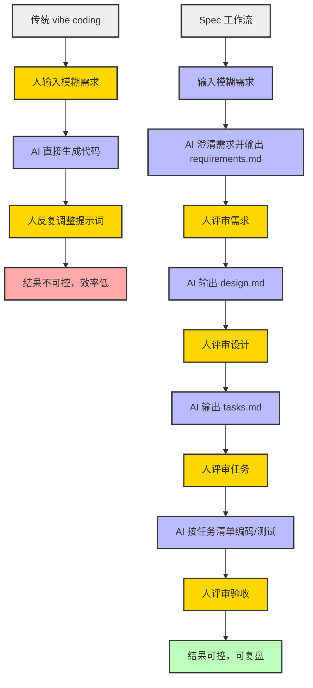

我用 AI 编程一年多，最深的体会是：vibe coding 一时爽，项目一复杂就露馅。需求一句话带过，AI 按自己的理解开干，出来的东西总差那么一点。你让它改，它改了这里崩了那里。几个来回下来，代码量翻了三倍，能用的功能没多几个。

后来我想明白了：问题不在 AI 写不好代码，在我说不清要什么。

Kiro 的 Spec 工作流就是来解决这个的。下面从头拆一遍。

{/* truncate */}


*图：文章配图*

---

## Vibe coding 的两个坑

Vibe coding 最折磨人的两件事：

**第一，你说不清楚，AI 靠猜。** 你说"加个筛选"，它不知道你要前端筛选还是后端查询，不知道单选还是多选，不知道要不要联动其他图表。AI 只能挑一个最常见的猜测，大概率不是你想要的。

**第二，改了一处，崩了三处。** AI 没有"全局影响评估"的概念。你让它换个组件库，它只改了你指的那一个文件，其他依赖旧组件的文件全报错。你都不知道有哪些文件用了旧组件。

这两件事的根子是同一个：**从想法到代码之间缺了一层"翻译"**。传统软件工程用需求文档和技术方案来干这件事。Spec 工作流就是把这两层加回 AI 编程里。

## 传统研发流程怎么解决这个问题的

传统软件工程强调需求澄清、技术设计、任务拆分、过程可追溯。这套流程"慢"，但项目能稳步推进、可复盘、可协作。

Kiro 是 AWS 推出的 AI IDE，把这种流程做成了内置的"Spec 工作流"，AI 编程也能像工程师一样干活。

## Spec 工作流的核心：三个文件

Kiro 把 Spec 工作流做成了一个可复制的模式，核心就三个文件：

```
project/
├── requirements.md    # 需求文档（用 EARS 语法写）
├── design.md          # 技术方案（架构、选型、流程）
└── tasks.md           # 任务清单（todolist，可追踪）
```

### 什么是 EARS 语法？

EARS（Easy Approach to Requirements Syntax）最早用在航空发动机控制系统上，对精确度的要求比软件高得多。它用固定句式约束需求的写法，从源头堵住模糊。

句式就这几种：

| 句式 | 用法 | 例子 |
|---|---|---|
| **The** `<系统>` **shall** `<动作>` | 恒定需求 | The 系统 shall 保持时钟同步 |
| **While** `<状态>` **the system shall** `<动作>` | 系统持续状态 | While 网络不可用，系统应当缓存操作并在恢复后同步 |
| **When** `<触发>` **the system shall** `<动作>` | 用户触发事件 | When 用户点击"静音"，系统应当抑制所有音频输出 |
| **Where** `<可选功能>` **the system shall** `<动作>` | 可选功能 | Where 产品包含推送功能，系统应当提供关闭入口 |
| **If** `<异常>` **then the system shall** `<动作>` | 异常行为 | If 用户输入无效密码，then 系统应当提示重新输入 |

一套句式写下来，AI 想理解偏都难。

参考：[EARS 语法指南](https://alistairmavin.com/ears/)

## 把 Spec 流程复刻到 Claude Code

即使不用 Kiro，这套流程在 Claude Code 里也能跑。关键在 CLAUDE.md——它相当于 AI 的"工作说明书"。

### 第一步：写 CLAUDE.md

```markdown
# CLAUDE.md

你是一个专业的 AI 编程助手，协助我用标准软件工程流程推进项目。请严格按照 Spec 工作流推进：
1. 需求澄清与确认，输出 requirements.md，用 EARS 语法写。
2. 技术方案设计，输出 design.md，包含架构、技术选型、接口、测试策略。
3. 任务拆分，输出 tasks.md，拆成可执行的 todolist。
4. 按任务清单逐步编码、测试，中间产物输出到 output/ 目录。
5. 每一步确认后才进入下一步。
```

### 第二步：启动后对话示例

**你**：我想做一个"AI 帮我自动整理会议纪要"的小工具，能帮我规划一下吗？

**Claude**（读取 CLAUDE.md 后）：当然。先用 EARS 语法帮你梳理 requirements.md——

```markdown
# requirements.md

## 用户故事
作为一名经常开会的用户，我希望能上传会议录音，自动生成结构化的会议纪要，并能导出为 Markdown 或 Word 文档。

## 验收标准
1. When 用户上传音频文件时，系统应当支持 mp3、wav、m4a 格式。
2. When 音频上传完成时，系统应当自动转写为文本并提取会议要点。
3. When 用户点击导出时，系统应当支持 Markdown 和 Word 格式。
```

请确认需求，补充修改后我进入 design.md。

**你**：确认。

**Claude**：收到。下面是 design.md——

```markdown
# design.md

## 架构
- 前端：文件上传 + 进度显示 + 导出按钮
- 后端：音频转文本（ASR）→ 要点提取（大模型）→ 文档格式转换
- 存储：临时存储，处理后自动删除

## 技术选型
- 前端：React
- 后端：Node.js + 大模型 API
- ASR：Whisper API
- 文档导出：jsdocx / markdown-it

## 流程
上传 → 转写 → 提取要点 → 展示 → 导出
```

请确认。确认后我输出 tasks.md。

整个过程你只需要在"确认"阶段介入，剩下的 AI 自己跑。比 vibe coding 的"说了改、改了试试、试了崩"省心很多。

### 对比流程图



> 黄色节点为"人"参与评审，蓝色为 AI 产出，红色为不理想结果，绿色为高质量结果，灰色为流程分组。

## 用下来的效果

试了几次之后，最直观的变化是返工少了。

之前写一个功能，AI 平均要改 2-3 轮才能对准需求。Spec 流程下，需求阶段就把"到底要什么"写死在 requirements.md 里了，AI 改代码时自己会回去翻需求文档。同一个功能通常一轮过。

| | Vibe coding | Spec 流程 |
|---|---|---|
| 需求阶段 | 一句话带过 | EARS 语法写清验收标准 |
| 实现过程 | AI 猜 → 你改 → AI 再猜 | 审完需求再开工 |
| 返工率 | 高（2-3轮） | 低（通常1轮） |
| 可追溯 | 忘了改了啥 | 每个决策有记录 |

当然也有代价。写 requirements.md 本身要花时间，而且你得清楚自己要什么。它解决的不是"AI 帮我做决定"，是"我有决定了，AI 别理解歪"。

## 几个容易翻车的坑

用了几次之后，有几个地方特别容易翻车：

- **需求文件会膨胀。** 一开始什么都想写进去，最后验收标准几十条，AI 反而抓不住重点。我的做法是：一个功能只保留最关键的 3-5 条验收标准，其余砍掉。
- **别把 design.md 写成论文。** 架构一两页就够，重点是选型理由和边界，不是流程图的堆砌。
- **tasks.md 要拆到能直接干。** "实现登录功能"这种任务拆了等于没拆。拆到"写登录接口 + 单测"这种粒度，AI 才不用每次都回来问你。
- **不是所有项目都值得走 Spec。** 一次性脚本、临时 demo，直接 vibe coding 更快。项目越大、越多人协作，Spec 的收益越明显。

## 总结

Spec 工作流让 AI 编程从"碰运气"变成"有章可循"。人类工程师的经验和判断，配合 AI 的高效执行，开发才能真正提速、提质、可复盘。

你平时是 vibe coding 还是已经在用类似的流程？用下来踩过什么坑，评论区聊聊。
