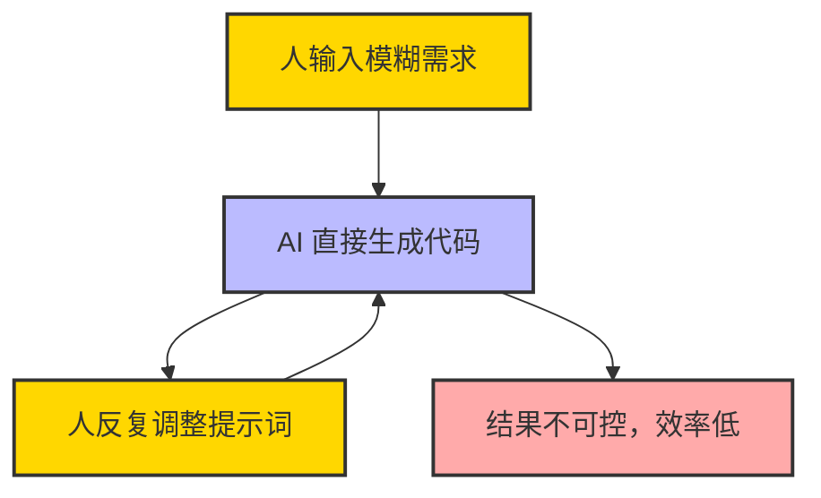
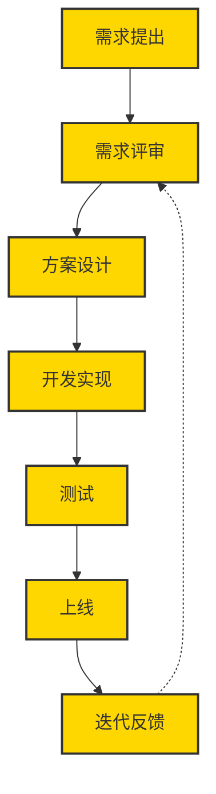
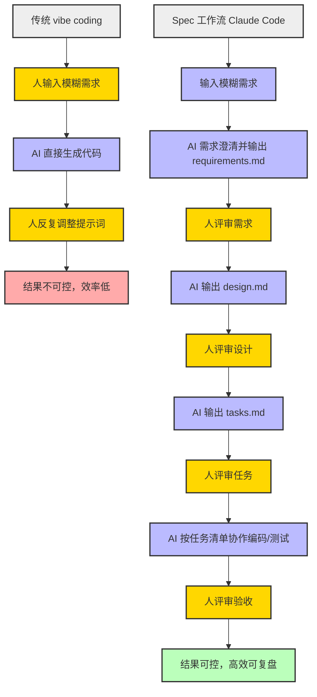
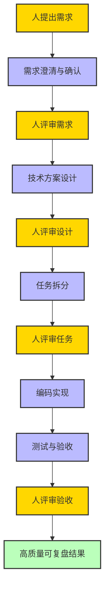

最近研究 Kiro 的推文又爆了，很多朋友私信问细节，所以再来整理一篇文章，系统分享下具体内容和实操方法。

{/* truncate */}


*图：文章配图*

---

## 拉霸式 vibe coding，真的靠谱吗？

你是否有过这样的体验：在 AI IDE 里输入一句模糊的需求，点击"生成"，满怀期待地等着 AI 给你一个完美的程序？结果却像在拉霸机前拉动拉杆——有时中个小奖，大多数时候却一无所获。

> 拉霸游戏和 vibe coding 的异同：
> 
> 拉霸游戏：买代币，拉拉杆，偶尔中大奖，更多时候是"再来一次"，最终庄家总是赢家。
> 
> 氛围编程（vibe coding）：买 Tokens，写模糊提示，点"生成"，有时得完美代码，有时一团乱麻。AI 鼓励你"再试一次"，你安慰自己"这次一定能修好 bug"，但最终模型厂商总是赢家。偶尔你觉得自己赚到了，回头却发现花了更多时间。

vibe coding 最大的问题是：它让开发变成了"碰运气"，而不是"可控的工程"。

### 常见的 vibe coding 流程示意图



> 黄色节点为"人"操作，蓝色为 AI 产出，红色为不理想结果。

## 有没有更好的办法？——传统研发流程是怎么做的

传统软件工程强调需求澄清、技术设计、任务拆分、过程可追溯。这样做虽然"慢"，但能让项目稳步推进、可复盘、可协作。

Kiro AI IDE 就把这种流程做成了"Spec 工作流"，让 AI 编程也能像工程师一样靠谱。

### 传统研发流程示意图



> 该流程强调需求评审和迭代反馈，体现传统软件工程的闭环和持续优化。

## Kiro 的 Spec 工作流有多香？

Kiro 是 AWS 推出的 AI IDE，除了免费集成 Claude 4，更大的亮点是它的 Spec 工作流：

- 每个项目下有 3 个核心文件：
  1. `requirements.md` —— 需求文档（用 EARS 语法写用户故事和验收标准）
  2. `design.md` —— 技术方案（架构、流程、注意事项）
  3. `tasks.md` —— 任务清单（todolist，便于跟踪）

### 什么是 EARS 需求语法？

EARS（简易需求语法）最早用于喷气发动机控制系统，后来被软件工程广泛采用。它用简单句式约束需求，避免"模糊表达"。

> 例：When 用户点击"静音"，系统应当抑制所有音频输出。

参考资料：[EARS 语法指南](https://alistairmavin.com/ears/) | [v0.dev Cheat Sheet](https://v0-ears-syntax-guide-bd8ywxbxo-booker-zhaos-projects.vercel.app)

## Claude Code 也能玩 Spec 流程！（含实操演示和对话示例）

即使没有 Kiro，其他 AI IDE 也能复刻这套流程。以 Claude Code 为例，整个过程可以非常丝滑：

1. **在项目下建立 CLAUDE.md**
   - 你可以把下面的提示词模板直接写进 CLAUDE.md，作为 AI 协作的"工作说明书"。
   - 示例（可根据实际需求调整）：

```
# CLAUDE.md

你是一个专业的 AI 编程助手，协助我用标准软件工程流程推进项目。请严格按照 Spec 工作流推进：
1. 需求澄清与确认，输出 requirements.md，采用 EARS 语法。
2. 技术方案设计，输出 design.md，包含架构、技术选型、接口、测试策略。
3. 任务拆分，输出 tasks.md，细化为可执行的 todolist。
4. 按照任务清单协助编码、测试，输出过程产物到 output/。
5. 重要：每一步都要和我确认，只有我确认后才能进入下一步。
```

2. **启动 Claude Code，输入原始需求**
   - 直接把你的想法、用户故事写进对话框。
   - Claude 会自动读取 CLAUDE.md，开始和你进行需求澄清和确认。

3. **需求确认后，Claude 输出 requirements.md**
   - Claude 会用 EARS 语法梳理需求，生成标准的 requirements.md。
   - 你可以随时补充、修改，Claude 会持续和你对齐。

4. **技术方案设计**
   - 需求确认后，Claude 会自动进入 design.md 阶段，输出详细的技术方案。
   - 包括架构、技术选型、接口、测试策略等。

5. **任务拆分**
   - Claude 会根据 design.md 自动生成 tasks.md，把方案拆分为可执行的 todolist。

6. **逐步实现与验收**
   - Claude 会按照 tasks.md 协助你逐步实现代码、测试，并输出所有过程产物到 output/ 目录。
   - 你只需参与需求、设计、验收等关键评审环节。

> 推荐 CLAUDE.md 提示词模板：
> "你是一个专业的 AI 编程助手，协助我用标准软件工程流程推进项目。请严格按照 Spec 工作流推进，每一步都要和我确认，只有我确认后才能进入下一步。"

这样，哪怕没有 Kiro，借助 Claude Code 也能轻松复刻 Spec 工作流，让 AI 编程变得高效、可控、可复盘。

### vibe coding 与 Spec 工作流对比流程图



> 黄色节点为"人"参与评审，蓝色为 AI 产出，红色为不理想结果，绿色为高质量结果，灰色为流程分组。

### Claude Code 复刻 Spec 工作流对话示例

```markdown
**用户**：我想做一个"AI 帮我自动整理会议纪要"的小工具，能帮我规划一下吗？

**Claude**（读取 CLAUDE.md 后自动响应）：
当然可以！我们将采用标准 Spec 工作流推进。首先，我会帮你澄清需求并输出 requirements.md。请问你希望支持哪些输入方式？比如：语音、文字、文件上传等？

**用户**：主要是上传录音文件，最好还能支持多种音频格式。

**Claude**：
明白了。还有输出格式有要求吗？比如纯文本、Markdown、Word 文档等？

**用户**：最好能导出 Markdown 和 Word。

**Claude**：
好的，需求已澄清。下面是基于 EARS 语法梳理的 requirements.md 草稿：

---

# requirements.md

## 用户故事
作为一名经常开会的用户，我希望能上传会议录音，自动生成结构化的会议纪要，并能导出为 Markdown 或 Word 文档，提升整理效率。

## 验收标准
1. When 用户上传音频文件时，the 系统 shall 支持多种主流音频格式（如 mp3, wav, m4a）。
2. When 音频上传完成时，the 系统 shall 自动将音频转为文本并提取会议要点。
3. When 用户点击导出时，the 系统 shall 支持导出为 Markdown 和 Word 文档。

---

请确认需求内容，或补充修改。确认后我将进入技术方案设计阶段。

**用户**：确认，没问题。

**Claude**：
收到！接下来输出 design.md：

---

# design.md

## 架构概述
- 前端：文件上传、进度显示、导出按钮
- 后端：音频转文本（调用 ASR 服务）、要点提取（大模型）、文档格式转换
- 存储：临时存储音频和文本

## 技术选型
- 前端：React
- 后端：Node.js + OpenAI/Claude API
- ASR 服务：Whisper API
- 文档导出：jsdocx、markdown-it

## 流程
1. 用户上传音频
2. 后端转写为文本
3. 调用大模型提取要点
4. 前端展示并支持导出

## 安全性
- 文件仅临时存储，处理后自动删除

---

请确认技术方案，或补充修改。确认后我将拆分任务清单。

**用户**：确认。

**Claude**：
好的，下面是 tasks.md：

---

# tasks.md

- [ ] 搭建前端上传页面
- [ ] 实现音频文件上传接口
- [ ] 集成 ASR 服务实现音频转文本
- [ ] 调用大模型提取会议要点
- [ ] 实现导出 Markdown/Word 功能
- [ ] 前后端联调与测试
- [ ] 文档与验收

---

请确认任务清单，确认后我将协助你逐步实现每个任务。
```

## CloudBase AI ToolKit：一站式复刻 Spec 工作流

如果你想要更开箱即用的体验，可以试试 CloudBase AI ToolKit：
- 支持多种 AI IDE
- 自带 Spec 工作流模板
- 一键生成、部署、托管全栈应用，无需运维

## 人机协作，才是正解

在 Spec 工作流下，AI 负责：
- 模糊需求 → 需求方案
- 技术设计文档
- 任务清单
- 编码实现
- 验收测试

人类只需参与：
- 需求输入
- 需求/技术/排期/测试评审

这样既能发挥 AI 的高效，又能保证工程质量。

### 标准软件工程流程示意图



> 黄色节点为"人"参与评审，蓝色为工程活动（可由 AI 或人协作完成），绿色为高质量结果。

## 总结：让 AI 编程更快、更稳、更靠谱

Spec 工作流让 AI 编程不再是"碰运气"，而是"有章可循"。人类工程师的经验和判断，配合 AI 的高效执行，才能让开发真正提速、提质、可复盘。

> 记住：AI 不是替代人，而是让人更强大。
