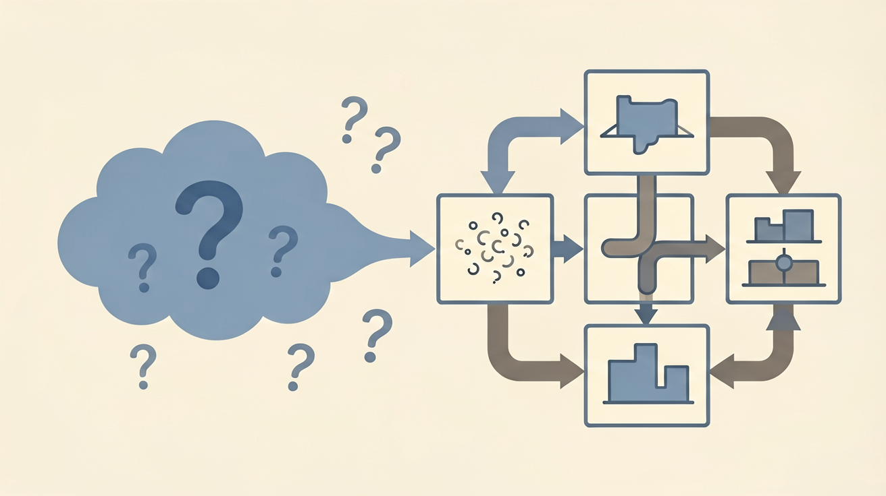

去年有个项目，用 AI 生成了一个数据分析面板。第一版看起来不错，图表、筛选、导出都有。结果加了一个筛选条件之后，图表不更新了。让 AI 修，它改了图表——筛选器又没了。反复五轮，功能越来越多，问题也越来越多。最后代码量翻了三倍，可用的东西却少了。

后来我意识到，问题不在 AI 写不好代码——在我"说不清要什么"。

Kiro 的 Spec 工作流就是来解决这个的。下面从头拆一遍。

{/* truncate */}


*图：文章配图*

---

## Vibe coding 的两个坑

Vibe coding 最折磨人的两件事：

**第一，你说不清楚，AI 靠猜。** 你说"加个筛选"，它不知道是前端筛选还是后端查询，不知道单选还是多选，不知道要不要联动其他图表。AI 只能选一个最常见的猜测——大概率不是你想要的。

**第二，改了一处，崩了三处。** AI 没有"全局影响评估"的概念。你让它换个组件库，它只改了你指的那一个文件，其他依赖旧组件的文件全报错。你都不知道有哪些文件用了旧组件。

这两件事的本质是同一个——**从想法到代码之间缺了一层"翻译"**。传统软件工程用需求文档和技术方案来干这件事。Spec 工作流就是把这两层加回了 AI 编程里。

---

## Spec 工作流的核心：三个文件

Kiro 把 Spec 工作流做成了一个可复制的模式，核心就三个文件：

```
project/
├── requirements.md    # 需求文档（用 EARS 语法写）
├── design.md          # 技术方案（架构、选型、流程）
└── tasks.md           # 任务清单（todolist，可追踪）
```

### 什么是 EARS 语法？

EARS（Easy Approach to Requirements Syntax）最早用在航空发动机控制系统上——对精确度的要求比软件高得多。它用几个固定的句式模板约束需求的写法，避免模糊。

句式就这几种：

| 句式 | 用法 | 例子 |
|---|---|---|
| **When** `<触发>` **the system shall** `<动作>` | 用户触发 | When 用户点击"静音"，系统应当抑制所有音频输出 |
| **Where** `<状态>` **the system shall** `<动作>` | 系统状态 | Where 网络不可用，系统应当缓存操作并在恢复后同步 |
| **As** `<条件>` **the system shall** `<动作>` | 持续条件 | As 用户输入搜索词，系统应当每 500ms 触发一次自动补全 |
| **Then** `<结果>` | 系统响应 | Then 系统应当展示"操作成功"提示 |

一套句式写下来，AI 不会有理解偏差。

参考：[EARS 语法指南](https://alistairmavin.com/ears/)

---

## 把 Spec 流程复刻到 Claude Code

即使不用 Kiro，这套流程在 Claude Code 里也能跑。关键在 CLAUDE.md——它相当于 AI 的"工作说明书"。

### 第一步：写 CLAUDE.md

```markdown
# CLAUDE.md

你是一个专业的 AI 编程助手，协助我用标准软件工程流程推进项目。请严格按照 Spec 工作流推进：

1. 需求澄清与确认，输出 requirements.md，用 EARS 语法写。
2. 技术方案设计，输出 design.md，包含架构、技术选型、接口、测试策略。
3. 任务拆分，输出 tasks.md，拆成可执行的 todolist。
4. 按任务清单逐步编码、测试，中间产物输出到 output/ 目录。
5. 每一步确认后才进入下一步。
```

### 第二步：启动后对话示例

**你**：我想做一个"AI 帮我自动整理会议纪要"的小工具，能帮我规划一下吗？

**Claude**（读取 CLAUDE.md 后）：
当然。先用 EARS 语法帮你梳理 requirements.md——

```
# requirements.md

## 用户故事
作为一名经常开会的用户，我希望能上传会议录音，
自动生成结构化的会议纪要，并能导出为 Markdown 或 Word 文档。

## 验收标准
1. When 用户上传音频文件时，系统应当支持 mp3、wav、m4a 格式。
2. When 音频上传完成时，系统应当自动转写为文本并提取会议要点。
3. When 用户点击导出时，系统应当支持 Markdown 和 Word 格式。
```

请确认需求，补充修改后我进入 design.md。

**你**：确认。

**Claude**：收到。下面是 design.md——

```
# design.md

## 架构
- 前端：文件上传 + 进度显示 + 导出按钮
- 后端：音频转文本（ASR）→ 要点提取（大模型）→ 文档格式转换
- 存储：临时存储，处理后自动删除

## 技术选型
- 前端：React
- 后端：Node.js + 大模型 API
- ASR：Whisper API
- 文档导出：jsdocx / markdown-it

## 流程
上传 → 转写 → 提取要点 → 展示 → 导出
```

请确认。确认后我输出 tasks.md。

整个过程你只需要在"确认"阶段介入，剩下的 AI 自己跑。比 vibe coding 的"说了改改了试试了崩"省心很多。

---

## 效果对比

试了几次之后，最直观的变化是——**返工少了**。

之前写一个功能，AI 平均要改 2-3 轮才能对准需求。Spec 流程下，需求阶段就把"到底要什么"写死在 requirements.md 里了，AI 后面改代码时自己会回去翻需求文档。同一个功能通常一轮过。

| | Vibe coding | Spec 流程 |
|---|---|---|
| 需求阶段 | 一句话带过 | EARS 语法写清验收标准 |
| 实现过程 | AI 猜 → 你改 → AI 再猜 | 审完需求再开工 |
| 返工率 | 高（2-3轮） | 低（通常1轮） |
| 可追溯 | ❌ 忘了改了啥 | ✅ 每个决策有记录 |

当然也有代价——写 requirements.md 本身要花时间，而且你得清楚自己要什么。它解决的不是"AI 帮我做决定"，是"我有决定了，AI 别理解歪"。

---

## 几个发现的坑

用了几次之后，有几个地方特别容易翻车：

**requirements.md 写太细也没用。** 一开始我事无巨细写满了验收标准，AI 做设计时反而被束缚了。后来发现写清楚"输入输出边界"就够了，实现细节留给 design.md。

**Claude Code 偶尔会跳过确认步骤。** 如果指令不够明确，它可能自己把 requirements 写完直接进 design。解决方法是把"每一步都要确认"加粗写在 CLAUDE.md 开头。

**不是所有项目都适合。** 原型验证、一次性脚本、个人小工具——犯不着写三个文件。Spec 流程最值的时候是多人协作或长期维护的项目。

---

Spec 工作流没解决"AI 不会写对"的问题，它解决的是"AI 不知道你在问什么"的问题。前者靠模型迭代，后者靠流程约束——而后者是你现在就能做的事情。
