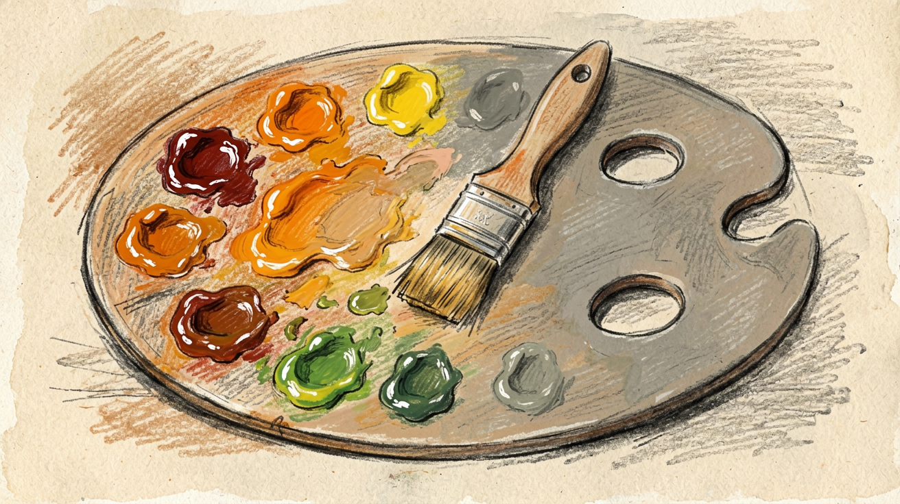

一开始用 AI 生图的时候，我自己没有太在意风格。Midjourney 默认输出什么样，我就用什么样：光影浓郁、细节饱满、色彩鲜艳。结果配到文章里怎么看怎么不对——不是画得不好，是**太像 AI 画的了**。

后来我花了不少时间在 prompt 里调参数做减法，试了好几套风格方案，慢慢摸索出一些规律。回头想想，去掉 AI 味的核心其实很简单：**做减法、加纹理、扁平化、低饱和度。**

下面这三套方案是实战下来最稳的，直接贴 prompt 后缀就能用。

{/* truncate */}


*图：文章配图*

---

## 为什么 AI 图片会"油腻"？

你有没有发现，很多 AI 生成的图片虽然看起来很"完美"，但总有一种说不出的"塑料感"？

这就是我们常说的"AI 味道"和"油腻感"。它们通常来自于：

- **过度的光影渲染**：高光、反光、阴影太刻意
- **过于完美的细节**：每个像素都太精致，缺少真实感
- **高饱和度的色彩**：颜色太鲜艳，显得不自然
- **典型的 3D 建模感**：像游戏引擎渲染出来的，而不是人画的

### 举个常见的例子

假设你要为"读书"主题配图，如果使用默认的 AI 提示词，可能会生成这样的图片：


**问题在哪里？**
- 光影太戏剧化，像电影海报
- 细节过于完美，每个角落都很精致
- 3D 渲染感太强，像游戏场景
- 整体感觉"太假"，缺少真实感

**想要去"油"且友好？核心策略很简单：做减法、加纹理、扁平化、低饱和度。**

下面为你整理了 **3 套可以直接用的风格方案**，用同样的"读书"主题，看看不油腻的版本：

---

## 方案一：极简矢量扁平风

**适合：** 科技博客、职场干货、产品介绍

这是最安全、最现代的风格。它去除了所有不必要的立体感，就像 Notion 的插画或者大厂 UI 设计那样，干净、简洁、专业。

**看起来像什么：** 干净、大面积留白、几何形状、哑光质感，就像你在 Apple 官网或者 Notion 里看到的那些插画。

**通用提示词后缀 (Prompt Suffix)：**

> **English:** `flat vector illustration, minimal style, corporate memphis, simple shapes, 2D, white background, wide margins, clean lines, matte finish, low saturation, soft pastel colors, no shading, Behance style --ar 16:9`

> **中文释义：** 扁平矢量插画，极简风格，企业孟菲斯风格，简单形状，2D，白底，宽边距，线条干净，哑光表面，低饱和度，柔和的粉彩色，无阴影，Behance 风格。

**示例对比：**

同样的"读书"主题，使用扁平风格后：


**对比油腻版本：** 去掉了 3D 渲染感，没有复杂的光影，简洁干净，专业感强。

---

## 方案二：手绘蜡笔/水彩风

**适合：** 生活感悟、读书笔记、情感故事

这种风格通过模拟真实的画材（蜡笔、铅笔、水彩），引入人为的"瑕疵感"和"噪点"，彻底消除 AI 的塑料光滑感，显得非常有温度。

**看起来像什么：** 就像你在儿童绘本里看到的那种插画，粗糙的纹理、温暖的色调、有点不完美的边缘，但特别有亲和力。

**通用提示词后缀 (Prompt Suffix)：**

> **English:** `hand-drawn sketch, crayon texture, watercolor style, children's book illustration, rough edges, textured paper, visible brush strokes, warm tones, cozy atmosphere, simple composition, cute and friendly --ar 16:9`

> **中文释义：** 手绘素描，蜡笔纹理，水彩风格，儿童绘本插画，边缘粗糙，纹理纸张，可见笔触，暖色调，舒适氛围，构图简单，可爱友好。

**示例对比：**

同样的"读书"主题，使用手绘风格后：


**对比油腻版本：** 有了真实的纹理和笔触，温暖的色调，就像真的手绘作品，特别有亲和力。

---

## 方案三：复古孔版印刷风 (Risograph)

**适合：** 观点文章、文艺评论、创意设计

这是目前去 AI 味的大杀器。Risograph（孔版印刷）风格强制使用有限的色彩和颗粒感，会让图片看起来像是有年代感的印刷品，非常高级且完全不油腻。

**看起来像什么：** 就像独立杂志或者艺术海报，有颗粒感、双色或三色套印、复古的错位感，特别有文艺范儿。

**通用提示词后缀 (Prompt Suffix)：**

> **English:** `Risograph style, grain and noise, screen print texture, limited color palette (blue and orange), halftone pattern, abstract minimalism, vintage aesthetic, matte paper texture, high contrast, flat illustration --ar 16:9`

> **中文释义：** 孔版印刷风格，颗粒和噪点，丝网印刷纹理，限制色板（如蓝和橙），半调图案，抽象极简，复古美学，哑光纸质感，高对比度，扁平插画。

**示例对比：**

同样的"读书"主题，使用 Risograph 风格后：


**对比油腻版本：** 有了颗粒感和印刷质感，限定的色彩让画面更高级，完全摆脱了 3D 渲染的塑料感。

---

## 💡 核心"去油"魔法词

如果你想自己微调风格，下面这些词是必用的"去油神器"：

### 1. 材质控制 (必选)

- `Matte` (哑光，去反光)
- `Grainy / Noise` (噪点，增加真实感)
- `Textured paper` (纸张纹理)

### 2. 光影控制

- `Flat lighting` (平光，避免戏剧性光影)
- `Soft shadows` (柔和阴影)
- `Natural light` (自然光)

### 3. 负向提示词（告诉 AI 不要画什么）

这非常重要！把这些词填入 Negative Prompt 框，告诉 AI 避免这些"油腻"元素：

> `photorealistic, 3d render, octane render, unreal engine, shiny, glossy, reflection, hyper detailed, neon lights, cyberpunk, plastic looking, oily skin, complex background`

**简单理解：** 就是告诉 AI "不要画得太真实、太 3D、太闪亮、太复杂"。

---

## 实战示例：同一个主题，三种风格

假设你要写一篇关于 **"如何高效管理时间"** 的文章，来看看三种风格的区别：

### 使用方案一 (扁平风) 的组合方式：

> **Prompt:** `A person organizing giant clock gears, happy expression, working on a desk` + `flat vector illustration, minimal style, simple shapes, 2D, white background, clean lines, matte finish, soft pastel colors, no shading --ar 16:9`


### 使用方案二 (手绘风) 的组合方式：

> **Prompt:** `A cute clock and a cup of coffee on a wooden table, sunlight` + `hand-drawn sketch, crayon texture, children's book illustration, rough edges, textured paper, warm tones, cozy atmosphere --ar 16:9`


### 使用方案三 (Risograph 风) 的组合方式：

> **Prompt:** `Abstract clock design with calendar elements` + `Risograph style, grain and noise, screen print texture, limited color palette (blue and orange), halftone pattern, abstract minimalism, vintage aesthetic --ar 16:9`


---

## 实用技巧

### 1. 混搭风格

你可以把不同风格的提示词组合起来，创造出独特的视觉效果：

```
主体描述 + 风格A的关键词 + 风格B的材质词
```

**举个例子：**
> `A person reading a book` + `flat vector illustration` + `crayon texture, rough edges`

这样就能得到"扁平风格但带手绘质感"的图片。

### 2. 如果颜色还是太鲜艳

可以加上这些词：
- `desaturated` (去饱和)
- `muted colors` (柔和色彩)
- `pastel palette` (粉彩色板)

### 3. 避免过度细节

如果 AI 画得太复杂，加上这些：
- `simple composition` (简单构图)
- `minimal details` (最少细节)
- `focus on main subject` (聚焦主体)

---

## 总结：5 个去油原则

去"AI 味道"的核心其实很简单：**让图片看起来像人画的，而不是机器渲染的**。

记住这 5 个原则：

1. ✅ **加纹理**：纸张、画布、噪点，增加真实感
2. ✅ **减细节**：不要过度完美，留点"瑕疵"
3. ✅ **降饱和度**：柔和色彩比鲜艳色彩更友好
4. ✅ **扁平化**：避免 3D 立体感，2D 更自然
5. ✅ **哑光处理**：去除高光和反光，避免"塑料感"

**记住：不完美才是真实，真实才最友好。**
