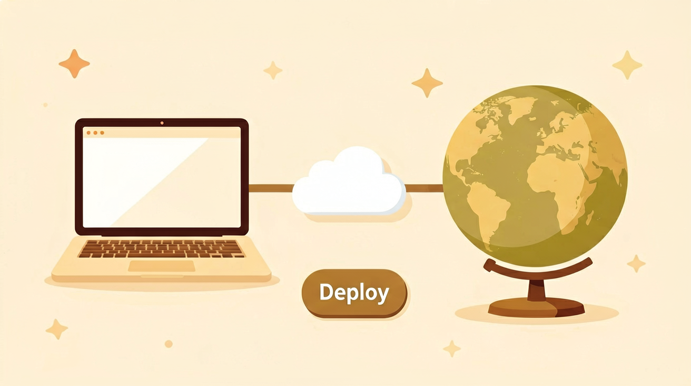

> 这篇文章帮你搞懂四件事：① Codex 是什么、能干什么 → ② 五分钟上手做个能玩的小游戏 → ③ 基本用法和核心功能 → ④ 接低成本的国产开源模型，把做好的应用发布上线，让别人能访问。
>
> **赶时间？** Codex 现在能接 DeepSeek、GLM 这些便宜模型了。**想省钱 + 一键部署的，跳到第四步**复制一段配置就行。想从头搞懂的，往下读。


{/* truncate */}


*图：文章配图*

## 第一步 · 先认识它

Codex 是 OpenAI 推出的 AI 编程桌面工具，2026 年上半年周活从 60 万涨到了 **500 万**。涨得快，4 月 Sam Altman 直接在 X 上发帖"重置所有用户限额，每多 100 万再重置一次"。最值得注意的是：现在大约 **20% 的用户根本不写代码**，是产品、运营、做投资的人。

跟你的关系直接：6 月 18 日 OpenAI 放开了第三方模型，DeepSeek、GLM、Kimi 都能接——用便宜的国产模型跑，成本能压下来一大截。

### 它跟 ChatGPT 有啥不一样？

不少人第一反应："这不就是个会写代码的 ChatGPT 吗？"差远了。

ChatGPT 是对话式的——你问它答，它给你建议，但活还得你自己干。Codex 直接在文件系统上工作。你告诉它"写一个贪吃蛇游戏"，它自己创建文件、装依赖、运行调试。

举个例子：你让 ChatGPT 写贪吃蛇，它给你一段代码，你得自己新建文件、粘贴、装库、运行、找错。你让 Codex 写贪吃蛇，它直接创建一个项目文件夹，生成代码，安装依赖，运行游戏。如果报错了，它会自己读错误信息，改完再跑，直到能玩为止。

**ChatGPT 是顾问，Codex 是帮你干活的。**

---

## 第二步 · 五分钟上手，做个能玩的小游戏

### 装好它：下载 · 登录 · 认识界面

去 [codex.com](https://codex.com) 下载桌面 App，用 OpenAI 账号登录。

界面不复杂，就三块：
- **左侧**：项目文件列表
- **中间**：对话窗口 + 代码编辑器
- **右下**：终端（能看到它在干什么）

### 第一个任务：一句话，让它做个贪吃蛇

打开 Codex，在对话框里输入：

> 用 Python 写一个贪吃蛇游戏，要用 pygame，能直接运行

说完它就开始干了。注意看中间区域——它会先创建文件、写代码，然后自动运行。

可能第一次报错（比如没装 pygame），它会自己发现问题，装好依赖再试一次。最终你会看到一个窗口弹出来，贪吃蛇已经能跑了。

从打开 Codex 到玩上游戏，快的话 **五分钟**。

---

## 第三步 · 动手之前，先搞懂这些

### ① 三档权限：决定它能动你多少东西

Codex 有三档权限来控制它的行动范围：

- **Clipboard Only**：只读剪贴板，啥也动不了，安全但没用
- **Read & Write Files**：能读写文件，干活的基本盘
- **Admin**：能装软件、改系统设置

默认是 Read & Write，日常够用了。做游戏、写代码、部署都用这个。

### ② 插件 · 技能 · MCP：三个最容易搞混的词

这三个不是同一个东西：

- **插件（Plugin）**：Codex 能调用的外部 API，比如连数据库、发消息、查天气。Codex 自己就内置了几十个。
- **Skill**：教 Codex 怎么干活的一套指令。你写好一个 Skill，下次吩咐一句话，它就知道整套流程怎么走。
- **MCP Server**：一个通用接口，让 Codex 能跟外部工具通信。

### ③ 招牌技能 Skill：教它一次，以后一句话复用

举个例子，你想让 Codex 每次写代码时都跑测试、检查类型、格式化代码。写一个 Skill：

```
## 代码质量规则

在完成任何代码修改后：
1. 运行 `npm test`，确保所有测试通过
2. 运行 `npx tsc --noEmit`，确保没有类型错误
3. 运行 `npx prettier --write .`，格式化代码
```

存成 Skill，下次说"用我的质量规则跑一遍"，它就按你说的做。

---

## 插曲 · 它远不止写代码

### ⏰ 定时自动干活

Codex 可以设定时任务：每天早上 9 点跑测试，每周一更新依赖。你睡觉的时候它帮你做这些杂活。

### 🚀 一键部署网站

写好的网页，跟 Codex 说一声它就能部署。配上 MCP 插件，它能直接连云服务。

### 📱 手机远程遥控

Codex 有手机 App，能随时看任务进度、发新指令。通勤路上看到 bug，直接手机发指令让它修。

### 📄 顺手生成文档和图片

画架构图、写更新日志、生成配图——都能干。

---

## 第四步 · 用便宜的国产模型，把游戏部署上线

### 先说那个坑：想接国产模型省钱，却卡住了

Codex 默认用 OpenAI 自己的模型，对于日常开发完全够用。但如果你想跑大量自动化任务或者团队协作，Token 消耗很快就上去了。

6 月 18 日 Codex 开放了第三方模型接入。但有个问题：你要自己搞定 API Key、模型配置、部署环境。

### 解法：CloudBase（配模型 + 装插件）

CloudBase 是腾讯云的 Serverless 平台，它的 AI Toolkit 正好解决了这个问题。

#### 配模型（5 分钟）

CloudBase 兼容 OpenAI 的和 Anthropic 的协议，DeepSeek、GLM、Kimi 用一个 Key 打通。配置好之后，Codex 里直接选国产模型就行，Token 成本能降到原来的十分之一以下。

#### 装插件（让它能直接部署）

CloudBase AI Toolkit 插件装了之后，Codex 就能直接在对话里把应用部署上线。不需要手动登录云控制台、配置域名、传文件。说一句"帮我部署到线上"，它就自动办完。

---

## 写在最后

Codex 这半年证明的事：**AI 工具拼的早就不是"能不能答题"，而是"能不能把活干完、把东西交付出来"。**

对我这种普通人，真正的坎也不是"有没有便宜模型"，而是接进来麻烦、做完没地方部署。协议要对得上，上线要有地方落。踩完一圈，我现在的答案就是 CloudBase：三种协议都兼容，国产模型一个 Key 全打通，写完还能在同一个窗口里部署。

**别处的 Token Plan 只给你 Token，CloudBase 还给你上线的地方。**

---

> 你用过 Codex 吗？是拿它写代码，还是干别的活？评论区聊聊，我都会回。
