> 一个插件，七种工具，通用协议

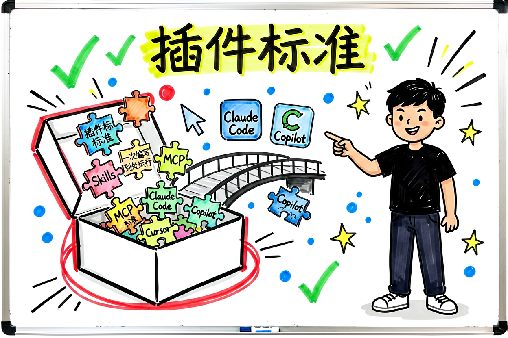
*图：Open Plugins 标准——一次编写，到处运行*

最近我发现一个趋势——AI 编程工具越来越多，Cursor、Claude Code、Codex、Grok Build……各有各的扩展机制。然后就冒出了一个新东西，叫 **Open Plugins**。

它是 Vercel Labs 维护的一个开放标准，能把 Skills、Agents、Hooks、MCP 服务器、LSP 服务器这些东西统统打包成一个标准化的插件目录，在七种不同的 AI 编程工具之间即装即用。

这篇文章不打算泛泛而谈，我会把这个协议的来龙去脉、技术细节和实际用法一次性讲清楚。

{/* truncate */}

---

## 现状：AI 编程工具的"插件战国"

先说问题。


*图：各工具各说各话，夹不到一起*

假设你有一组很好用的 AI 编程辅助工具：

- 一个代码审查 skill，每次提交前自动审查变更
- 一个 MCP 服务器，连接到公司的 API 文档
- 一个钩子脚本，保存文件时自动格式化

在 Claude Code 里配一遍，换到 Cursor 又得重新配，换到 Codex 格式可能还不一样。这就像 npm 出现之前的 JavaScript——每个库有自己的模块格式，想复用就得手动折腾。

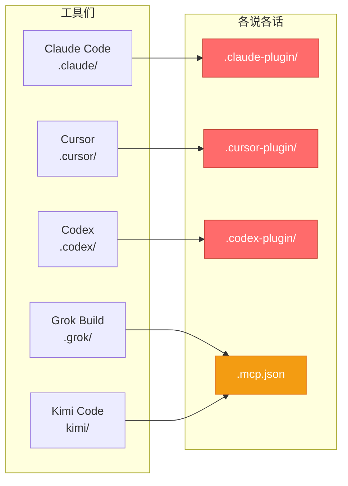
```mermaid
flowchart LR
    subgraph 工具们
        CC[Claude Code<br/>.claude/]
        Cursor[Cursor<br/>.cursor/]
        Codex[Codex<br/>.codex/]
        Grok[Grok Build<br/>.grok/]
        KC[Kimi Code<br/>kimi/]
    end

    subgraph 各说各话
        A[.claude-plugin/]
        B[.cursor-plugin/]
        C[.codex-plugin/]
        D[.mcp.json]
    end

    CC --> A
    Cursor --> B
    Codex --> C
    Grok --> D
    KC --> D

    style A fill:#ff6b6b,stroke:#c0392b,color:#fff
    style B fill:#ff6b6b,stroke:#c0392b,color:#fff
    style C fill:#ff6b6b,stroke:#c0392b,color:#fff
    style D fill:#f39c12,stroke:#e67e22,color:#fff
```

Open Plugins 的目的就是终结这种割裂：**定一套标准，所有工具共用**。

---

## npx plugins：唯一的安装命令

从用户角度，Open Plugins 的使用方式极其简单。一个 CLI 命令搞定：

```bash
# 从 GitHub 安装插件（短格式）
npx plugins add vercel/vercel-plugin

# 完整 HTTPS URL
npx plugins add https://github.com/vercel/vercel-plugin

# 从本地目录安装
npx plugins add ./my-plugin

# 先看看有哪些组件，不实际安装
npx plugins discover owner/repo

# 查看本地已检测到的工具
npx plugins targets
```

这个 `plugins` 包（v1.3.4）就是 Open Plugins 生态的"安装器"。安装后的存储路径统一走 `.agents/plugins/`。

它的工作流程可以看作一条流水线：

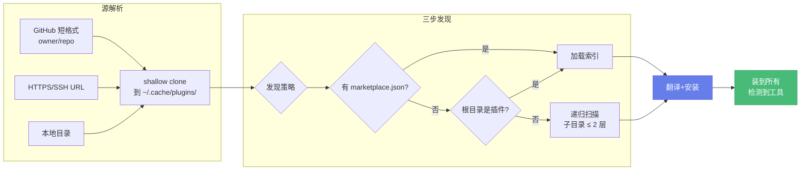
```mermaid
flowchart LR
    subgraph 源解析
        A[GitHub 短格式<br/>owner/repo] --> D
        B[HTTPS/SSH URL] --> D
        C[本地目录] --> D
    end

    D[shallow clone<br/>到 ~/.cache/plugins/] --> E

    subgraph 三步发现
        E{发现策略} --> F{有 marketplace.json?}
        F -->|是| G[加载索引]
        F -->|否| H{根目录是插件?}
        H -->|是| G
        H -->|否| I[递归扫描<br/>子目录 ≤ 2 层]
    end

    G --> J[翻译+安装]
    I --> J
    J --> K[装到所有<br/>检测到工具]

    style J fill:#667eea,stroke:#5a67d8,color:#fff
    style K fill:#48bb78,stroke:#38a169,color:#fff
```

支持的安装 scope 分为三档：

```bash
npx plugins add repo --scope user     # 用户级（~/.agents/plugins/）
npx plugins add repo --scope project  # 项目级（./.agents/plugins/）
npx plugins add repo --scope local    # 仅本地开发测试
```

还可以指定安装到某个特定工具：

```bash
npx plugins add owner/repo -t grok     # 只装到 Grok Build
npx plugins add owner/repo -t vscode   # 只装到 VS Code
```

---

## 支持七种 AI 编程工具

`npx plugins targets` 会检测你机器上安装了哪些工具，然后自动安装到所有检测到的目标。


*图：七种 AI 编程工具，一个插件标准全支持*

不过，装完不等于每个组件都在所有工具里能用。这里有个关键认知——**Open Plugin Spec v1 保证的只有两类组件：Skills 和 MCP**。其他组件（Hooks、Commands、Agents）不在 v1 规范里，支不支持完全看宿主工具。

```
Spec v1 保证 → Skills + MCP（装完就能用）
Spec v1 不保证 → Hooks / Commands / Agents（宿主不认识就忽略，不报错）
```

来看看各工具的实际情况：

| 工具 | Skills | MCP | Hooks | Agents | Commands | 备注 |
|------|:------:|:---:|:-----:|:------:|:--------:|------|
| **Claude Code** | ⭐ v1 | ⭐ v1 | ✅ 原生 | ✅ 原生 | ✅ 原生 | 最全面的宿主 |
| **Cursor** | ⭐ v1 | ⭐ v1 | ✅ | ❌ | ❌ | |
| **Codex** | ⭐ v1 | ⭐ v1 | ✅ | ✅ | ✅ | |
| **Grok Build** | ⭐ v1 | ⭐ v1 | ✅ | ❌ | ❌ | |
| **Kimi Code** | ⭐ v1 | ⭐ v1 | ❌ | ❌ | ❌ | |
| **GitHub Copilot CLI** | ⭐ v1 | ⭐ v1 | ✅ | ✅ | ✅ | |
| **VS Code** | ⭐ v1 | ⭐ v1 | ❌ | ❌ | ❌ | Preview |

> ⭐ v1 = Spec v1 标准保证；✅ = 宿主额外支持；❌ = 不支持（宿主会静默忽略）

关键要点：

- **Skills + MCP 是跨 IDE 通用协议**，装到哪个工具都能用——这是我们推荐 `npx plugins add` 的根本原因
- **Hooks 不是全员标配**。Claude Code 和 Copilot CLI 支持最完整，VS Code 和 Kimi Code 就不认
- Claude Code 通过原生 marketplace 机制支持最全（hooks + commands + agents），但那是宿主能力，不是 v1 标准
- 不支持 Hooks 的工具会静默忽略，不会报错，插件仍然能正常工作

---

## 插件协议规范 Deep Dive

一个插件本质上就是一个目录，按约定结构放置各类组件。

### 标准目录结构

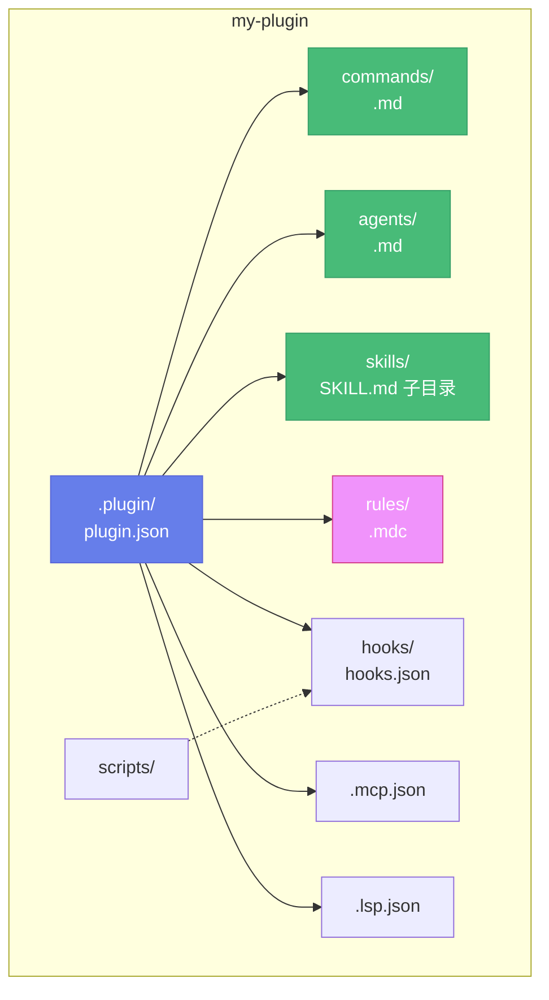
```mermaid
flowchart TD
    subgraph my-plugin
        A[.plugin/<br/>plugin.json] --> B[commands/<br/>.md]
        A --> C[agents/<br/>.md]
        A --> D[skills/<br/>SKILL.md 子目录]
        A --> E[rules/<br/>.mdc]
        A --> F[hooks/<br/>hooks.json]
        A --> G[.mcp.json]
        A --> H[.lsp.json]
        I[scripts/] -.-> F
    end

    style A fill:#667eea,stroke:#5a67d8,color:#fff
    style B fill:#48bb78,stroke:#38a169,color:#fff
    style C fill:#48bb78,stroke:#38a169,color:#fff
    style D fill:#48bb78,stroke:#38a169,color:#fff
    style E fill:#f093fb,stroke:#d53f8c,color:#fff
```

安装后的存储路径分两个 scope：

```text
~/.agents/plugins/          # 用户级
<project>/.agents/plugins/  # 项目级
```

### plugin.json 清单文件

清单文件**是可选的**。如果省略，插件名称从目录名派生，组件只在默认位置发现。

如果提供，`name` 是**唯一必填字段**：

```json
{
  "name": "my-plugin",
  "version": "1.2.0",
  "description": "插件描述",
  "author": {
    "name": "Author",
    "email": "author@example.com"
  },
  "homepage": "https://example.com",
  "repository": "https://github.com/author/plugin",
  "license": "MIT",
  "keywords": ["code-review", "automation"]
}
```

`name` 的命名约束：1-64 字符，小写字母/数字/连字符/点号，字母数字开头结尾，禁止 `--` 或 `..`。✅ `deployment-tools`、`code-reviewer`、`prompts.chat` ❌ `My-Plugin`、`-tools`、`my--plugin`

### 组件发现算法

这是协议最核心的部分。工具扫描插件的完整流程：

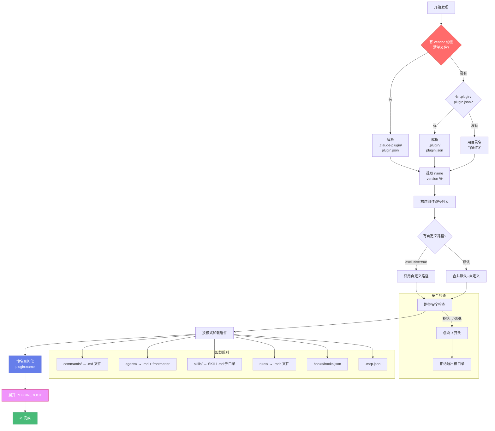
```mermaid
flowchart TD
    S[开始发现] --> M{有 vendor 前缀<br/>清单文件?}
    M -->|有| P1[解析<br/>.claude-plugin/<br/>plugin.json]
    M -->|没有| N{有 .plugin/<br/>plugin.json?}
    N -->|有| P2[解析<br/>.plugin/<br/>plugin.json]
    N -->|没有| P3[用目录名<br/>当插件名]

    P1 --> C1[提取 name<br/>version 等]
    P2 --> C1
    P3 --> C1

    C1 --> C2[构建组件路径列表]
    C2 --> C3{有自定义路径?}
    C3 -->|exclusive:true| C4a[只用自定义路径]
    C3 -->|默认| C4b[合并默认+自定义]

    C4a --> S1[路径安全检查]
    C4b --> S1

    S1 --> R[按模式加载组件]
    R --> NS[命名空间化<br/>plugin:name]
    NS --> PE[展开 PLUGIN_ROOT]
    PE --> Done[✅ 完成]

    subgraph 安全检查
        S1 -->|拒绝 ../ 逃逸| S2
        S2[必须 ./ 开头] --> S3[拒绝超出根目录]
    end

    subgraph 加载规则
        R1[commands/ → .md 文件]
        R2[agents/ → .md + frontmatter]
        R3[skills/ → SKILL.md 子目录]
        R4[rules/ → .mdc 文件]
        R5[hooks/hooks.json]
        R6[.mcp.json]
    end

    R --> R1 & R2 & R3 & R4 & R5 & R6

    style M fill:#ff6b6b,stroke:#c0392b,color:#fff
    style NS fill:#667eea,stroke:#5a67d8,color:#fff
    style PE fill:#f093fb,stroke:#d53f8c,color:#fff
    style Done fill:#48bb78,stroke:#38a169,color:#fff
```

插件的四步生命周期——从安装到激活：

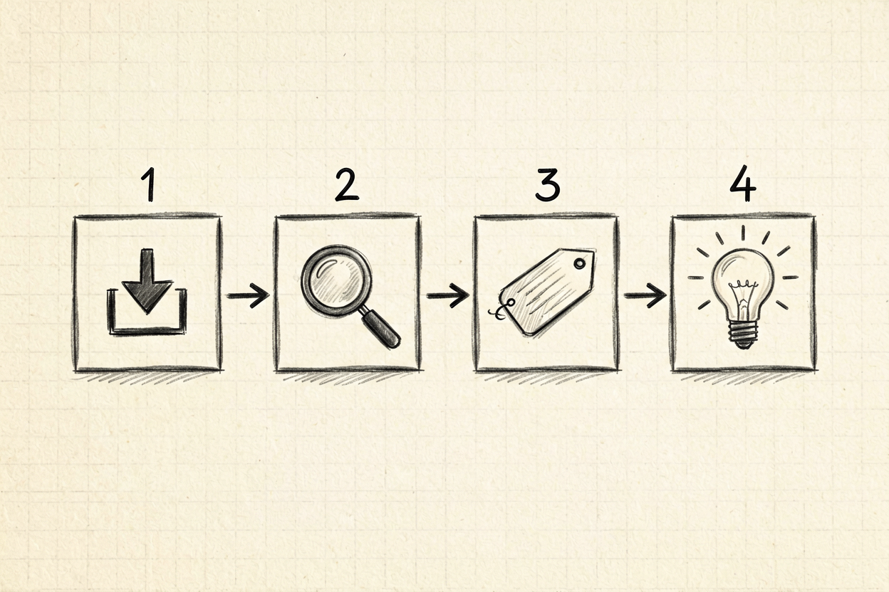
*图：插件的安装、发现、命名空间和激活流程*

### `${PLUGIN_ROOT}` 路径展开

插件内的所有配置文件中都可以使用 `${PLUGIN_ROOT}`，工具加载时自动替换为插件根目录的绝对路径。这个机制让插件可以**自包含**——所有路径引用都相对于自身，装到任何位置都能工作。

```json
{
  "mcpServers": {
    "db-server": {
      "command": "${PLUGIN_ROOT}/servers/db-server",
      "args": ["--config", "${PLUGIN_ROOT}/config.json"],
      "env": {
        "DB_PATH": "${PLUGIN_ROOT}/data"
      }
    }
  }
}
```

扩展规则：递归展开，嵌套引用也会被替换；逃逸检查保证路径不超出插件目录。

---

## 实战：把 CloudBase MCP 改成 Open Plugins 插件

前面讲了一堆理论，来点真实的。

我们最近在维护一个叫 **[CloudBase MCP](https://github.com/TencentCloudBase/CloudBase-MCP)** 的开源项目，给 AI 编程工具提供云接入能力——AI 模型调用、NoSQL/PostgreSQL 数据库、云函数、云托管、云存储、微信小程序对接等等。以前手动配 `.claude-plugin/`、`.codex-plugin/`、`.mcp.json`，每个工具一个配置，维护起来头大。这次正好借 Open Plugins 标准的东风，做了一次改造。

完整改造 PR：[TencentCloudBase/CloudBase-MCP#808](https://github.com/TencentCloudBase/CloudBase-MCP/pull/808)（+818 / -34）

> 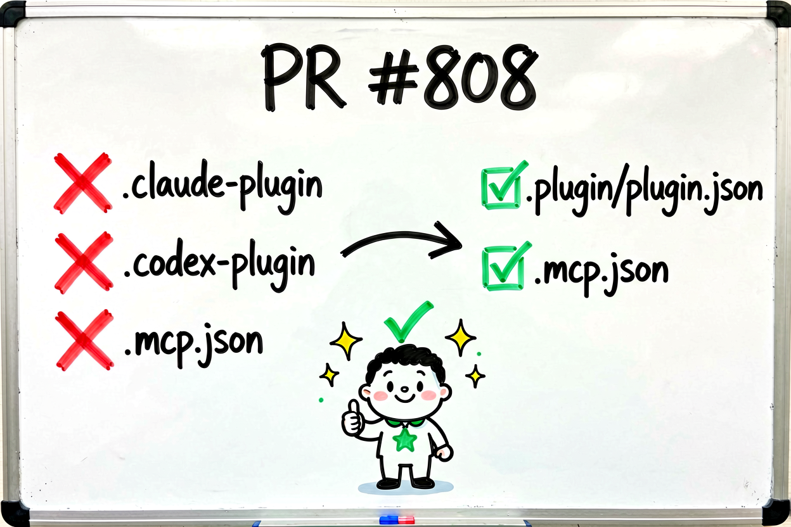
> *图：PR #808 改造前后对比——从 vendor 专属格式到通用插件标准*

### 改造前后对比

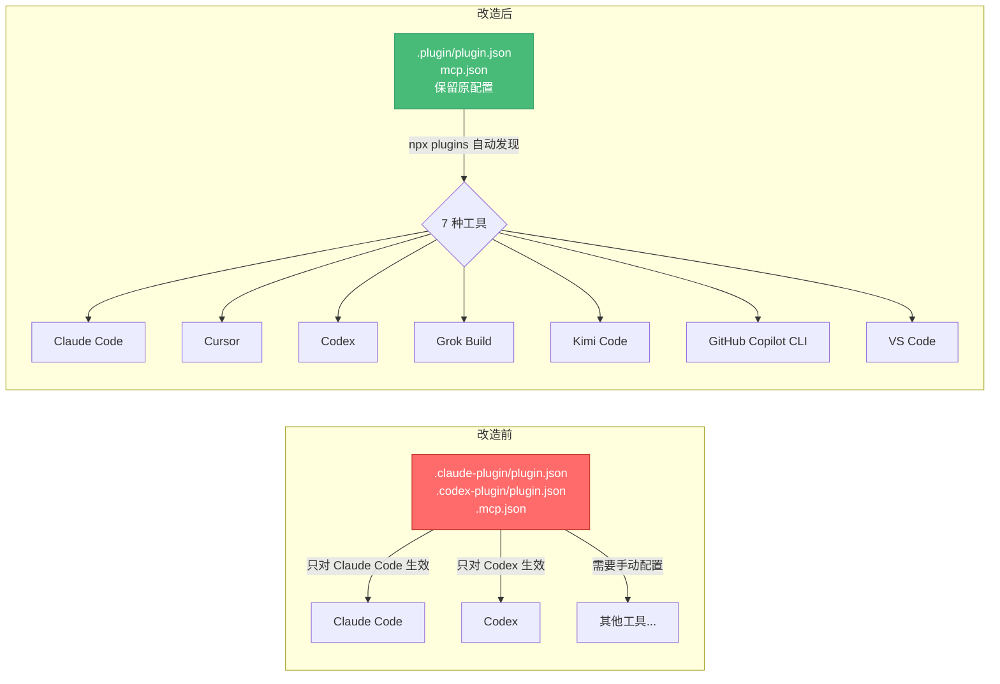
```mermaid
flowchart LR
    subgraph 改造前
        BEFORE[.claude-plugin/plugin.json<br/>.codex-plugin/plugin.json<br/>.mcp.json]
        BEFORE -->|只对 Claude Code 生效| CC[Claude Code]
        BEFORE -->|只对 Codex 生效| CX[Codex]
        BEFORE -->|需要手动配置| Other[其他工具...]
    end

    subgraph 改造后
        NOW[.plugin/plugin.json<br/>mcp.json<br/>保留原配置]
        NOW -->|npx plugins 自动发现| ALL{7 种工具}
        ALL --> ALL1[Claude Code]
        ALL --> ALL2[Cursor]
        ALL --> ALL3[Codex]
        ALL --> ALL4[Grok Build]
        ALL --> ALL5[Kimi Code]
        ALL --> ALL6[GitHub Copilot CLI]
        ALL --> ALL7[VS Code]
    end

    style BEFORE fill:#ff6b6b,stroke:#c0392b,color:#fff
    style NOW fill:#48bb78,stroke:#38a169,color:#fff
```

### plugin.json

按照 Open Plugins 规范 v1.0.0 的 closed schema，只保留规范允许的元数据字段：

```json
{
  "$schema": "https://open-plugins.com/schemas/1.0.0/plugin.schema.json",
  "name": "cloudbase",
  "version": "0.2.0",
  "description": "Tencent CloudBase — AI models, authentication, NoSQL/PostgreSQL databases, cloud functions, cloud storage, CloudRun backend services, and WeChat Mini Program integration.",
  "author": {
    "name": "Tencent CloudBase",
    "url": "https://cloudbase.net"
  },
  "homepage": "https://github.com/TencentCloudBase/cloudbase-mcp",
  "license": "MIT",
  "keywords": [
    "cloudbase", "tencent-cloud", "baas",
    "ai-model", "database", "cloud-function",
    "authentication", "storage", "cloudrun"
  ]
}
```

### mcp.json

MCP 服务器配置从 `.mcp.json` 复制到规范路径 `mcp.json`：

```json
{
  "mcpServers": {
    "cloudbase-mcp": {
      "command": "npx",
      "args": ["-y", "@cloudbase/cloudbase-mcp@latest"],
      "env": {}
    }
  }
}
```

### 自动化构建

写了 `build-open-plugin-spec.mjs` 构建脚本，从 `.claude-plugin/plugin.json` 自动生成产物。还加了 `--check` 模式跑在 CI 里——每次 PR 自动校验，防止改源码忘了更新。

```bash
# 生成产物
node scripts/build-open-plugin-spec.mjs

# CI 模式：只检查不写入
node scripts/build-open-plugin-spec.mjs --check
```

配了 GitHub Actions workflow（`.github/workflows/open-plugin-spec-check.yml`），PR 自动跑检查。

### 验收结果

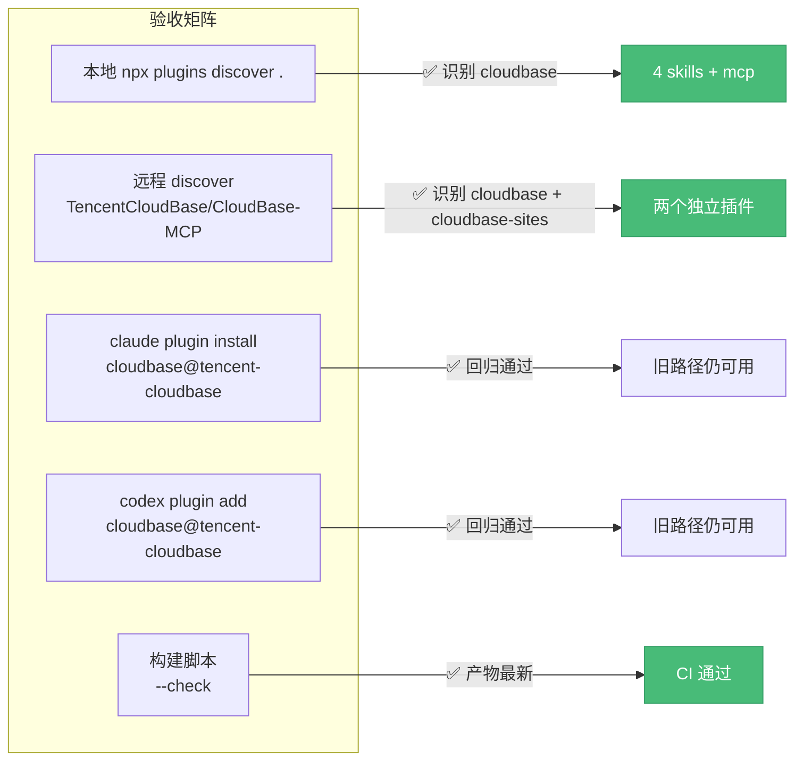
```mermaid
flowchart LR
    subgraph 验收矩阵
        CHECK1[本地 npx plugins discover .]
        CHECK2[远程 discover<br/>TencentCloudBase/CloudBase-MCP]
        CHECK3[claude plugin install<br/>cloudbase@tencent-cloudbase]
        CHECK4[codex plugin add<br/>cloudbase@tencent-cloudbase]
        CHECK5[构建脚本<br/>--check]
    end

    CHECK1 -->|✅ 识别 cloudbase| R1[4 skills + mcp]
    CHECK2 -->|✅ 识别 cloudbase + cloudbase-sites| R2[两个独立插件]
    CHECK3 -->|✅ 回归通过| R3[旧路径仍可用]
    CHECK4 -->|✅ 回归通过| R4[旧路径仍可用]
    CHECK5 -->|✅ 产物最新| R5[CI 通过]

    style R1 fill:#48bb78,stroke:#38a169,color:#fff
    style R2 fill:#48bb78,stroke:#38a169,color:#fff
    style R5 fill:#48bb78,stroke:#38a169,color:#fff
```

最大的成就感是一行命令装到所有工具：

```bash
npx plugins add TencentCloudBase/cloudbase-plugin
```

而且因为之前就已经在 `skills/` 目录下放了 4 个 Skill，`npx plugins discover` 自动把它们注册为命名空间下的命令：

| 组件 | 用户调用方式 |
|------|-------------|
| `skills/ai-model/` | `/cloudbase:ai-model` |
| `skills/cloudbase-data/` | `/cloudbase:cloudbase-data` |
| `skills/cloud-functions/` | `/cloudbase:cloud-functions` |
| `skills/mini-program/` | `/cloudbase:mini-program` |

不用多写一行配置，按规范放目录就行。

### 第一个坑：marketplace.json 冲突

PR #808 合进去之后，兴冲冲跑 `npx plugins add TencentCloudBase/CloudBase-MCP`，结果：

```bash
No plugins found. 2 remote plugin(s) not shown.
```

插件就在仓库里，但 CLI 说找不到。

查了半天发现原因：主仓库根目录有一个 `marketplace.json`，这是给 Claude Code 和 Codex 的 marketplace add 用的索引文件。`npx plugins` CLI 检测到它后，把整个仓库识别为 **marketplace**（多插件集合），拒绝安装其中的子目录插件。

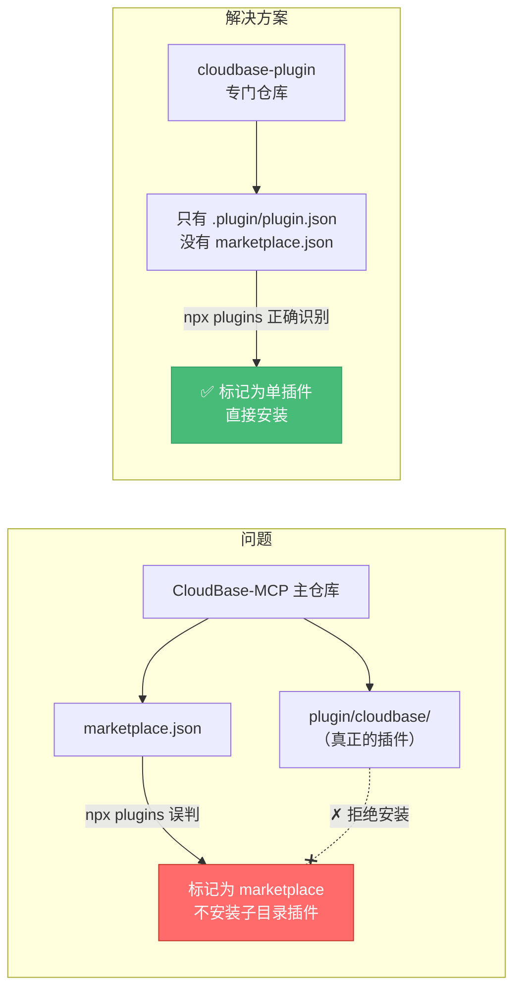
```mermaid
flowchart LR
    subgraph 问题
        REPO[CloudBase-MCP 主仓库] --> M[marketplace.json]
        M -->|npx plugins 误判| WRONG[标记为 marketplace<br/>不安装子目录插件]
        REPO --> SUB[plugin/cloudbase/<br/>（真正的插件）]
        SUB -.-x|✗ 拒绝安装| WRONG
    end

    subgraph 解决方案
        NEW_REPO[cloudbase-plugin<br/>专门仓库] --> NEW[只有 .plugin/plugin.json<br/>没有 marketplace.json]
        NEW -->|npx plugins 正确识别| RIGHT[✅ 标记为单插件<br/>直接安装]
    end

    style WRONG fill:#ff6b6b,stroke:#c0392b,color:#fff
    style RIGHT fill:#48bb78,stroke:#38a169,color:#fff
```

**解决方案：创建专门插件仓库**

参考 Vercel（`vercel/vercel-plugin`）和 Supabase（`supabase-community/supabase-plugin`）的做法——建专门的插件仓库，根目录只有 `.plugin/plugin.json`，没有 `marketplace.json`，让 CLI 识别为单插件。

创建了两个仓库：

| 仓库 | 安装命令 | 内容 |
|------|---------|------|
| `TencentCloudBase/cloudbase-plugin` | `npx plugins add TencentCloudBase/cloudbase-plugin` | 28 skills + MCP + 5 commands + 2 agents + hooks |
| `TencentCloudBase/cloudbase-sites-plugin` | `npx plugins add TencentCloudBase/cloudbase-sites-plugin` | 1 skill + MCP + hooks |

内容从主仓库 `plugin/cloudbase/` 和 `plugin/cloudbase-sites/` 自动同步，**同步时排除 `marketplace.json`**——这是关键。

**自动化同步机制**

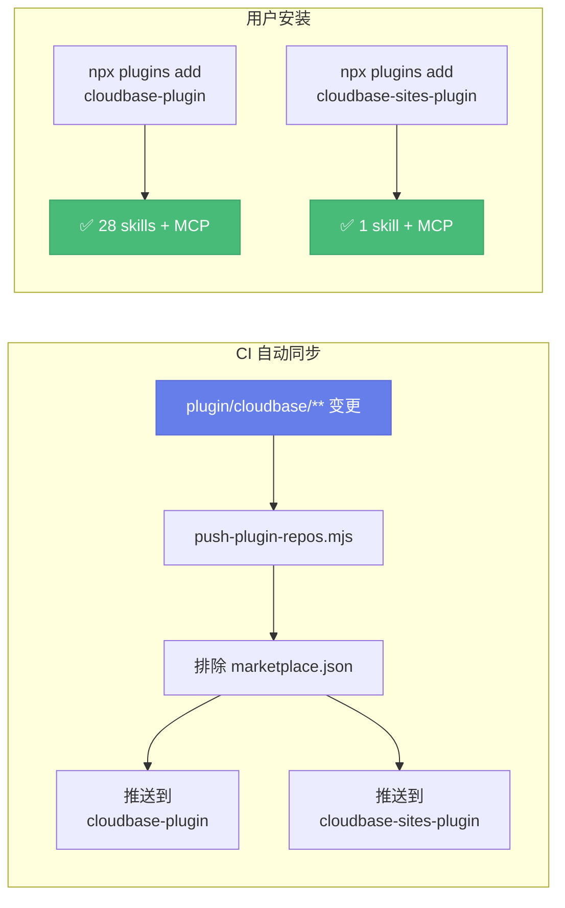
```mermaid
flowchart LR
    subgraph CI 自动同步
        TRIGGER[plugin/cloudbase/** 变更] --> BUILD[push-plugin-repos.mjs]
        BUILD --> EXCLUDE[排除 marketplace.json]
        EXCLUDE --> PUSH1[推送到<br/>cloudbase-plugin]
        EXCLUDE --> PUSH2[推送到<br/>cloudbase-sites-plugin]
    end

    subgraph 用户安装
        USER1[npx plugins add<br/>cloudbase-plugin] --> INST1[✅ 28 skills + MCP]
        USER2[npx plugins add<br/>cloudbase-sites-plugin] --> INST2[✅ 1 skill + MCP]
    end

    style TRIGGER fill:#667eea,stroke:#5a67d8,color:#fff
    style INST1 fill:#48bb78,stroke:#38a169,color:#fff
    style INST2 fill:#48bb78,stroke:#38a169,color:#fff
```

新增了这些文件：

| 文件 | 作用 |
|------|------|
| `scripts/push-plugin-repos.mjs` | 构建插件仓库产物到 `.plugin-repo-output/` |
| `.github/workflows/push-plugin-repos.yaml` | CI 自动同步 workflow |
| `scripts/build-open-plugin-spec.mjs`（扩展） | 同时处理 cloudbase + cloudbase-sites |
| `plugin/cloudbase-sites/.plugin/plugin.json` | cloudbase-sites 的 Open Plugin Spec manifest |
| `plugin/cloudbase-sites/mcp.json` | cloudbase-sites 的 MCP 配置 |

验证全部通过：

```bash
npx plugins discover TencentCloudBase/cloudbase-plugin --remote
# → ✅ Found 1 local plugin(s), 28 skills, 5 cmds, 2 agents, hooks

npx plugins add TencentCloudBase/cloudbase-plugin --target cursor --scope local
# → ✅ Installed

npx plugins discover TencentCloudBase/cloudbase-sites-plugin --remote
# → ✅ Found 1 local plugin(s), 1 skill, hooks
```

现在的安装命令统一指向专门仓库：

```bash
# 主插件
npx plugins add TencentCloudBase/cloudbase-plugin

# Sites 插件
npx plugins add TencentCloudBase/cloudbase-sites-plugin
```

这个坑的核心教训是：**Open Plugins 会把根目录有 `marketplace.json` 的仓库当作插件集合，而非单插件。** 如果你的仓库本身就有多个发布物（像 CloudBase-MCP 既有 MCP 服务器又有插件），需要建专门的插件仓库。Vercel 和 Supabase 也是这样做的。

---

## Hook 系统：比你以为的更深

Hooks 是 Open Plugins 里最灵活的组件——它可以拦截整个 agent 工作流的各个生命周期点。不过要注意：**Hooks 不在 Spec v1 标准之内**，支不支持完全看宿主工具。Claude Code 和 Copilot CLI 支持最完整，VS Code 和 Kimi Code 就不认（静默忽略，不报错）。

下面讲的事件模型来自 Open Plugin Spec 的 Hooks 组件规范——如果你的宿主工具支持 Hooks，这就是它的工作方式。

> 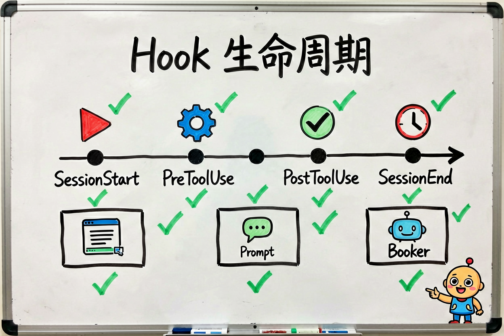
> *图：Hook 系统——从 SessionStart 到 SessionEnd 的完整事件链*

### 事件全景

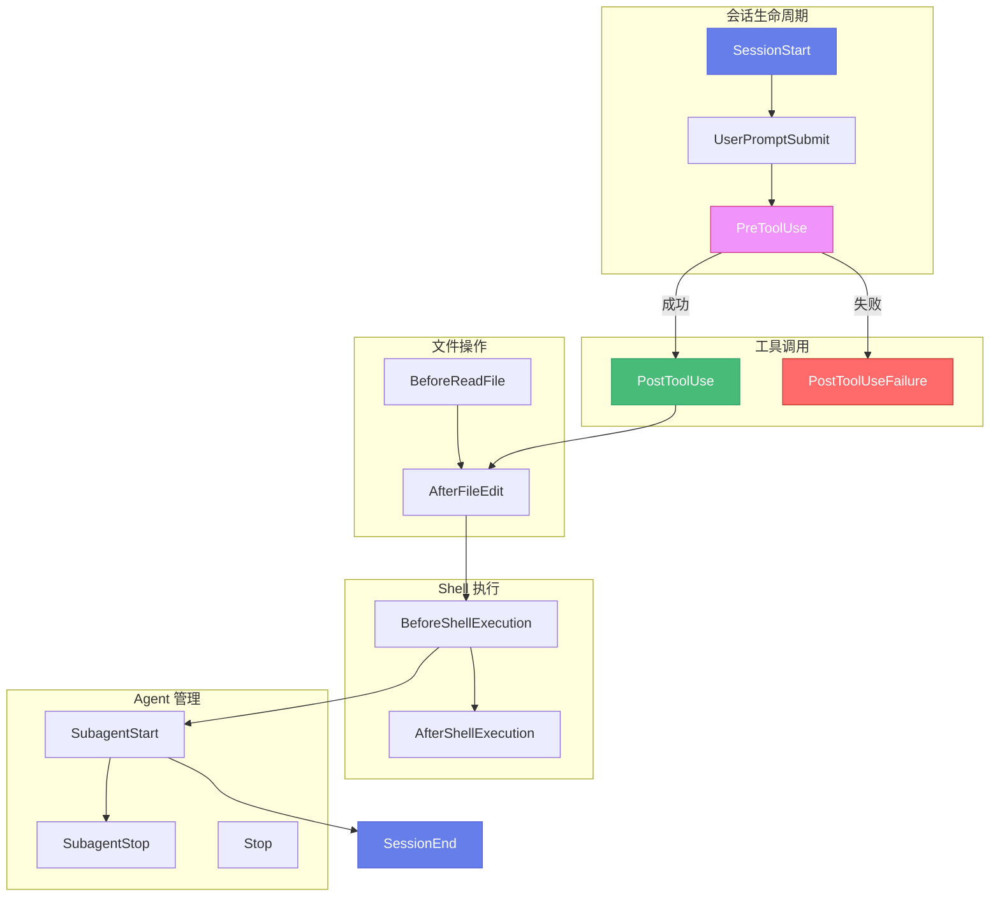
```mermaid
flowchart TD
    subgraph 会话生命周期
        SS[SessionStart] --> US[UserPromptSubmit]
        US --> PTU[PreToolUse]
    end

    subgraph 工具调用
        PTU -->|成功| POT[PostToolUse]
        PTU -->|失败| POF[PostToolUseFailure]
    end

    subgraph 文件操作
        BRF[BeforeReadFile] --> AFE[AfterFileEdit]
    end

    subgraph Shell 执行
        BSE[BeforeShellExecution] --> ASE[AfterShellExecution]
    end

    subgraph Agent 管理
        SAS[SubagentStart] --> SAS2[SubagentStop]
        ST[Stop]
    end

    POT --> AFE
    AFE --> BSE
    BSE --> SAS
    SAS --> SE[SessionEnd]

    style SS fill:#667eea,stroke:#5a67d8,color:#fff
    style PTU fill:#f093fb,stroke:#d53f8c,color:#fff
    style POT fill:#48bb78,stroke:#38a169,color:#fff
    style POF fill:#ff6b6b,stroke:#c0392b,color:#fff
    style SE fill:#667eea,stroke:#5a67d8,color:#fff
```

| 事件 | 触发时机 | 匹配器作用域 |
|------|---------|-------------|
| `PreToolUse` | agent 调用工具**前** | 工具名 |
| `PostToolUse` | 工具调用**成功后** | 工具名 |
| `PostToolUseFailure` | 工具调用**出错时** | 工具名 |
| `BeforeReadFile` | 读取文件**前** | 文件路径 |
| `AfterFileEdit` | 文件写入**后** | 文件路径 |
| `BeforeShellExecution` | 执行 shell 命令**前** | 命令字符串 |
| `AfterShellExecution` | shell 命令**完成后** | 命令字符串 |
| `SessionStart` | 会话**开始时** | — |
| `SessionEnd` | 会话**结束时** | — |
| `UserPromptSubmit` | 用户**提交提示词** | — |
| `Stop` | agent **尝试停止** | — |
| `SubagentStart` | 子 agent **启动** | — |
| `SubagentStop` | 子 agent **结束** | — |

### 三种 Action 类型

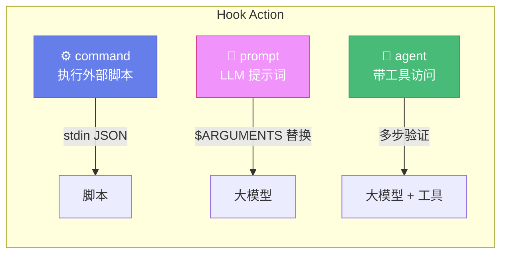
```mermaid
flowchart LR
    subgraph Hook Action
        direction TB
        CMD["⚙️ command<br/>执行外部脚本"] -->|stdin JSON| SCRIPT[脚本]
        PRMPT["💬 prompt<br/>LLM 提示词"] -->|$ARGUMENTS 替换| LLM[大模型]
        AGT["🤖 agent<br/>带工具访问"] -->|多步验证| LLM2[大模型 + 工具]
    end

    style CMD fill:#667eea,stroke:#5a67d8,color:#fff
    style PRMPT fill:#f093fb,stroke:#d53f8c,color:#fff
    style AGT fill:#48bb78,stroke:#38a169,color:#fff
```

**command** — 执行外部脚本，事件上下文通过 stdin JSON 传入：

```json
{ "type": "command", "command": "${PLUGIN_ROOT}/scripts/lint.sh" }
```

**prompt** — 向 LLM 发送提示词，`$ARGUMENTS` 替换为事件上下文：

```json
{ "type": "prompt", "prompt": "Review the change: $ARGUMENTS" }
```

**agent** — 类似 prompt 但带工具访问权限，可以做多步验证：

```json
{ "type": "agent", "prompt": "Verify style guide compliance: $ARGUMENTS" }
```

### 执行模型

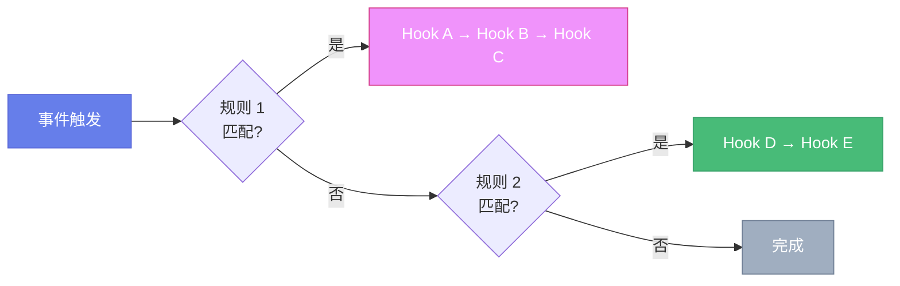
```mermaid
flowchart LR
    E[事件触发] --> R1{规则 1<br/>匹配?}
    R1 -->|是| H1[Hook A → Hook B → Hook C]
    R1 -->|否| R2{规则 2<br/>匹配?}
    R2 -->|是| H2[Hook D → Hook E]
    R2 -->|否| Done[完成]

    style E fill:#667eea,stroke:#5a67d8,color:#fff
    style H1 fill:#f093fb,stroke:#d53f8c,color:#fff
    style H2 fill:#48bb78,stroke:#38a169,color:#fff
    style Done fill:#a0aec0,stroke:#718096,color:#fff
```

- 多个规则可以匹配同一个事件，**全部执行**
- 同一规则内的 hooks **按数组顺序串行执行**
- 实现端**应该设置超时**
- 失败**不能 crash 宿主工具**

---

## 协议集成：如何让你的工具支持 Open Plugins

如果你是**工具开发者**，想让自己开发的 AI 编程工具兼容 Open Plugins，需要实现什么？

核心就五条，一条不能少：

### 五大核心能力

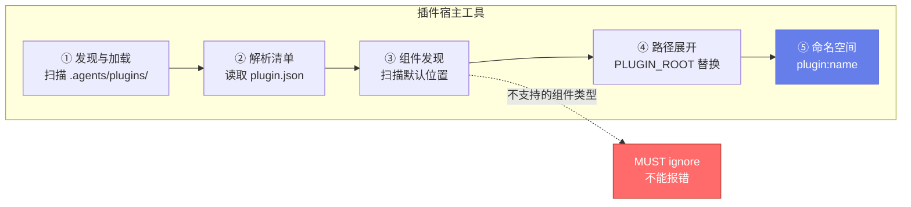
```mermaid
flowchart LR
    subgraph 插件宿主工具
        direction TB
        C1[① 发现与加载<br/>扫描 .agents/plugins/]
        C2[② 解析清单<br/>读取 plugin.json]
        C3[③ 组件发现<br/>扫描默认位置]
        C4[④ 路径展开<br/>PLUGIN_ROOT 替换]
        C5[⑤ 命名空间<br/>plugin:name]
    end

    C1 --> C2 --> C3 --> C4 --> C5
    C3 -.->|不支持的组件类型| IGNORE[MUST ignore<br/>不能报错]

    style C5 fill:#667eea,stroke:#5a67d8,color:#fff
    style IGNORE fill:#ff6b6b,stroke:#c0392b,color:#fff
```

### 不同工具的集成方式

每个工具现有的插件机制不同，`npx plugins` 在安装时做了一层翻译——把通用 `.plugin/` 格式转成各工具自己的原生格式：

| 工具 | 安装目标 | 集成机制 |
|------|---------|---------|
| **Claude Code** | `.claude/plugins/` | Skills 和配置直接兼容 |
| **Cursor** | `.cursor/plugins/` | 通过 Rules + MCP 机制注册 |
| **Codex** | 市场入口 `vercel@openai-curated` | 通过内置 Vercel 集成 |
| **Grok Build** | `grok plugin install` | 原生插件命令 + Claude Code 兼容层 |
| **Kimi Code** | Kimi 插件存储 | `/plugins` TUI 重载后可见 |
| **GitHub Copilot CLI** | `copilot plugin marketplace add` | 注册源后 `plugin add plugin@marketplace` |
| **VS Code** | `chat.pluginLocations` 设置 | 需开启 `chat.plugins.enabled`（Preview） |

### 安全防护模型

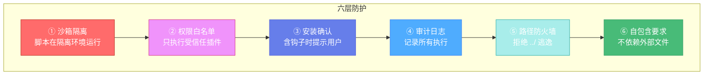
```mermaid
flowchart TD
    subgraph 六层防护
        L1["① 沙箱隔离<br/>脚本在隔离环境运行"]
        L2["② 权限白名单<br/>只执行受信任插件"]
        L3["③ 安装确认<br/>含钩子时提示用户"]
        L4["④ 审计日志<br/>记录所有执行"]
        L5["⑤ 路径防火墙<br/>拒绝 ../ 逃逸"]
        L6["⑥ 自包含要求<br/>不依赖外部文件"]
    end

    L1 --> L2 --> L3 --> L4 --> L5 --> L6

    style L1 fill:#ff6b6b,stroke:#c0392b,color:#fff
    style L2 fill:#f093fb,stroke:#d53f8c,color:#fff
    style L3 fill:#667eea,stroke:#5a67d8,color:#fff
    style L4 fill:#4facfe,stroke:#3b82f6,color:#fff
    style L5 fill:#a8edea,stroke:#38b2ac,color:#fff
    style L6 fill:#48bb78,stroke:#38a169,color:#fff
```

---

## 一些感受

Open Plugins 让我想起十年前 npm 刚流行的时候。JavaScript 的包管理也是一团乱麻：AMD、CommonJS、UMD、IIFE……每个项目有自己的一套。后来 npm + ES Modules 统一了标准，整个生态起飞了。AI 编程工具的插件生态，现在就处在那"前 npm"时代。

这次给 CloudBase MCP 做改造是个挺有意思的过程。从 `npx plugins discover` 识别出插件，到一行命令装到所有工具，那种"写一次到处用"的感觉，恰好就是这个标准想解决的问题。

> 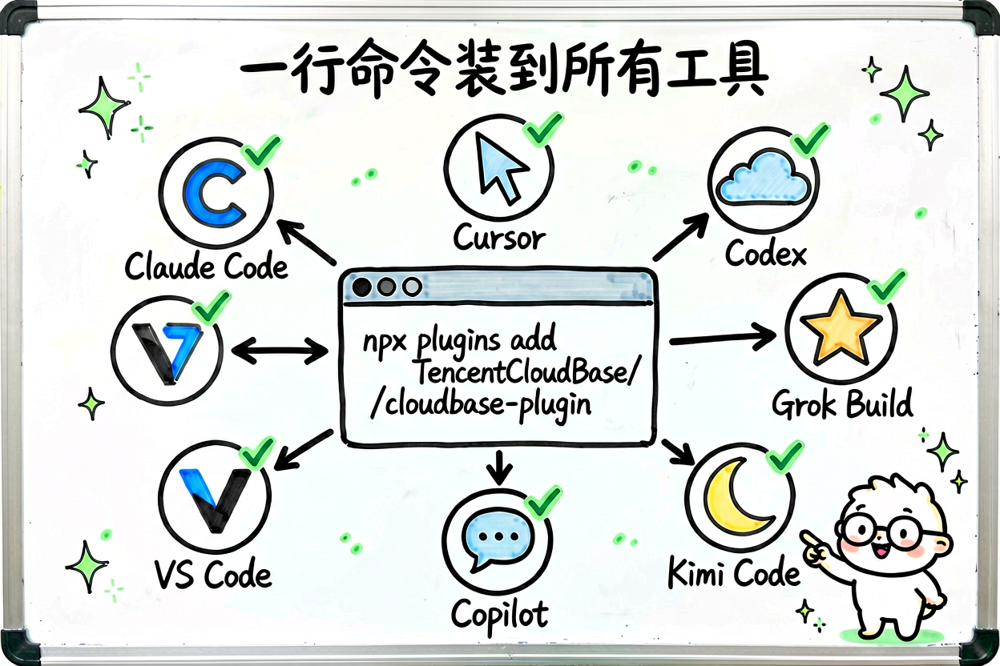
> *图：npx plugins add TencentCloudBase/cloudbase-plugin——一行命令装到所有工具*

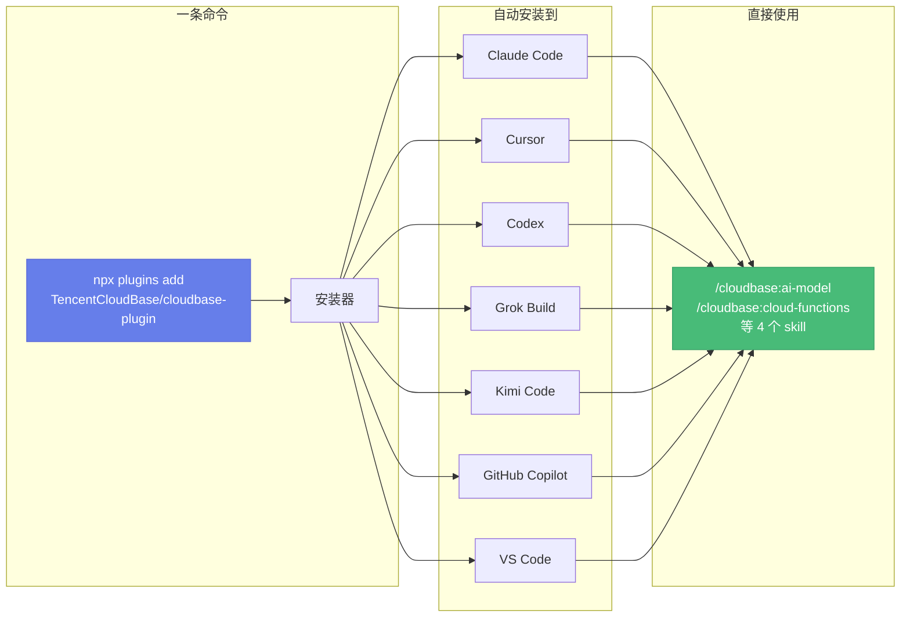
```mermaid
flowchart LR
    subgraph 一条命令
        CMD[npx plugins add<br/>TencentCloudBase/cloudbase-plugin] --> INSTALL
    end

    subgraph 自动安装到
        INSTALL[安装器] --> T1[Claude Code]
        INSTALL --> T2[Cursor]
        INSTALL --> T3[Codex]
        INSTALL --> T4[Grok Build]
        INSTALL --> T5[Kimi Code]
        INSTALL --> T6[GitHub Copilot]
        INSTALL --> T7[VS Code]
    end

    subgraph 直接使用
        T1 & T2 & T3 & T4 & T5 & T6 & T7 --> USE["/cloudbase:ai-model<br/>/cloudbase:cloud-functions<br/>等 4 个 skill"]
    end

    style CMD fill:#667eea,stroke:#5a67d8,color:#fff
    style USE fill:#48bb78,stroke:#38a169,color:#fff
```

如果你也做 AI 编程工具的扩展，推荐了解一下 Open Plugins 规范。好消息是不需要搞多复杂，只要在项目里加个 `.plugin/plugin.json`，你的插件就能被 7 种工具识别。我们的改造也就四百来行代码，两天不到搞完。

最后，如果你在用 AI 编程工具做云开发——无论是 Claude Code、Cursor、Codex、Grok Build，还是 VS Code、Kimi Code、GitHub Copilot——可以试试我们的插件：

```bash
# 主插件（推荐）
npx plugins add TencentCloudBase/cloudbase-plugin

# Sites 部署插件
npx plugins add TencentCloudBase/cloudbase-sites-plugin
```

装完后直接跟 Claude 说「查一下我的云函数」或者「帮我部署静态网站」，它就能通过 MCP 协议直接操作云资源了。支持 AI 模型调用、认证管理、NoSQL/PostgreSQL 数据库、云函数、云托管、云存储、微信小程序对接……比手动复制粘贴舒服不少。

---

## 参考链接

- [Open Plugins 官网](https://open-plugins.com)
- [plugins npm 包](https://www.npmjs.com/package/plugins) — `npx plugins add` 的安装器
- [Agent Skills 规范](https://agentskills.io)
- [Model Context Protocol](https://modelcontextprotocol.io)
- [CloudBase Plugin](https://github.com/TencentCloudBase/cloudbase-plugin) — Open Plugins 标准插件仓库
- [CloudBase Sites Plugin](https://github.com/TencentCloudBase/cloudbase-sites-plugin) — Sites 插件仓库
- [CloudBase MCP](https://github.com/TencentCloudBase/CloudBase-MCP) — 腾讯云开发 MCP 插件
- [PR #808: CloudBase MCP 集成 Open Plugin 规范](https://github.com/TencentCloudBase/CloudBase-MCP/pull/808)
