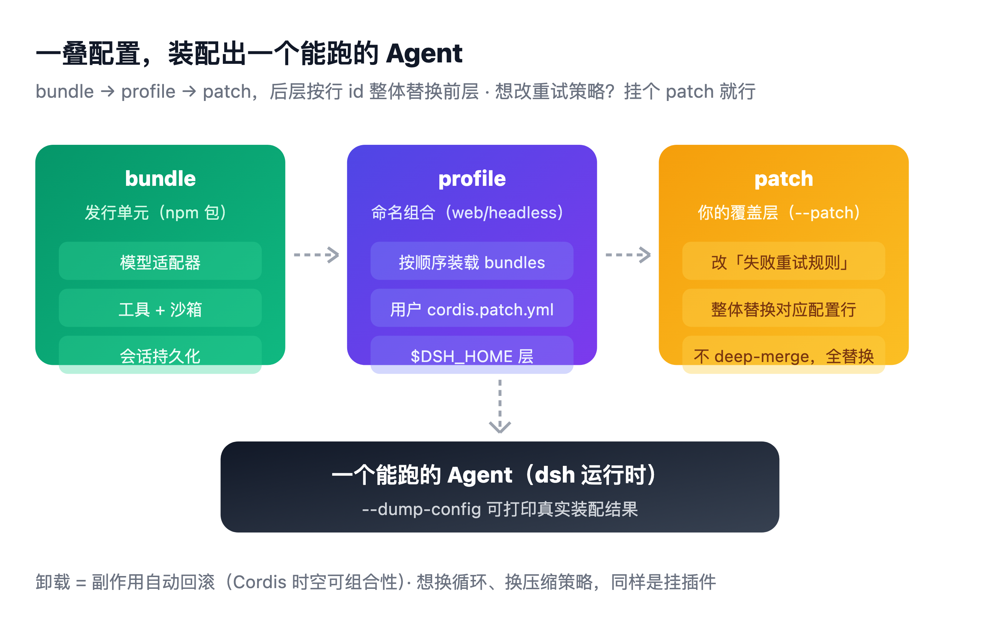
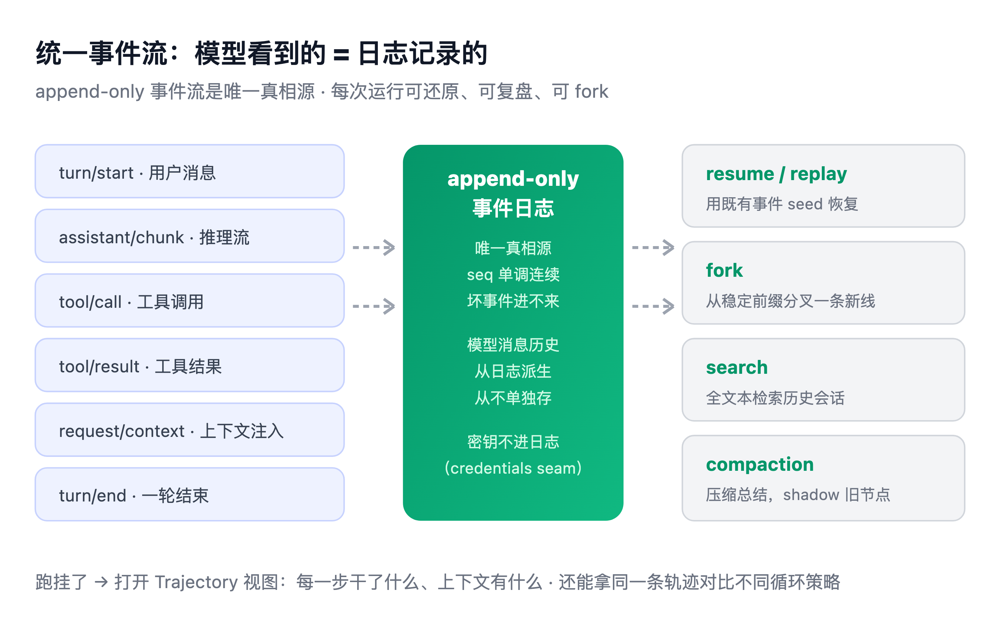
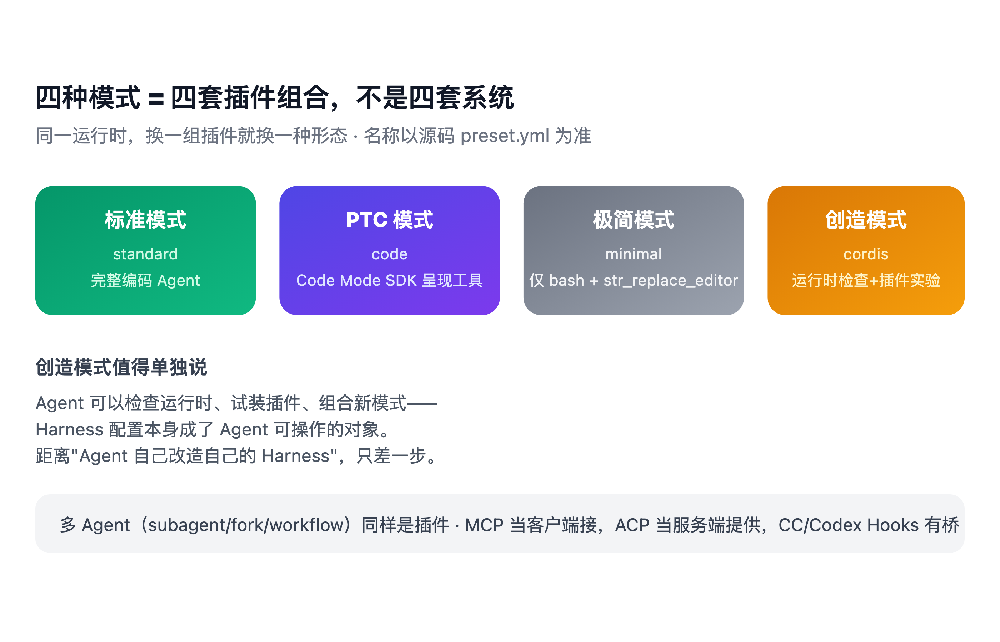
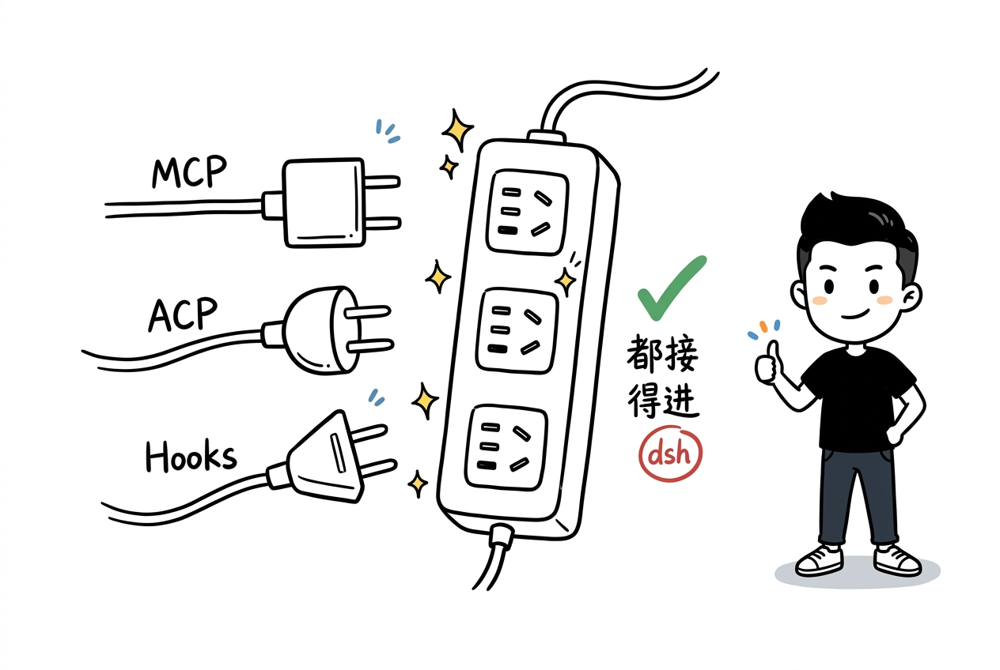

> 模型是灵魂，Harness 是身体

*图：Agent = Model + Harness。模型负责想，Harness 负责做*

大家好，我是 Booker。

今天拆 DeepSeek 昨天（2026-08-13）开源的一个东西：**DeepSeek Harness**，命令行叫 `dsh`。

这篇不抄二手解读。我直接扒了源码和官方文档，讲它三个真正的设计决策，外加泼冷水和诚实记录试跑踩坑。

{/* truncate */}

## 先问三个问题

三个场景，你大概率踩过至少一个：

**第一个。** 你让 Agent 跑一个长任务，跑了很久，最后挂了。你能说出它死在哪个工具调用上吗？当时上下文里到底有什么，你还原得出来吗？

**第二个。** 你想给 Agent 加一条规则："工具调用失败后，自动再试一次。"这条规则，你能加进去吗？还是只能去改框架源码？

**第三个。** 你想让 3 个 agent 分工：一个查资料、一个写代码、一个 review。这三个 agent 可能来自不同生态——一个用 MCP，一个用 ACP，一个用 Hooks。你能把它们接到一块吗？

这三个问题，是这篇文章要拆的东西。

DeepSeek 开源的 dsh，答案就三个字：**全是插件**。但"全是插件"这四个字，很多人理解浅了。往下看。

## 模型不会做事，它只会生成文字

先从最朴素的地方开始。

你用 ChatGPT 问一个问题，它回答你。这时候你脑子里没有"Harness"这个概念，也不需要。它就是一个会生成文字的东西：你给一句话，它给你下一句话。

真正的麻烦，从"让它做事"开始。

比如你说："帮我改一下这个项目的代码。"要改代码，它得先读文件、找到报错的地方、改掉、再跑测试。这些动作，模型一个都做不了。

模型只会一件事：**预测下一个 token 该是什么**。它生成的不是"改代码的动作"，而是一段描述"应该怎么改"的文字。

那谁来真的读文件、真的跑命令？

答案：外面得有一层东西，把"读文件""跑命令"这些真实动作，包装成模型能"调用"的形式——模型说"我要读 src/main.ts"，这层就去读，把内容拿回来喂给模型。

**这一层，就是 Harness。**

官方主页有句话说得比我好：

> "模型是 Agent 的灵魂。Harness 给予 Agent 理解环境、使用工具，并在真实场景中持续工作的能力。"

大多数人不知道这层存在。我们习惯说"换个模型就是换个 Agent"。但同一个模型装进不同的 Harness，效果能差出一大截——工具怎么暴露、上下文怎么管理、循环怎么转，全是 Harness 决定的。

## 事情一复杂，这层要管的越来越多

如果只是"读一个文件"，一层薄薄的包装就够了。但真实任务不是这样。

回到"改代码"那个例子。一次真实的改代码任务里，会发生这些事：

- 模型说"我要读文件"，得先问一句：有权限读吗？这是沙箱和权限的事。
- 读回来的内容可能很长，长到装不下。得裁剪、压缩再喂回去。这是上下文层的事。
- 改完代码要跑测试。测试失败了，要不要再试一次？试几次？这是循环层和重试策略的事。
- 整个过程每一步，都得记下来。不然跑挂了，你根本不知道它死在哪。这是日志和追溯的事。
- 这些能力，是给 CLI 用的、还是 Web 界面、还是给 IDE 当后端？这是入口形态的事。

每一件事，都需要有人替模型做决定。这些决定逻辑，全都在 Harness 里。

*图：三个真实痛点，对应 dsh 的三个机制*

最常见的三个坑，你用 Claude Code、Codex、Cursor 的时候应该都撞过：

**坑一：Agent 是黑盒。** 长任务跑挂了，说不清死在哪个调用上，也还原不出模型当时看到了什么上下文。

**坑二：框架是写死的壳。** 想改"失败后怎么重试""循环怎么转"？改不了，只能改框架源码，或者等官方下个版本。

**坑三：多 Agent 接不到一块。** MCP 的、ACP 的、Hooks 的各玩各的，subagent 协作没有统一编排，都得自己造轮子。

这三件事，不是 DeepSeek 发明的痛点，是全行业共同的。dsh 的价值在于：它给这三个坑，都给出了**能落地的机制答案**。

## dsh 的第一个设计决策：连"循环怎么转"都是插件

先纠正一个我自己的说法：很多人（包括最初的我）以为"一切皆插件"就是"能加工具、能加技能"。不是。dsh 的插件化深得多。

我扒源码的时候，在 `packages/core/agent-loop` 的 README 里看到一句话，是理解 dsh 的关键：

> "这是整个 harness 里唯一包含具体循环逻辑的包。其他一切都是抽象服务或针对扩展点的插件——新行为应该进入插件，而不是进入这里。"

翻译一下：**连"Agent 循环怎么转"本身，都只是一个具体的插件（agent-loop），不是框架内核。** 模型适配器、工具注册表、会话日志、沙箱、UI、调度——在 dsh 里全是插件，通过 Cordis 这个框架挂到一棵插件树上。

怎么组装？用 `bundle → profile → patch` 三层配置：

*图：一叠配置，装配出一个能跑的 Agent*

- **bundle**：发行单元（npm 包），每个 bundle 声明自己贡献哪些配置行
- **profile**：具名组合，列出叠哪些 bundle（`web`、`headless` 是官方模板）
- **patch**：你的覆盖层，按行 id 整体替换某条配置

想改"失败后重试"？不用改源码。挂一个 patch，把那条规则整体换掉。想换上下文压缩策略？同样是挂插件。

而且这背后不是"能挂就能挂"的野路子。Cordis 有一套形式化理论（时空可组合性），核心保证是：**插件卸载时，它装的副作用全部回滚，系统像没装过一样**。没有这个保证，插件化就是玩具；有了它，深度替换才是可靠的工程。

`dsh --profile web --dump-config` 能打印你机器实际启动的插件树——每一行都是可替换的。

## dsh 的第二个设计决策：PTC 不是"省次数"，是"重新定义模型看到的工具"

这个是我觉得 dsh 最有想法的部分，也是很多人没讲透的部分。

先说我最初的理解错在哪：我以为 PTC（程序化工具调用）就是"让模型写段程序代替多次工具调用"。方向对，但浅了。

源码里真相是这样：

**PTC 模式（官方叫 PTC 模式，不是"Code Mode"）下，模型能看到的工具面整个变了。**

工具注册表还在，但呈现层（tool-presentation）换成了 `code`：

- 模型**只能看到** `run_code` 一个工具，加一个生成的 TypeScript SDK
- 模型**只能直接调** `run_code`。它要是直接调用其他工具，在执行创建那一刻就被解析成 `UNKNOWN_TOOL`——而且是在审批、守卫之前，因为"不该观察或批准一个注定失败的调用"
- 报错信息还贴心指路："只有 run_code 可以直接调——请在 run_code 程序内部调用 xxx"

这背后有一个设计不变量，叫 **announced surface = callable surface**（宣布的表面 = 可调用的表面）。模型看到的工具，必须和它能调用的工具完全一致。

*图：传统 5 次往返 vs PTC 1 段程序*

那"5 次往返变 1 次"是什么原理？看 `code` preset 的配置注释，官方原话：

> "模型针对生成的 SDK 写一段 TypeScript 程序，`run_code` 执行它——所以本来要 5 次往返的序列变成 1 次。"

关键设计是这三条：

1. **SDK 是确定性的**。每个可见工具都有精确的参数类型和输出类型（`ToolArgsMap`/`ToolOutputMap`），模型写的程序不会"猜"工具签名。
2. **中间值只在执行环境里**。SDK 里的绑定调用结果、日志、中间计算，始终只在 worker 线程里，**只有程序最终的 logs 和返回值回到模型上下文**。省上下文是这么省的。
3. **程序里的工具调用仍然走完整流水线**。沙箱、审批、超时、日志，一个不落。不是"绕过去"，是"压缩往返"。

## dsh 的第三个设计决策：模型看到的一切，都被记下来

黑盒问题怎么解？dsh 的做法很朴素但很硬：

**凡是进到模型请求里的内容，必须能从日志里重建出来。**

*图：模型看到的 = 日志记录的，可还原、可复盘、可 fork*

实现上，会话是一个 append-only 的 `SessionEvent` 事件流，是整个交互历史的**唯一真相源**。模型的消息历史不是单独存的，是从日志里**派生**的。

它记录什么？系统提示词、思维链、工具调用与结果、子 Agent 调度、每一次上下文注入。官方把这叫一条不变量：**model-visible ⟺ logged**（模型可见的 ⟺ 已记录的）。

这意味着：长任务跑挂了，打开 Trajectory 视图，能按来源看每一步干了什么、当时上下文里有什么。还能 fork 一条线重跑，或者 replay 复盘。

对喜欢折腾的人来说，还有个隐藏价值：你可以拿同一条任务轨迹，对比不同循环策略、不同工具实现哪个效果更好——这在以前基本做不到。

还有一个细节：密钥不进日志。凭证走独立的 credentials seam，日志里只有引用（环境变量名），没有值。

## 四种模式，其实是四套插件组合

dsh 的官方四种模式，名称容易记错，我核实过源码 `preset.yml`：

*图：标准 / PTC / 极简 / 创造，四套插件组合*

| 模式 | 官方名 | 是什么 |
|---|---|---|
| **标准模式** | standard | 功能完整的编码 Agent：文件编辑、Shell、文件与网页检索、Skills、计划、目标、子代理、工作流 |
| **PTC 模式** | code | 标准模式全部能力，但通过 Code Mode SDK 呈现工具（就是上一节讲的那个） |
| **极简模式** | minimal | 只有两个工具：持久 bash + str_replace_editor。官方注释："用于最小化环境下的模型基准测试" |
| **创造模式** | cordis | 标准模式全部能力 + 运行时检查 + 插件实验 + preset 创作指导 |

注意两个点：

**极简模式的存在，说明 DeepSeek 自己就在意 benchmark。** 但它 BENCHMARK.md 里只写了"怎么跑"，没公开结果——这个反差后面讲。

**创造模式是最有想象力的。** 它带一个 `tool-cordis` 插件，Agent 可以检查自己运行时的插件树、挂载/卸载模型自己写的插件。这等于说：**Harness 的配置本身，成了 Agent 可操作的对象**。距离"Agent 自己改造自己的 Harness"，只差一步。

*图：MCP / ACP / Hooks，都接得进 dsh*

多 Agent 和生态兼容：subagent、fork、workflow 都是插件；MCP 能当客户端接，ACP 能当服务端提供，Claude Code 和 Codex 的 Hooks 有桥——你已有的钩子脚本不用重写。

## 它到底新在哪

口说无凭。我把 dsh 和三个主流对象做了对比：Claude Code、Codex CLI、OpenHands。

*图：五轴对比——插件化 / 沙箱 / 可追溯 / 多模式 / 开源*

几个关键差异：

- **插件化深度**：Claude Code 有 Hooks 和 MCP，Codex 有 AGENTS.md 配置，OpenHands 有 skills。但**没有任何一家把 Agent 主循环本身做成可替换插件**。dsh 是第一个。
- **沙箱**：Claude Code 和 Codex 以权限审批为主，OpenHands 是 Docker 沙箱。dsh 做了三平台原生隔离（Linux Landlock/bwrap、macOS Seatbelt、Windows ACL），三档权限（read-only / workspace-write / danger-full-access）。而且"partial 如实上报"——做不到完整的平台会明说 partial，不装。
- **可追溯**：各家都有日志，但 dsh 把"模型看到的 = 日志记录的"做成引擎级不变量，不是产品层设计。
- **开源**：Claude Code 闭源，Codex 开源，dsh 是 MIT。发布当天 star 冲到 17.8k+（我写这篇时已过这个数）。

一句话判读：**在"把 Agent 拆开"这件事上，dsh 走得比谁都远。**

## 战略：DeepSeek 到底想干什么

光看技术不够，得看人。

dsh 团队负责人是**崔添翼（@tianyi）**，前 Jane Street 量化交易 9 年，联创过 TSY Capital。媒体（36氪）的解读是："DeepSeek 用做交易系统的严谨，来做 Agent 执行层。"

这个背景不是八卦，它解释了 dsh 的很多设计：

- 对"可追溯"的执念（交易系统最怕说不清哪笔错了）
- 对"fail-loud 不静默降级"的坚持（provider 缺失、事件类型未知，都是 loud reject）
- 对"工程门禁"的苛刻（后面说）

再看时机：dsh 发布当天，DeepSeek 还发了 **V4-Pro**。同一天"模型 + Harness"组合拳，信号很明确——**DeepSeek 不满足于只卖模型 API 了，它在抢 Agent 执行层的入口。**

悬念（InfoQ 的原问题）：它会长成 DeepSeek 自己的 Coding 产品，还是成为更多 Agent 产品的共同底层？现在下结论太早。

## 泼几盆冷水

夸完了，说点不中听的。我不喜欢把东西吹上天。

*图：冷静一点看*

**"什么都能换"不会自动带来更好的成功率。** 价值取决于官方默认插件质量、稳定的组合范式、可信的评测、以及第三方生态。插件化只是给了你"差异化空间"，不保证兑现。

**多 Agent 范式没有突破。** 它是层级式 Supervisor–Worker——父 agent 拆任务、子 agent 执行。有新意，但离 Swarm（自主发现、协商、竞争、动态接管）还有距离。InfoQ 那句评价很中肯："宣传成全新的多 Agent 架构，就吹过头了。"

**没有公开的 benchmark。** 我翻过它的 BENCHMARK.md——只有"怎么跑 benchmark"的说明，没有一个测试结果数字。而且它自己做了极简模式去测基准，却不出数据，这是刻意还是没准备好，值得观察。

**兼容性破坏是明示的。** 它还在 v0.1，README 里原话写着 *THERE WILL BE COMPATIBILITY-BREAKING CHANGES*。现在进去玩的，迁移成本不会低。

**插件化有代价。** 接口稳定性、依赖管理、版本兼容、性能开销、调试复杂度——边界挖得越深，这些越难控制。

## 我试跑的经历（诚实版）

本来想给你写"跑通了，真香"。但说实话，没跑通。

`npx @deepseek-ai/dsh@0.1.0-rc.6 web` 装是装上了（100 多个包），但 dsh 命令没进 PATH。我直接调 bin.js，又遇到 `ERR_MODULE_NOT_FOUND`（js-yaml 的 ESM 解析问题）。这是 rc.6 的实际安装体验。

这本身就是预览版的真实状态：**README 里明说了会有破坏性变更，我撞上的就是这类问题。** 不吹不黑，v0.1 的安装体验确实还毛糙。想跑通需要从源码 `pnpm install && pnpm run build`，依赖不小，我给这机器留的磁盘不够，没继续。

这也解释了为什么我看到它 17.8k star 却依然保持谨慎——**热度是热度，工程完成度是另一回事。**

## 结尾

这篇文章想说的其实就一句：**Agent 表现 = 模型 + 外面那层，而那层往往被忽略了。**

dsh 给了三个值得抄的答案：

1. **连循环都是插件**——想改重试策略不用等官方
2. **PTC 重新定义模型看到的工具**——宣布面=可调面，中间值不进上下文
3. **模型看到的 = 日志记录的**——跑挂了不再靠猜

它还不成熟，但思路值得看一眼——哪怕你只是想去自己的工具链里，找一个"能改、能查"的 Agent。

你正在用的 Agent 框架，踩过上面哪个坑？评论区聊聊。

🥚 彩蛋：扒源码时我发现它的工程门禁很变态——per-file 100% 行覆盖、文档过期直接阻断 CI、跨文件克隆检测。下一篇可以聊聊"为什么敢在 v0.1 就持续破坏性变更"的底气从哪来，等我。

— Booker
