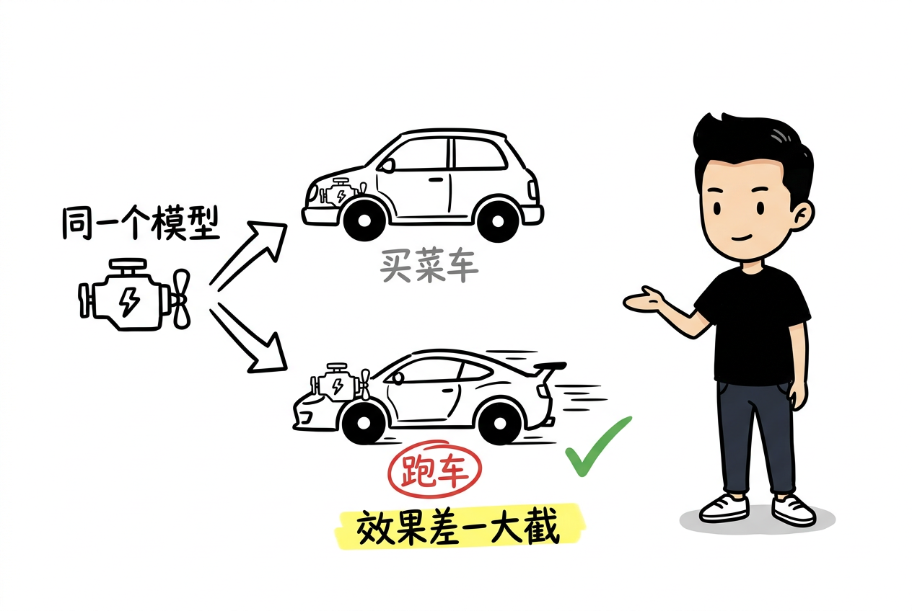

> 模型负责想，外面那层决定它能做成什么样

*图：Agent = Model + Harness。模型负责想，Harness 负责做*

大家好，我是 Booker。

今天拆 DeepSeek 昨天（2026-08-13）开源的一个东西：**DeepSeek Harness**，命令行叫 `dsh`。

不堆概念，一步步来。读完你会明白"Agent 表现 = 模型 + 外面那层"到底是怎么回事，以及 dsh 为什么值得看一眼。

{/* truncate */}

## 先问三个问题

三个场景，你大概率踩过至少一个：

**第一个。** 你让 Agent 跑一个长任务，跑了很久，最后挂了。你能说出它死在哪个工具调用上吗？当时上下文里到底有什么，你还原得出来吗？

**第二个。** 你想给 Agent 加一条规则："工具调用失败后，自动再试一次。"这条规则，你能加进去吗？还是只能去改框架源码？

**第三个。** 你想让 3 个 agent 分工：一个查资料、一个写代码、一个 review。这三个 agent 可能来自不同生态——一个用 MCP，一个用 ACP，一个用 Hooks。你能把它们接到一块吗？

这三个问题，是这篇文章要拆的东西。

DeepSeek 开源的这个运行时，答案就三个字：**全是插件**。

## 模型不会做事，它只会生成文字

先从最朴素的地方开始。

你用 ChatGPT 问一个问题，它回答你。这时候你脑子里没有"Harness"这个概念，也不需要。它就是一个会生成文字的东西：你给一句话，它给你下一句话。

真正的麻烦，从"让它做事"开始。

比如你说："帮我改一下这个项目的代码。"要改代码，它得先读文件、找到报错的地方、改掉、再跑测试。这些动作，模型一个都做不了。

模型只会一件事：**预测下一个 token 该是什么**。它生成的不是"改代码的动作"，而是一段描述"应该怎么改"的文字。

那谁来真的读文件、真的跑命令？

答案：外面得有一层东西，把"读文件""跑命令"这些真实动作，包装成模型能"调用"的形式——模型说"我要读 src/main.ts"，这层就去读，把内容拿回来喂给模型。

**这一层，就是 Harness。**

顺带说一句：大多数人不知道这层存在。我们习惯说"换个模型就是换个 Agent"。但实际上，同一个模型装进不同的 Harness，效果能差出一大截——工具怎么暴露、上下文怎么管理、循环怎么转，全是 Harness 决定的。

InfoQ 昨天那篇解读里有一句说得很好：

> "模型只负责预测下一步，Harness 决定模型能看到什么、可以调用哪些工具、如何组织上下文、遇到错误怎么重试。"

## 事情一复杂，这层要管的越来越多

如果只是"读一个文件"，一层薄薄的包装就够了。但真实任务不是这样。

回到"改代码"那个例子。一次真实的改代码任务里，会发生这些事：

- 模型说"我要读文件"，得先问一句：有权限读吗？这是沙箱和权限的事。
- 读回来的内容可能很长，长到装不下。得裁剪、压缩再喂回去。这是上下文层的事。
- 改完代码要跑测试。测试失败了，要不要再试一次？试几次？这是循环层和重试策略的事。
- 整个过程每一步，都得记下来。不然跑挂了，你根本不知道它死在哪。这是日志和追溯的事。
- 这些能力，是给 CLI 用的、还是 Web 界面、还是给 IDE 当后端？这是入口形态的事。

每一件事，都需要有人替模型做决定。这些决定逻辑，全都在 Harness 里。

*图：三个真实痛点，对应 dsh 的三个机制*

我把最常见的三个坑列一下。你在用 Claude Code、Codex、Cursor 的时候，应该都撞过：

**坑一：Agent 是黑盒。** 长任务跑挂了，说不清死在哪个调用上，也还原不出模型当时看到了什么上下文。

**坑二：框架是写死的壳。** 想改"失败后怎么重试""循环怎么转"？改不了，只能改框架源码，或者等官方下个版本。

**坑三：多 Agent 接不到一块。** MCP 的、ACP 的、Hooks 的各玩各的，subagent 协作没有统一编排，都得自己造轮子。

这三件事，不是 DeepSeek 发明的痛点，是全行业共同的。dsh 的价值在于：它给这三个坑，都给出了"能落地"的机制答案。

## 为什么是现在：模型趋同，Harness 是差异化

先把话说透：这篇不是 DeepSeek 的软文。dsh 值不值得看，跟"模型多强"没关系，跟"外面这层怎么做"有关系。

为什么是现在？因为模型在趋同。

各家模型的基础能力在快速拉平——推理、编码、长上下文，差距越来越小。光靠"换更强的模型"，边际收益越来越低。

那还有哪里的收益没榨干？**Harness 层。**

同一个模型，工具怎么暴露、上下文怎么管理、循环怎么转、失败怎么重试——这些全是 Harness 决定的。把这层调好，比等模型升级更直接、更可控。

打个比方（很土的比方）：模型是发动机，Harness 是整台车。底盘怎么调、方向盘灵敏度、刹车逻辑，全是车的事。同一台发动机，装进买菜车和装进跑车，驾驶感受天差地别。

*图：同一个模型，装进不同的 Harness，效果差一大截*

所以对开发者来说，与其盯着模型升级，不如看看自己用的那层——它是不是写死的？能不能改？跑挂了能不能查？

## 连"循环怎么转"都是插件

先说 dsh 最反常识的一点：它的插件化不是"能加工具"那种程度，而是**模型、工具、上下文、循环、沙箱、存储、UI，全部都是插件**。

怎么做到？靠 Cordis 这个插件框架，用 `bundle → profile → patch` 三层配置，把一整套运行时"装配"出来。

*图：一叠配置，装配出一个能跑的 Agent*

想改"失败后重试"？不用改源码。挂一个 patch，把那条规则整体换掉就行。想换上下文压缩策略？同样是挂插件。

而且这背后不是"能挂就能挂"的野路子。Cordis 有一套形式化理论（时空可组合性），核心保证是：**插件卸载时，它装的副作用全部回滚，系统像没装过一样**。没有这个保证，插件化就是玩具；有了它，深度替换才是可靠的工程。

## 可追溯：跑挂不再靠猜

dsh 解决黑盒问题的方式，是把"模型看到的一切"都记成一条 append-only 的事件流。

*图：模型看到的 = 日志记录的，可还原、可复盘、可 fork*

它有一条硬性不变量：**"模型看到的 = 日志记录的"**。凡是进到模型请求里的内容，必须能从日志里重建出来。

这意味着：长任务跑挂了，你可以打开 Trajectory 视图，看它每一步干了什么、当时上下文里有什么。还可以 fork 一条线重新跑，或者 replay 复盘。

对喜欢折腾的人来说，这还有一个隐藏价值：你可以拿同一条任务轨迹，对比不同的循环策略、不同的工具实现，哪个效果更好——这在以前是做不到的。

## Code Mode：5 次往返变 1 次

这是我最想试的一个机制，叫 **PTC（程序化工具调用）**，dsh 里对应 Code Mode。

传统方式下，一个五步任务是这样的：模型说"调用工具 A" → 等结果 → 再说"调用工具 B" → 等结果……五次往返，中间结果全占上下文。

*图：传统 5 次往返 vs Code Mode 1 段程序*

Code Mode 不一样：模型直接写一段 TypeScript 程序，里面可以循环、可以条件判断、可以并发。然后一次 `run_code`，把整段程序在 worker 线程里跑完。中间步骤的结果**不进模型上下文**。

官方注释的原话是：5 次往返变 1 次。

步骤越多、中间数据越大，收益越明显。上下文是有限的资源，省下来的就是能力。

## 多 Agent 和生态兼容

dsh 有四套预设模式，本质是四套插件组合，不是四套系统：

*图：标准 / Code Mode / 极简 / 创造，四套插件组合*

- **标准**：常规的 Agent，工具调用 + 循环。
- **Code Mode**：上面说的 PTC，程序化工具调用。
- **极简**：最少的工具集，适合跑 benchmark。
- **创造**：Agent 可以检查运行时、试装插件——Harness 配置本身成了 Agent 可操作的对象。

多 Agent 方面，subagent、fork、workflow 都是插件。更实际的是生态兼容：MCP 能当客户端接，ACP 能当服务端提供，Claude Code 和 Codex 的 Hooks 也有桥——**你已有的钩子脚本不用重写**。

*图：MCP / ACP / Hooks，都接得进 dsh*

## 它到底新在哪

口说无凭，拉出来跟现有的比一比。

我拿 dsh 和三个主流对象做了个对比：Claude Code、Codex CLI、OpenHands。

*图：五轴对比——插件化 / 沙箱 / 可追溯 / 多模式 / 开源*

几个关键差异：

- **插件化程度**：Claude Code 有 Hooks 和 MCP，Codex 有 AGENTS.md 配置，OpenHands 有 skills——但**没有任何一家把 Agent 主循环本身做成可替换插件**。dsh 是第一个。
- **沙箱**：Claude Code 和 Codex 以权限审批为主，OpenHands 是 Docker 沙箱。dsh 做了三平台原生隔离（Linux Landlock、macOS Seatbelt、Windows ACL），外加远程执行的口子。
- **可追溯**：各家都有日志，但 dsh 把"模型看到的 = 日志记录的"做成了运行时不变量，是引擎级强制，不是产品层设计。
- **开源**：Claude Code 闭源，Codex 开源，dsh 是 MIT——而且开源当天 star 就破 1.5 万。

一句话判读：**在"把 Agent 拆开"这件事上，dsh 走得比谁都远。**

## 泼几盆冷水

夸完了，说点不中听的。我不喜欢把东西吹上天。

*图：冷静一点看*

**"什么都能换"不会自动带来更好的成功率。** 价值取决于官方默认插件质量、稳定的组合范式、可信的评测、以及第三方生态。插件化只是给了你"差异化空间"，不保证兑现。

**多 Agent 范式没有突破。** 它是层级式 Supervisor–Worker——父 agent 拆任务、子 agent 执行。有新意，但离 Swarm（自主发现、协商、竞争、动态接管）还有距离。把它宣传成"全新的多 Agent 架构"，就吹过头了。

**没有公开的 benchmark。** 我特意去翻过它的 BENCHMARK.md——里面只有"怎么跑 benchmark"的说明，没有一个测试结果数字。没有数据背书，理性对待。

**兼容性破坏是明示的。** 它还在 v0.1，README 里原话写着 *THERE WILL BE COMPATIBILITY-BREAKING CHANGES*。现在进去玩的，迁移成本不会低。

**插件化有代价。** 接口稳定性、依赖管理、版本兼容、性能开销、调试复杂度——边界挖得越深，这些越难控制。

## 结尾

这篇文章想说的其实就一句：**Agent 表现 = 模型 + 外面那层，而那层往往被忽略了。**

DeepSeek 开源 dsh，把一个通常写死的层拆成了可以换的插件，还顺带给了你可追溯的事件流和一次跑完的 Code Mode。它的思路值得看一眼——哪怕你只是想去自己的工具链里，找一个"能改、能查"的 Agent。

你正在用的 Agent 框架，踩过上面哪个坑？评论区聊聊。

如果你想试试把外面那层拆开，dsh 现在 `npx @deepseek-ai/dsh web` 一行就能跑起来（需要 Node.js）。

🥚 彩蛋：我已经在盯着它的源码写拆解了。下一篇讲它怎么把"卸载即回滚"做出来，等我。

— Booker
