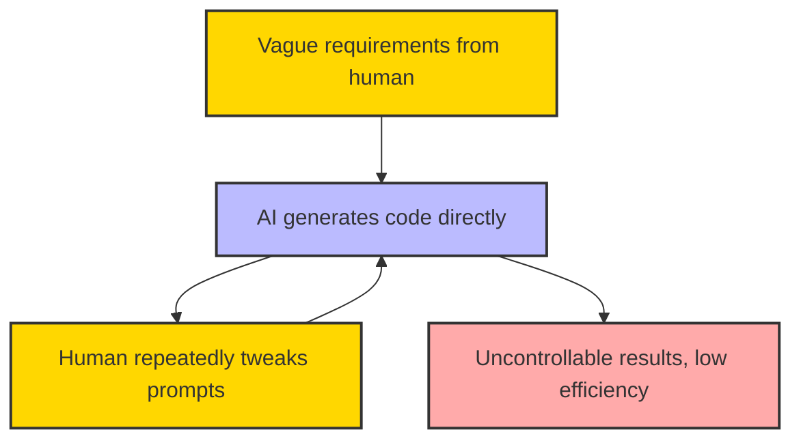
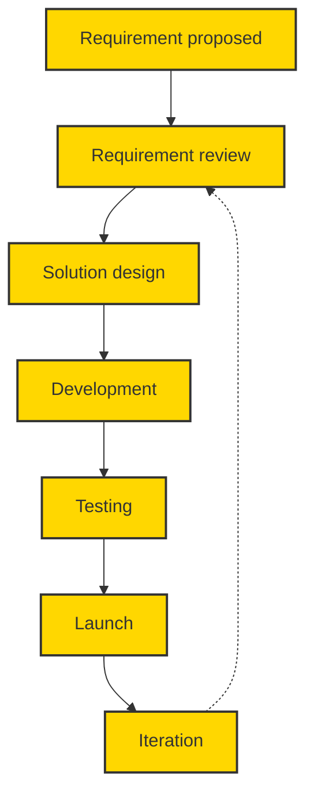
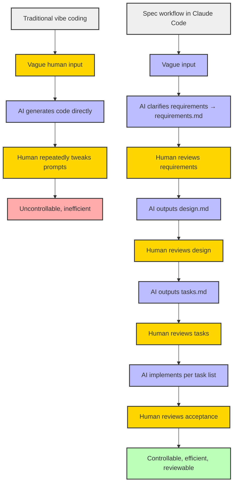
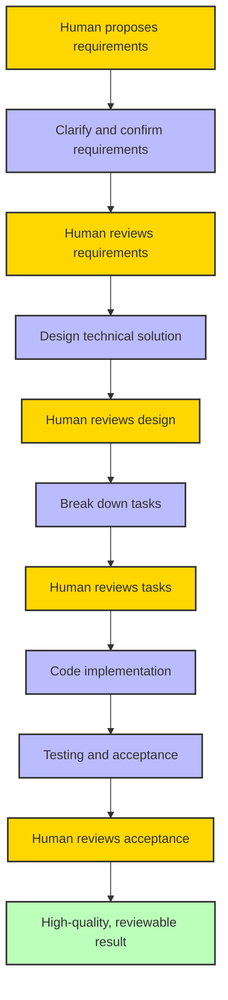

Kiro's tweets blew up recently, and many friends DM'd me for details, so here's a systematic article covering the specifics and practical methods.

{/* truncate */}

---

## Slot-machine vibe coding — is it really reliable?

Ever had this experience? You type a vague requirement into an AI IDE, hit "generate," and wait expectantly for AI to produce a perfect program? The result feels like pulling the lever on a slot machine — sometimes you hit a small jackpot, but most of the time you get nothing.

> Vibe coding is like a slot machine:
> 
> Slot machine: buy tokens, pull the lever, occasionally win big. More often it's "try again." The house always wins in the end.
> 
> Vibe coding: buy Tokens, write vague prompts, hit "generate." Sometimes you get perfect code, sometimes a mess. AI encourages you to "try again." You console yourself with "this time I'll fix the bug." But the model vendor always wins in the end. Occasionally you feel like you came out ahead — only to realize later you spent more time than it was worth.

Vibe coding's biggest problem: it turns development into "gambling" instead of "controlled engineering."

### Typical vibe coding flow



> Yellow = human operation, Blue = AI output, Red = undesirable result.

## Is there a better way? — How traditional development works

Traditional software engineering emphasizes requirement clarification, technical design, task breakdown, and traceability. This approach may seem "slow," but it keeps projects moving steadily, enables review, and supports collaboration.

Kiro AI IDE has packaged this process into a **Spec workflow** — making AI coding as reliable as an engineer.

### Traditional development flow



> This flow emphasizes requirement review and iterative feedback — the closed-loop continuous improvement of traditional software engineering.

## What makes Kiro's Spec workflow so good?

Kiro is AWS's AI IDE. Beyond free access to Claude 4, its biggest highlight is the Spec workflow:

- Every project has 3 core files:
  1. **requirements.md** — spec document (user stories + acceptance criteria with EARS syntax)
  2. **design.md** — technical design (architecture, flow, caveats)
  3. **tasks.md** — task list (trackable todo list)

### What is EARS syntax?

EARS (Easy Approach to Requirements Syntax) was originally developed for jet engine control systems before being widely adopted in software engineering. It uses simple sentence patterns to constrain requirements and eliminate ambiguity.

> Example: When the user clicks "mute," the system shall suppress all audio output.

References: [EARS Syntax Guide](https://alistairmavin.com/ears/) | [v0.dev Cheat Sheet](https://v0-ears-syntax-guide-bd8ywxbxo-booker-zhaos-projects.vercel.app)

## You can run Spec workflow with Claude Code too! (with a worked example)

Even without Kiro, you can replicate this workflow with any AI IDE. Using Claude Code as an example, the process is remarkably smooth:

1. **Create a CLAUDE.md in your project**
   Write the following prompt template into `CLAUDE.md` as your AI collaboration "job description":

```
# CLAUDE.md

You are a professional AI programming assistant. Follow the Spec workflow strictly:
1. Clarify requirements and output requirements.md using EARS syntax.
2. Design technical solution and output design.md (architecture, tech choices, APIs, testing strategy).
3. Break down tasks and output tasks.md as an actionable todo list.
4. Help write and test code according to the task list, saving artifacts to output/.
5. Critical: confirm each step with me before proceeding to the next.
```

2. **Launch Claude Code, enter your raw requirements**
   Just type your idea or user story into the chat.
   Claude reads CLAUDE.md and starts clarifying requirements with you.

3. **After confirmation, Claude outputs requirements.md**
   Claude uses EARS syntax to structure requirements and generates a standards-compliant requirements.md.
   You can add or modify at any point — Claude stays aligned with you.

4. **Technical design**
   After requirements are confirmed, Claude automatically moves to the design.md phase.
   Includes architecture, tech choices, APIs, testing strategy, etc.

5. **Task breakdown**
   Claude generates tasks.md from design.md, breaking the solution into executable items.

6. **Step-by-step implementation and review**
   Claude helps implement code and tests according to tasks.md, saving all artifacts to an output/ directory.
   You only participate in key review checkpoints: requirements, design, acceptance.

> **Recommended CLAUDE.md prompt**:
> "You are a professional AI programming assistant. Follow the Spec workflow strictly, confirming each step with me before proceeding."

This way, even without Kiro, you can replicate the Spec workflow with Claude Code — making AI coding efficient, controllable, and reviewable.

### Vibe coding vs Spec workflow comparison



> Yellow = human review, Blue = AI output, Red = bad outcome, Green = good outcome, Gray = group.

### Claude Code Spec workflow — conversation example

```markdown
**User**: I want to build a tool that "automatically organizes meeting minutes." Can you help plan it?

**Claude** (reads CLAUDE.md and responds automatically):
Of course! We'll follow the standard Spec workflow. First, I'll help clarify requirements and output requirements.md. What input methods do you need? For example: voice, text, file upload?

**User**: Mainly uploading audio recordings — preferably supporting multiple audio formats.

**Claude**:
Got it. Any requirements for output format? Plain text, Markdown, Word documents?

**User**: Markdown and Word export would be ideal.

**Claude**:
Confirmed. Here's the requirements.md draft using EARS syntax:

---

# requirements.md

## User Story
As a frequent meeting attendee, I want to upload meeting recordings and get structured meeting minutes automatically, with export to Markdown or Word, to save organization time.

## Acceptance Criteria
1. When the user uploads an audio file, the system shall support common audio formats (mp3, wav, m4a).
2. When audio upload completes, the system shall automatically transcribe the audio and extract key points.
3. When the user clicks export, the system shall support Markdown and Word document export.

---

Please confirm the requirements. After confirmation, I'll move to the technical design phase.

**User**: Confirmed.

**Claude**:
Proceeding to design.md:

---

# design.md

## Architecture Overview
- Frontend: file upload, progress display, export button
- Backend: audio-to-text (ASR service), key point extraction (LLM), format conversion
- Storage: temporary file storage

## Tech Stack
- Frontend: React
- Backend: Node.js + OpenAI/Claude API
- ASR: Whisper API
- Document export: jsdocx, markdown-it

## Flow
1. User uploads audio
2. Backend transcribes to text
3. LLM extracts key points
4. Frontend displays and supports export

## Security
- Files stored temporarily, auto-deleted after processing

---

Please confirm the design. After confirmation, I'll break down the task list.

**User**: Confirmed.

**Claude**:
Here's tasks.md:

---

# tasks.md

- [ ] Build frontend upload page
- [ ] Implement audio file upload API
- [ ] Integrate ASR service for audio transcription
- [ ] Call LLM for key point extraction
- [ ] Implement Markdown/Word export
- [ ] Integration testing
- [ ] Documentation and acceptance

---

Please confirm the task list. After confirmation, I'll help implement each task step by step.
```

## CloudBase AI Toolkit: one-stop Spec workflow replication

If you want a more turnkey experience, try CloudBase AI Toolkit:
- Supports multiple AI IDEs
- Built-in Spec workflow templates
- One-click generation, deployment, and hosting — no ops needed

## Human-AI collaboration is the real answer

In the Spec workflow, AI handles:
- Vague requirements → clarified specs
- Technical design docs
- Task breakdown
- Code implementation
- Acceptance testing

Humans only need to:
- Input requirements
- Review requirements / design / schedule / tests

This gives you the best of both worlds: AI's efficiency and human engineering quality.

### Standard software engineering flow



> Yellow = human review, Blue = engineering activity (AI + human), Green = high-quality result.

## Summary: faster, more reliable, more trustworthy AI coding

The Spec workflow transforms AI coding from "gambling" into "a repeatable process." The experience and judgment of human engineers, combined with AI's efficient execution — that's how you truly accelerate development, improve quality, and keep things reviewable.

> Remember: AI doesn't replace humans. It makes humans more capable.
