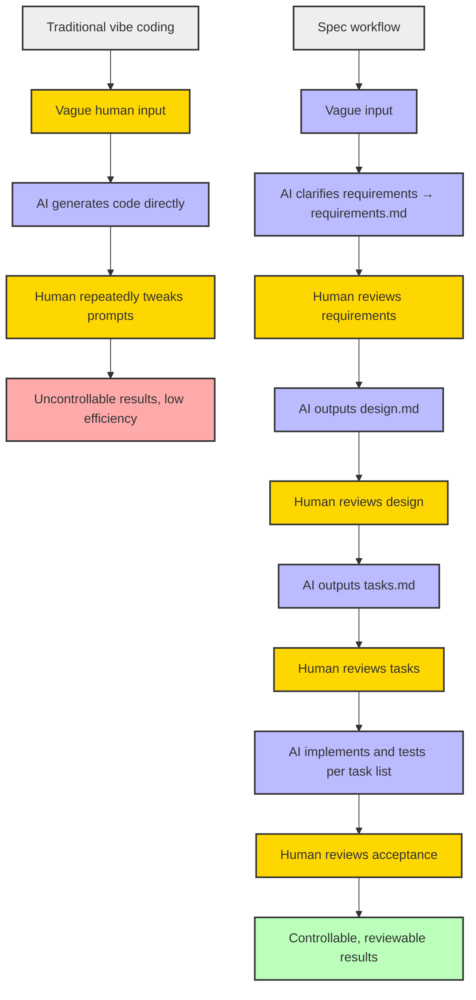

After more than a year of AI-assisted coding, my biggest lesson is this: vibe coding feels great in the moment, but it falls apart the moment a project gets complex. A one-line requirement, AI starts coding on its own assumptions, and what comes out is always a bit off. You ask it to fix something, it fixes that and breaks something else. A few rounds of this and your codebase has tripled in size while the number of working features barely grew.

Eventually I figured it out: the problem isn't that AI writes bad code. It's that I don't say clearly what I want.

Kiro's Spec workflow is built to solve exactly that. Let's walk through it from scratch.

{/* truncate */}

---

## Two traps of vibe coding

Two things about vibe coding drive me crazy:

**First, you're vague and AI guesses.** You say "add a filter" — it has no idea whether you want frontend filtering or a backend query, single-select or multi-select, or whether it should cascade with other charts. AI picks the most common guess, which is probably not what you meant.

**Second, one change breaks three places.** AI has no concept of "global impact assessment." You ask it to swap a component library, it only changes the one file you pointed at, and every other file depending on the old components blows up. You don't even know which files used the old library.

Both problems share one root cause: **there's a missing "translation" layer between the idea and the code.** Traditional software engineering uses requirements documents and technical design to do this. The Spec workflow puts those two layers back into AI coding.

## How traditional development solves this

Traditional software engineering emphasizes requirement clarification, technical design, task breakdown, and traceability. The process is "slow," but projects move steadily forward and can be reviewed, learned from, and collaborated on.

Kiro is AWS's AI IDE. It has turned this process into a built-in "Spec workflow," so AI coding can work like an engineer.

## The core of the Spec workflow: three files

Kiro turned the Spec workflow into a replicable pattern. At its core are three files:

```
project/
├── requirements.md    # Requirements doc (written with EARS syntax)
├── design.md          # Technical design (architecture, choices, flows)
└── tasks.md           # Task list (trackable todo list)
```

### What is EARS syntax?

EARS (Easy Approach to Requirements Syntax) was originally used for jet engine control systems, where precision requirements are far stricter than in software. It constrains how requirements are written with fixed sentence patterns, blocking ambiguity at the source.

There are only a few patterns:

| Pattern | Use | Example |
|---|---|---|
| **The** `<system>` **shall** `<action>` | Ubiquitous requirement | The system shall keep the clock synchronized |
| **While** `<state>` **the system shall** `<action>` | Persistent system state | While the network is unavailable, the system shall cache operations and sync after recovery |
| **When** `<trigger>` **the system shall** `<action>` | User-triggered event | When the user clicks "mute," the system shall suppress all audio output |
| **Where** `<optional feature>` **the system shall** `<action>` | Optional feature | Where the product includes push notifications, the system shall provide a disable option |
| **If** `<anomaly>` **then the system shall** `<action>` | Unwanted behavior | If the user enters an invalid password, then the system shall prompt for re-entry |

Written in these patterns, it's hard for AI to misunderstand.

Reference: [EARS Syntax Guide](https://alistairmavin.com/ears/)

## Replicating the Spec workflow in Claude Code

Even without Kiro, this workflow runs fine in Claude Code. The key is CLAUDE.md — it acts as the AI's "job description."

### Step 1: Write CLAUDE.md

```markdown
# CLAUDE.md

You are a professional AI programming assistant. Follow the Spec workflow strictly:
1. Clarify and confirm requirements, output requirements.md written in EARS syntax.
2. Design the technical solution, output design.md (architecture, tech choices, interfaces, testing strategy).
3. Break down tasks, output tasks.md as an executable todo list.
4. Code and test step by step per the task list, saving artifacts to output/.
5. Confirm each step before moving to the next.
```

### Step 2: A sample conversation after startup

**You**: I want to build a small tool that "automatically organizes meeting notes with AI." Can you help plan it?

**Claude** (after reading CLAUDE.md): Of course. Let me draft requirements.md in EARS syntax first —

```markdown
# requirements.md

## User story
As a user who attends lots of meetings, I want to upload meeting recordings
and get structured meeting notes automatically, exportable as Markdown or Word.

## Acceptance criteria
1. When the user uploads an audio file, the system shall support mp3, wav, m4a formats.
2. When the upload finishes, the system shall transcribe the audio and extract key points.
3. When the user clicks export, the system shall support Markdown and Word formats.
```

Please confirm the requirements; after any edits I'll move on to design.md.

**You**: Confirmed.

**Claude**: Here's design.md —

```markdown
# design.md

## Architecture
- Frontend: file upload + progress display + export button
- Backend: audio-to-text (ASR) → key point extraction (LLM) → document format conversion
- Storage: temporary, auto-deleted after processing

## Tech choices
- Frontend: React
- Backend: Node.js + LLM API
- ASR: Whisper API
- Document export: jsdocx / markdown-it

## Flow
upload → transcribe → extract points → display → export
```

Please confirm. After that I'll output tasks.md.

Throughout the whole process you only intervene at the "confirm" checkpoints; AI handles the rest. Way less exhausting than vibe coding's "change it, try it, it breaks."

### Side-by-side comparison



> Yellow nodes = human review, blue = AI output, red = undesirable outcome, green = good outcome, gray = process group.

## How it worked out for me

After trying it a few times, the most visible change was less rework.

Before, a feature typically needed 2-3 rounds of AI corrections to match the requirement. With the Spec workflow, "what you actually want" is fixed in requirements.md at the requirements stage, and when AI changes code it goes back and re-reads the requirements doc itself. The same feature usually passes in one round.

| | Vibe coding | Spec workflow |
|---|---|---|
| Requirements stage | One vague line | EARS acceptance criteria |
| Implementation | AI guesses → you fix → AI guesses again | Start coding after requirements review |
| Rework rate | High (2-3 rounds) | Low (usually 1 round) |
| Traceability | Forgot what changed | Every decision recorded |

There's a cost, of course. Writing requirements.md takes time, and you need to actually know what you want. It doesn't solve "AI makes decisions for me" — it solves "I have a decision, and AI won't misinterpret it."

## Pitfalls that bite

A few places trip me up repeatedly:

- **The requirements file balloons.** I used to want everything in it, ending up with dozens of acceptance criteria that overwhelmed AI. My fix: keep only the most critical 3-5 criteria per feature, cut the rest.
- **Don't turn design.md into a thesis.** One or two pages of architecture is enough — focus on the rationale behind choices and boundaries, not flowchart piling.
- **tasks.md must be granular enough to execute.** "Implement login" is a task that wasn't split at all. Split it to "write login API + unit tests" — that granularity means AI doesn't have to come back and ask every time.
- **Not every project deserves the Spec workflow.** One-off scripts and throwaway demos are faster with plain vibe coding. The bigger the project and the more collaborators, the bigger the payoff.

## Summary

The Spec workflow turns AI coding from "gambling" into "a repeatable process." Human engineering experience and judgment, combined with AI's execution speed — that's how development actually gets faster, higher quality, and reviewable.

Are you still vibe coding, or already using a similar workflow? What pitfalls did you hit? Leave a comment.
