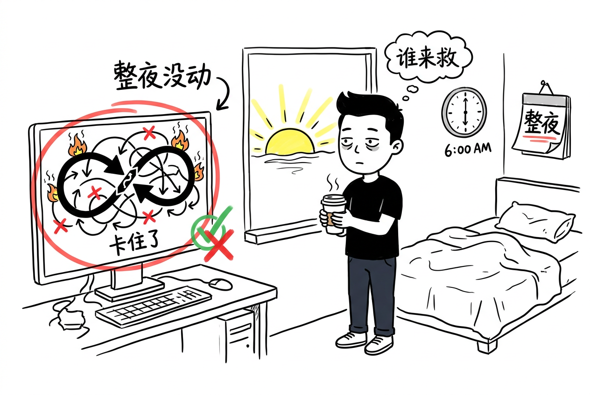
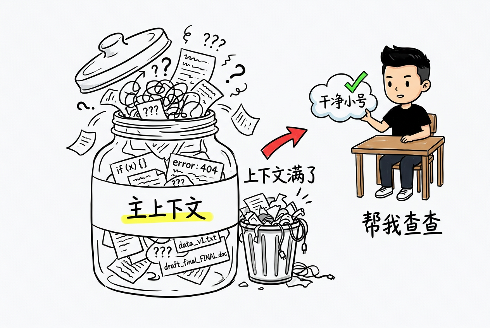
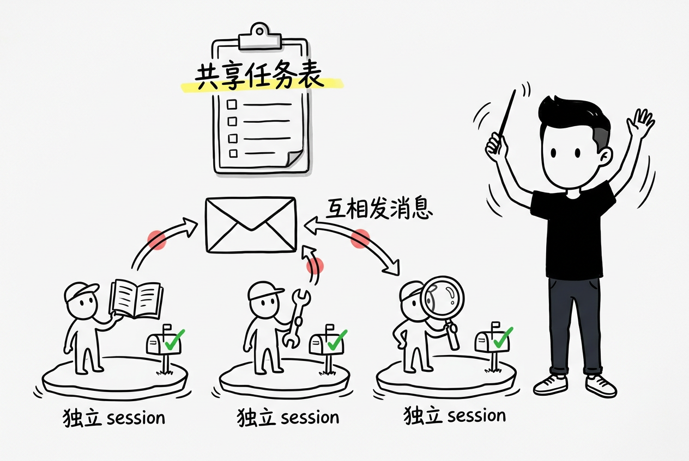
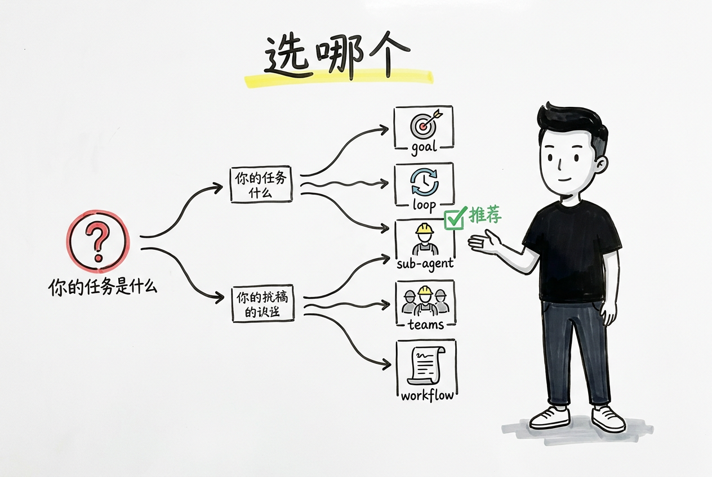

If you've used Claude Code for complex tasks, you've probably experienced this:

You ask it to replace all `fetch` calls with `axios`, grab a coffee, come back — and it's done three files and stopped waiting for approval. Repeat seven or eight times, and your coffee is cold.

Or you ran `/loop` overnight to watch a PR, wake up to find it got stuck on a `git merge` conflict at 2 AM. The window has been open all night.

Or you launched three sub-agents to research independently — and ended up with three contradictory conclusions because none of them saw what the others were doing.

The root cause isn't that AI isn't smart enough. Claude Code is **turn-based** — each turn does one thing, then waits for you to decide the next step. To make it run continuously, decide autonomously, and work in parallel, you need orchestration mechanisms to bridge the gap.

Claude Code gives you five: `/goal`, `/loop`, sub-agent, Agent Teams, and Workflows.

Pick wrong, and you're not just wasting tokens — you're making things more complicated.

{/* truncate */}

## Pain point 1: I'm waiting for it, it's waiting for me


You give AI a clear goal. It's capable of completing it. But after every turn it stops and waits for your approval. This is what `/goal` solves.

### /goal — conditional autonomous polling

```
/goal Complete data-editor test generalization into a cross-module standard test framework in three steps:
  Step 1: Create shared test-utils.sh
  Step 2: Create verify-*.sh for each module
  Step 3: Update acceptance criteria
```

Under the hood it's a lightweight Stop Hook: registering a `type: 'prompt'` hook into `sessionHooksRegistry`, triggered after each turn for evaluation.

The evaluator receives three things:
1. **Goal condition** — your `/goal` description
2. **Conversation transcript** — everything since the goal was set
3. **Metadata** — session ID, timestamp, permission mode, etc.

Output is structured JSON:

```
{"ok": false, "reason": "Step 1 complete, test-utils.sh created, but Step 2 hasn't started"}
```

`ok: true` → stop. `ok: false` → continue with reason.

Key design: **the working model and the evaluating model are separate**. The main model doesn't grade itself. The evaluator only reads transcripts, not executing, so it can judge objectively.

Limitations:
- **Serial** — one turn at a time, just saves you from pressing Enter manually
- **Evaluator is opaque** — no logs telling you why it passed or failed
- **Transcript grows** — longer conversations mean higher evaluation cost each turn
- **Evaluation latency** — Haiku is faster, Sonnet is more accurate

#### When to use

**Good for**: tasks with a clear terminal state, potentially spanning multiple turns, where you don't want to sit and supervise.

**Not for**: continuous monitoring scenarios (use `/loop`), or open-ended exploratory tasks.

One detail: you can swap the evaluator model. Use Sonnet for complex goals and a smaller model for simpler ones to save cost.

Requires v2.1.139+

---

## Pain point 2: projects go stale when left alone



Many scenarios have no end state — PRs need ongoing attention, CI failures need handling, dependencies need upgrading. You can't watch the terminal 24/7. But if you don't, it might get stuck all night.

### /loop — adaptive scheduler

`/goal` cares about "is it done." `/loop` cares about "what needs to be done now."

Without arguments, it runs a three-stage pipeline:
1. Finish incomplete work
2. Check current PR comments, CI status, merge conflicts
3. Run lint, type checking, formatting

Interval adjusts dynamically: 1 minute when active, gradually extending to 1 hour when idle.

```
/loop          # adaptive mode (recommended for daily use)
/loop 15m      # fixed 15-minute interval
/loop 2h       # fixed 2-hour interval
```

The three stages aren't hardcoded logic — they're built-in prompt templates. Claude decides which step to execute. Adaptive intervals also depend on Claude's perception of "what just happened," not external metrics (CI status, CPU, logs).

This limitation explains why adaptive mode is unavailable on Bedrock, Vertex AI, and Azure Foundry — it falls back to a fixed 10-minute interval. Those platform APIs don't support "model decides interval" communication patterns.

**Cost**: `/loop` runs in the **same session**. Turn 10's context is much heavier than turn 1's — it carries artifacts from the previous 9 turns. Overhead increases, attention dilutes. The issue isn't `/loop` itself being expensive — it's session aging.

---

## Pain point 3: main context gets polluted with junk



When a session runs long, the context fills up with intermediate artifacts — docs you read, approaches you tried, paths you corrected. You're spending more tokens while the model gets "dumber." But your auxiliary work (reading API docs, researching libraries, validating hypotheses) shouldn't pollute the main thread.

### Sub-Agent — context-isolated workers

Sub-agents solve the "main context is precious" problem. Each sub-agent starts with a **fresh context window** — it can't see your conversation history. It only returns a summary when done, never polluting the main session. Nesting is limited to 5 levels, hardcoded and not configurable.

**Isolation mechanism** (source code from `forkedAgent.ts`):
- **Independent AbortController**: parent session cancellation doesn't affect sub-agents, and vice versa
- **No-op state propagation**: parent session doesn't pass any internal state. The sub-agent doesn't even know which tools the parent used. To share context, you must explicitly pass it via prompt

The 5-level limit is practical: each nesting level opens a new LLM session. Depth 5 means maintaining 5 sessions' token overhead simultaneously. Sub-agents beyond the depth limit won't receive Agent tools — effectively silently rejected.

#### Three ways to create

```
# Method 1: one-shot
/agent Go research this function's call chain

# Method 2: config file (persistent)
# .claude/agents/researcher.yaml
name: researcher
description: Agent specialized in technical research, good at reading source code and docs
prompt: You focus on research...
model: claude-sonnet-4-20260514
disallowedTools: [Write, Edit]

# Method 3: SDK
const agent = claude.subAgent({ prompt: "..." });
```

The `description` field in config files has a special role — Claude automatically decides when to delegate tasks based on descriptions.

#### When to use

| Scenario | Use sub-agent? |
|---|---|
| Research a function's call chain | Use `/agent`, one-shot, simple |
| Frequent research tasks | Write a YAML file, persistent and reusable |
| Parallel research of multiple approaches | One sub-agent each, no interference |
| Simple grep | No, main session is faster |

#### Sub-agents in teams

In multi-person collaboration, project-level `.claude/agents/` directories can be git-shared. Team members push their configured agents, others pull them down and use them. This makes agent configuration an engineering asset — part of the project, like `.claude/rules/`.

---

## Pain point 4: ten tasks crammed together



`/goal` runs one task. Sub-agent handles one sub-task. But you have ten things to do — fix bugs, refactor modules, write docs, prepare demos. You can't do them one by one, and you can't let them step on each other.

### Agent Teams — observable parallelism

Introduced in Claude Code v2.1.166+. Core idea: each task runs in an independent session, no interference. The main session creates tasks with an agenda (like a job description). The Teams layer handles scheduling.

**Key behavior**:

```
Task → sub-Agent session (independent, invisible)
       ↕
Task → sub-Agent session (independent, invisible)
       ↕
Main session ← observable ← Agent reporting
```

Compared to sub-agents, Teams adds three layers:
1. **Observability** — main session sees each Agent's real-time progress
2. **Parallel execution** — each Agent runs in its own session, truly parallel
3. **Passive scheduling** — no need to explicitly specify when to do what; the system decides automatically

#### Task assignment rules

The main session decomposes tasks and distributes them. The decomposition isn't fixed prompt engineering — it's the model's own judgment. Give it an agenda like "refactor the user module" and it decides how to split.

The granularity of decomposition tells you how well it understood: coarse means it didn't really get it; fine-grained means it understood the dependency chain.

#### Debugging challenges

Independent sessions mean independent token consumption. When things work, fine. When they break, you have no idea which Agent, at which step, for what reason. There's no global log — each session's input/output can only be examined individually.

The official UI shows them in the same TUI, but the data from independent sessions can only be inspected indirectly through the main session. There's no centralized debug view. This is the natural cost of parallelism.

---

## Pain point 5: complex tasks can't be driven by pure conversation


Some tasks aren't "just do it" — they're multi-step with tight coupling between phases: research first, then design, then code, then test. One wrong step derails everything. Without a framework to constrain the process, relying purely on the model's free-form reasoning means "works the first time, fails the second."

### Workflows — deterministic process

Workflows is Claude Code's newer mechanism, using declarative YAML to define multi-agent collaboration topology. The difference from Teams isn't about which is more powerful — it's about **different orchestration philosophy**:

| | Teams | Workflows |
|---|---|---|
| Topology | Hub-and-Spoke (star) | Directed acyclic graph (DAG) |
| Scheduling | Passive — created, then system-driven | Explicit — you define step order |
| Communication | Main session observes one-way reporting | Previous step output feeds next step input |
| Determinism | Low — depends on model performance | High — parameter tunable, reproducible |
| Best for | Exploratory, high-uncertainty tasks | Deterministic, quality-stable tasks |

Workflow phase definition:

```yaml
name: "feature-dev"
agents:
  design:
    model: claude-sonnet-4-20260514
    prompt: "You handle technical design..."
  implement:
    model: claude-sonnet-4-20260514
    prompt: "You handle implementation..."
  review:
    model: claude-sonnet-4-20260514
    prompt: "You handle code review..."

steps:
  - agent: design
    output: DESIGN
  - agent: implement
    input: DESIGN
    output: CODE
  - agent: review
    input: CODE
    output: REVIEW
```

Each step's `output` is the previous step's output path; `input` is the current step's input. The chain is clear — when something breaks, you know which step.

#### Workflow task types

Three built-in types:
- **feature** — serial step-by-step
- **swe** — software engineering multi-turn loop (design → code → test → fix → review)
- **research** — exploratory research (not multi-step, lets the agent explore freely)

---

## Decision guide: which mechanism for which scenario?



```
                   What's your pain point?
                           │
          ┌────────────────┼────────────────┐
          ▼                ▼                ▼
   Turn-by-turn approval   Can't watch      Task too complex
   /goal                   /loop            Workflows
          │                │
          ▼                ▼
   Main context bloated   Ten tasks at once
   sub-agent              Agent Teams
```

Specifically:

- **Single clear goal, potentially multi-turn process** → /goal (serial autonomous, lightest weight)
- **No end state, needs ongoing attention** → /loop (adaptive, but watch for session aging)
- **Auxiliary work shouldn't pollute main context** → sub-agent (best isolation)
- **Multiple independent tasks simultaneously** → Agent Teams (true parallelism)
- **Quality stability required, tightly coupled steps** → Workflows (most deterministic)

---

## Final thoughts

The common source of these pain points isn't Claude Code's feature gaps — it's that **we're asking AI to do things its design isn't optimized for**: running continuously, deciding autonomously, collaborating in parallel. `/goal` disguises turn-based interaction as continuous execution. `/loop` packages waiting as adaptive scheduling. Sub-agents fight context bloat with isolation. Every mechanism compensates for the turn-based model's limitations.

From a patchwork perspective, they're indeed hooks and session-level wrappers. But look at it differently: Claude Code didn't reinvent the runtime. It built a spectrum of orchestration capabilities on top of the turn-based model — from simple to complex, from serial to parallel — using the lightest-weight approaches possible (hooks, new sessions, JS sandbox).

**Turn-based isn't a flaw — it's a constraint.** Each turn handing control back means interruptible, auditable, and intervenable. Systems that run continuously are hard to stop when something goes wrong. Turn-based gives you a natural safety boundary.

**Orchestration is the art of trade-offs.** Want predictability? Use Workflows, lose flexibility. Want isolation? Use sub-agents, accept context sync costs. No perfect mechanism — only trade-offs.

**The most expensive thing isn't tokens — it's your attention.** Saving the time you spend staring at the terminal is worth far more than saving a few tokens. Freeing cognitive bandwidth is the real value of these mechanisms.

---

## 🥚 Easter egg: a ready-to-use agent config pack

The most useful thing I can do is give you pre-configured agents. Here's my current `.claude/agents/` setup — three configured Agents, each focused on one thing:

**1. researcher — research only, no code changes**

```yaml
# .claude/agents/researcher.yaml
name: researcher
description: Agent specialized in technical research, good at reading source code, docs, and validating hypotheses
prompt: |
  You are a technical research assistant.
  Your tool permissions are read-only: you can Read, Grep, Glob, but not Edit, Write, or Bash (except non-destructive commands).
  Your task format:
    ## Research Goal
    [Question to investigate]
    
    ## Context
    [Relevant code/documentation location]
  Output:
    - Key findings (3-5 items)
    - Evidence sources (file path + line number)
    - Recommended approach or next steps
model: claude-sonnet-4-20260514
disallowedTools: [Write, Edit, Bash]
```

**2. reviewer — code review, no code changes**

```yaml
# .claude/agents/reviewer.yaml
name: reviewer
description: Code review focused on security, performance, maintainability
prompt: |
  You are a code review assistant.
  Read-only. Given a PR diff or code block, review against:
  1. Security (SQL injection, XSS, credential leaks)
  2. Performance (N+1 queries, unnecessary loops, memory leaks)
  3. Maintainability (code duplication, naming, complexity)
  4. Test coverage (what's missing, how to add)
  Each issue gets a severity label: P0(must fix) / P1(should fix) / P2(nice to fix)
model: claude-sonnet-4-20260514
disallowedTools: [Write, Edit]
```

**3. refactorer — focused on refactoring, full permissions**

```yaml
# .claude/agents/refactorer.yaml
name: refactorer  
description: Code refactoring agent for well-scoped refactoring tasks
prompt: |
  You are a refactoring assistant.
  You receive a specific module path + refactoring goal.
  Rules:
  - Before refactoring, run tests once to confirm baseline passes
  - After each change, run related tests; roll back on failure
  - Don't modify files outside the module boundary
  - Output a change summary after refactoring
allowedTools: [Read, Write, Edit, Bash, Glob, Grep]
```

**Usage**: Drop these files in your project's `.claude/agents/` directory, then call `/agent researcher` or `/agent reviewer` from Claude Code. Push to the repo and the whole team can use them.

---

**What scenarios are you using these mechanisms for? What pitfalls have you hit? Drop a comment!**

---

*Based on real Claude Code usage + source code analysis (forkedAgent.ts / sessionHooksRegistry / DynamicWorkflow testing), regularly updated.*
