> One plugin standard, shared across seven tools.

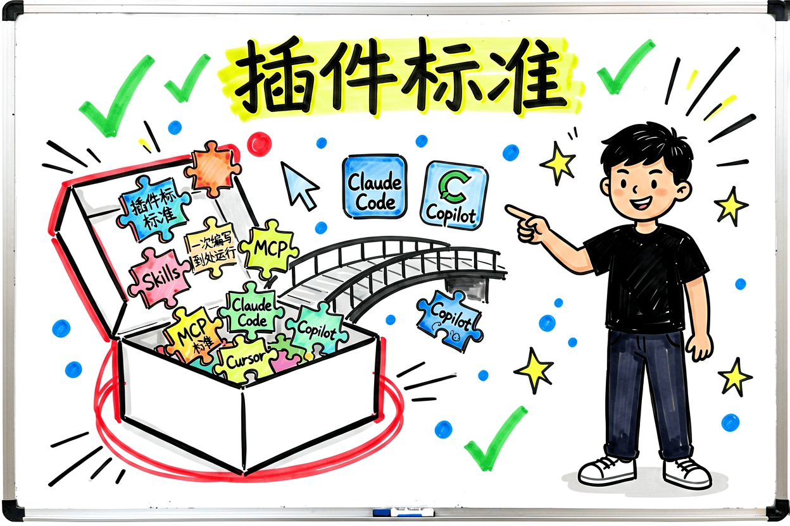
*Fig: Open Plugins — install once, works across seven tools*

AI coding tools are multiplying: Cursor, Claude Code, Codex, Grok Build — each with its own plugin format. Then came **Open Plugins**.

It's an open standard maintained by Vercel Labs. Install one plugin, it runs across seven tools.

{/* truncate */}

---

## The Problem: AI Coding Tools in a "Plugin Warring States" Era

Let's start with the problem.


*Fig: Every tool speaks its own language — they don't integrate*

Imagine you have a great set of AI coding assistants:

- A code review skill that automatically reviews changes before each commit
- An MCP server connecting to your company's API documentation
- A hook script that auto-formats files on save

You configure it once in Claude Code. Then you switch to Cursor and have to reconfigure everything. Switch to Codex and the format is different. It's like JavaScript before npm — every library had its own module format, and reusing anything meant manual work.

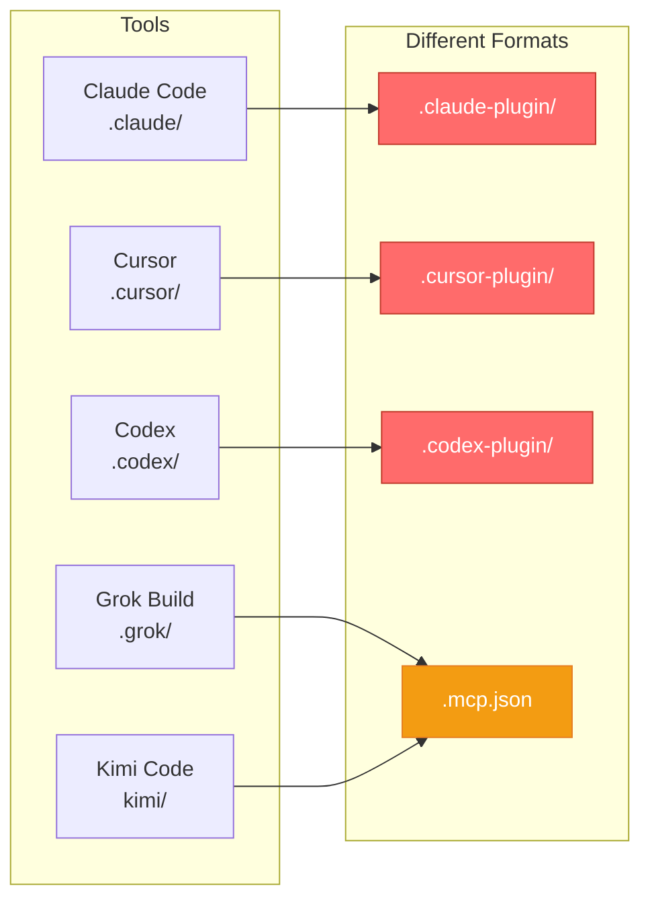
```mermaid
flowchart LR
    subgraph Tools
        CC[Claude Code<br/>.claude/]
        Cursor[Cursor<br/>.cursor/]
        Codex[Codex<br/>.codex/]
        Grok[Grok Build<br/>.grok/]
        KC[Kimi Code<br/>kimi/]
    end

    subgraph Different Formats
        A[.claude-plugin/]
        B[.cursor-plugin/]
        C[.codex-plugin/]
        D[.mcp.json]
    end

    CC --> A
    Cursor --> B
    Codex --> C
    Grok --> D
    KC --> D

    style A fill:#ff6b6b,stroke:#c0392b,color:#fff
    style B fill:#ff6b6b,stroke:#c0392b,color:#fff
    style C fill:#ff6b6b,stroke:#c0392b,color:#fff
    style D fill:#f39c12,stroke:#e67e22,color:#fff
```

Open Plugins aims to end this fragmentation: **define one standard, share across all tools**.

---

## npx plugins: How to Install

One command:

```bash
# Install a plugin from GitHub (short format)
npx plugins add vercel/vercel-plugin

# Full HTTPS URL
npx plugins add https://github.com/vercel/vercel-plugin

# Install from local directory
npx plugins add ./my-plugin

# Preview components without installing
npx plugins discover owner/repo

# List locally detected tools
npx plugins targets
```

The `plugins` package (v1.3.4) is the Open Plugins ecosystem's "installer". Everything goes into `.agents/plugins/` after installation.

Its workflow can be thought of as an assembly line:

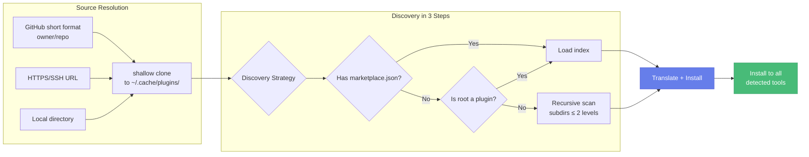
```mermaid
flowchart LR
    subgraph Source Resolution
        A[GitHub short format<br/>owner/repo] --> D
        B[HTTPS/SSH URL] --> D
        C[Local directory] --> D
    end

    D[shallow clone<br/>to ~/.cache/plugins/] --> E

    subgraph Discovery in 3 Steps
        E{Discovery Strategy} --> F{Has marketplace.json?}
        F -->|Yes| G[Load index]
        F -->|No| H{Is root a plugin?}
        H -->|Yes| G
        H -->|No| I[Recursive scan<br/>subdirs ≤ 2 levels]
    end

    G --> J[Translate + Install]
    I --> J
    J --> K[Install to all<br/>detected tools]

    style J fill:#667eea,stroke:#5a67d8,color:#fff
    style K fill:#48bb78,stroke:#38a169,color:#fff
```

Three installation scopes:

```bash
npx plugins add repo --scope user     # User-level (~/.agents/plugins/)
npx plugins add repo --scope project  # Project-level (./.agents/plugins/)
npx plugins add repo --scope local    # Local dev testing only
```

You can also target a specific tool:

```bash
npx plugins add owner/repo -t grok     # Install to Grok Build only
npx plugins add owner/repo -t vscode   # Install to VS Code only
```

---

## Seven Supported AI Coding Tools

`npx plugins targets` detects which tools you have installed and installs to all of them automatically.

Here are the supported tools and their component type compatibility:

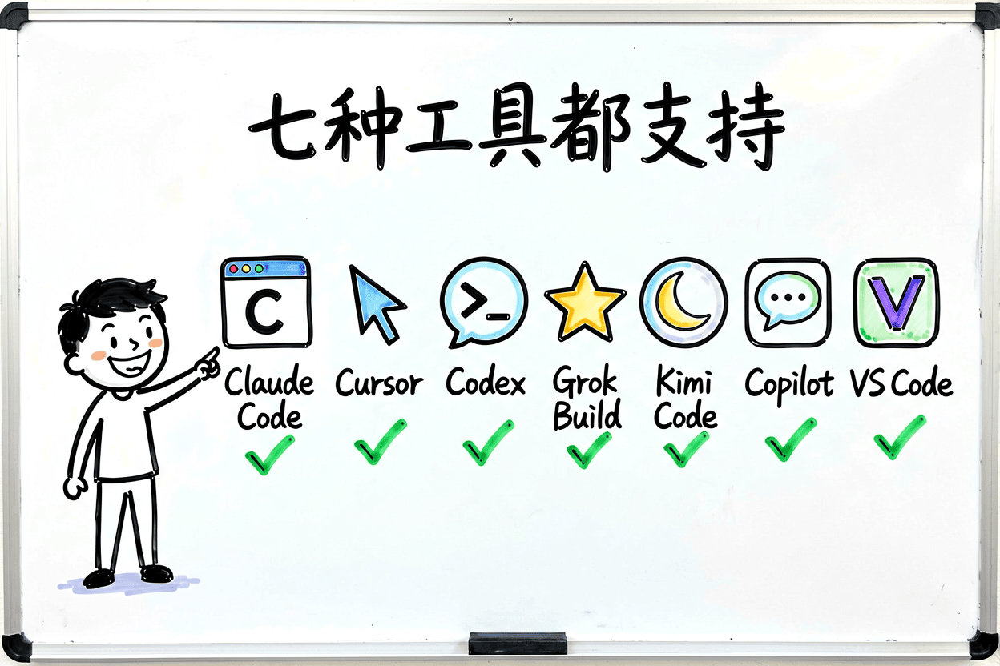
*Fig: Seven AI coding tools, one plugin standard*

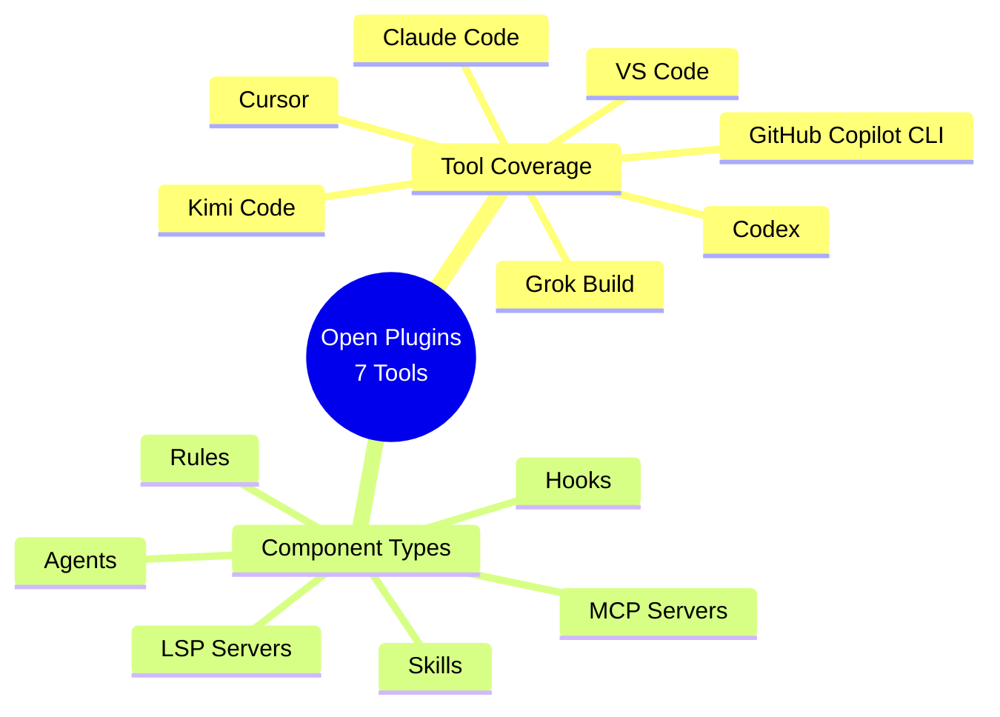
```mermaid
mindmap
  root((Open Plugins<br/>7 Tools))
    Tool Coverage
      Claude Code
      Cursor
      Codex
      Grok Build
      Kimi Code
      GitHub Copilot CLI
      VS Code
    Component Types
      Skills
      Agents
      Rules
      Hooks
      MCP Servers
      LSP Servers
```

Full compatibility matrix:

| Tool | Skills | Agents | Rules | Hooks | MCP | LSP |
|------|:------:|:------:|:-----:|:-----:|:---:|:---:|
| **Claude Code** | ✅ | ✅ | ✅ | ✅ | ✅ | ❌ |
| **Cursor** | ✅ | ❌ | ✅ | ✅ | ✅ | ✅ |
| **Codex** | ✅ | ✅ | ✅ | ✅ | ✅ | ❌ |
| **Grok Build** | ✅ | ❌ | ✅ | ✅ | ✅ | ✅ |
| **Kimi Code** | ✅ | ❌ | ❌ | ✅ | ✅ | ❌ |
| **GitHub Copilot CLI** | ✅ | ✅ | ✅ | ✅ | ✅ | ❌ |
| **VS Code** | ✅ | ❌ | ✅ | ❌ | ✅ | ❌ |

Key differences:

- **Cursor** doesn't support Agents but supports LSP — ideal for deep in-editor usage
- **Claude Code** and **Codex** support Agents but not LSP — they follow the agent-oriented path
- **Grok Build** is provided through xAI's CLI, compatible with Claude Code's Skills and Agents formats
- **GitHub Copilot CLI** is the most versatile, supporting all component types
- **VS Code** currently has Agent Plugins in Preview — requires `chat.plugins.enabled`

---

## Protocol Breakdown

A plugin is essentially a directory with files organized by convention.

### Standard Directory Structure

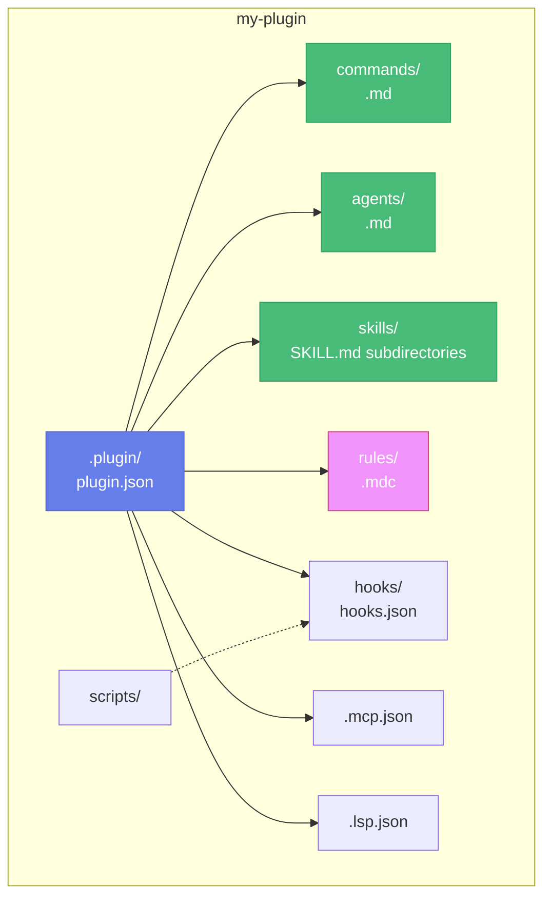
```mermaid
flowchart TD
    subgraph my-plugin
        A[.plugin/<br/>plugin.json] --> B[commands/<br/>.md]
        A --> C[agents/<br/>.md]
        A --> D[skills/<br/>SKILL.md subdirectories]
        A --> E[rules/<br/>.mdc]
        A --> F[hooks/<br/>hooks.json]
        A --> G[.mcp.json]
        A --> H[.lsp.json]
        I[scripts/] -.-> F
    end

    style A fill:#667eea,stroke:#5a67d8,color:#fff
    style B fill:#48bb78,stroke:#38a169,color:#fff
    style C fill:#48bb78,stroke:#38a169,color:#fff
    style D fill:#48bb78,stroke:#38a169,color:#fff
    style E fill:#f093fb,stroke:#d53f8c,color:#fff
```

Storage paths after installation:

```text
~/.agents/plugins/          # User-level
<project>/.agents/plugins/  # Project-level
```

### plugin.json Manifest

The manifest is **optional**. If omitted, the plugin name is derived from the directory name and components are discovered in default locations only.

If provided, `name` is the **only required field**:

```json
{
  "name": "my-plugin",
  "version": "1.2.0",
  "description": "Plugin description",
  "author": {
    "name": "Author",
    "email": "author@example.com"
  },
  "homepage": "https://example.com",
  "repository": "https://github.com/author/plugin",
  "license": "MIT",
  "keywords": ["code-review", "automation"]
}
```

`name` constraints: 1-64 characters, lowercase alphanumeric/hyphens/dots, must start and end with alphanumeric, no `--` or `..`. ✅ `deployment-tools`, `code-reviewer`, `prompts.chat` ❌ `My-Plugin`, `-tools`, `my--plugin`

### Component Discovery Algorithm

This is the core of the protocol. The full process a tool uses to scan a plugin:

```mermaid
flowchart TD
    S[Start Discovery] --> M{Has vendor-prefixed<br/>manifest?}
    M -->|Yes| P1[Parse<br/>.claude-plugin/<br/>plugin.json]
    M -->|No| N{Has .plugin/<br/>plugin.json?}
    N -->|Yes| P2[Parse<br/>.plugin/<br/>plugin.json]
    N -->|No| P3[Use directory name<br/>as plugin name]

    P1 --> C1[Extract name<br/>version etc.]
    P2 --> C1
    P3 --> C1

    C1 --> C2[Build component path list]
    C2 --> C3{Has custom paths?}
    C3 -->|exclusive:true| C4a[Use custom paths only]
    C3 -->|default| C4b[Merge default + custom]

    C4a --> S1[Path safety check]
    C4b --> S1

    S1 --> R[Load components by pattern]
    R --> NS[Namespacing<br/>{plugin}:{name}]
    NS --> PE[Expand PLUGIN_ROOT]
    PE --> Done[✅ Complete]

    subgraph Safety Check
        S1 -->|Reject ../ escape| S2
        S2[Must start with ./] --> S3[Reject paths beyond root]
    end

    subgraph Loading Rules
        R1[commands/ → .md files]
        R2[agents/ → .md + frontmatter]
        R3[skills/ → SKILL.md directories]
        R4[rules/ → .mdc files]
        R5[hooks/hooks.json]
        R6[.mcp.json]
    end

    R --> R1 & R2 & R3 & R4 & R5 & R6

    style M fill:#ff6b6b,stroke:#c0392b,color:#fff
    style NS fill:#667eea,stroke:#5a67d8,color:#fff
    style PE fill:#f093fb,stroke:#d53f8c,color:#fff
    style Done fill:#48bb78,stroke:#38a169,color:#fff
```

The plugin's four-stage lifecycle — from installation to activation:

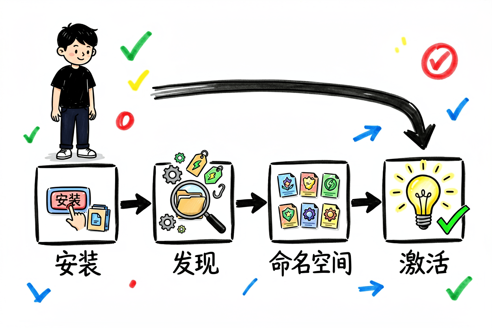
*Fig: Plugin installation, discovery, namespacing, and activation flow*

### `${PLUGIN_ROOT}` Path Expansion

Any configuration file within a plugin can use `${PLUGIN_ROOT}`, which the tool automatically replaces with the plugin root directory's absolute path. This makes plugins **self-contained** — all path references are relative to itself, working from any installation location.

```json
{
  "mcpServers": {
    "db-server": {
      "command": "${PLUGIN_ROOT}/servers/db-server",
      "args": ["--config", "${PLUGIN_ROOT}/config.json"],
      "env": {
        "DB_PATH": "${PLUGIN_ROOT}/data"
      }
    }
  }
}
```

Expansion rules: recursive expansion (nested references are replaced); escape checking ensures paths don't leave the plugin directory.

---

## In Practice: Migrating CloudBase AI Toolkit to Open Plugins

Enough theory — let's get real.

We've been maintaining an open-source project called **[CloudBase AI Toolkit](https://github.com/TencentCloudBase/CloudBase-AI-ToolKit)** that provides cloud access for AI coding tools — AI model invocation, NoSQL/PostgreSQL databases, cloud functions, CloudRun, cloud storage, WeChat Mini Program integration, and more. Previously we manually configured `.claude-plugin/`, `.codex-plugin/`, `.mcp.json` — one config per tool, a maintenance headache. Open Plugins came at the perfect time for a migration.

Full migration PR: [TencentCloudBase/CloudBase-AI-ToolKit#808](https://github.com/TencentCloudBase/CloudBase-AI-ToolKit/pull/808) (+818 / -34)

> 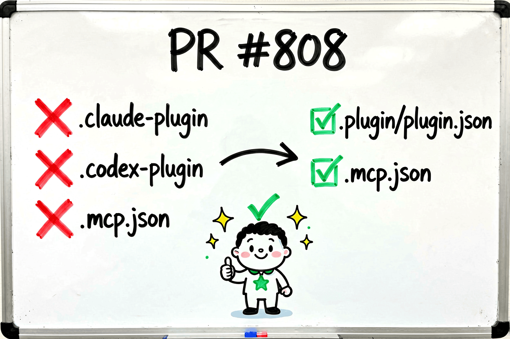
> *Fig: PR #808 before/after — from vendor-specific formats to a universal plugin standard*

### Before vs After

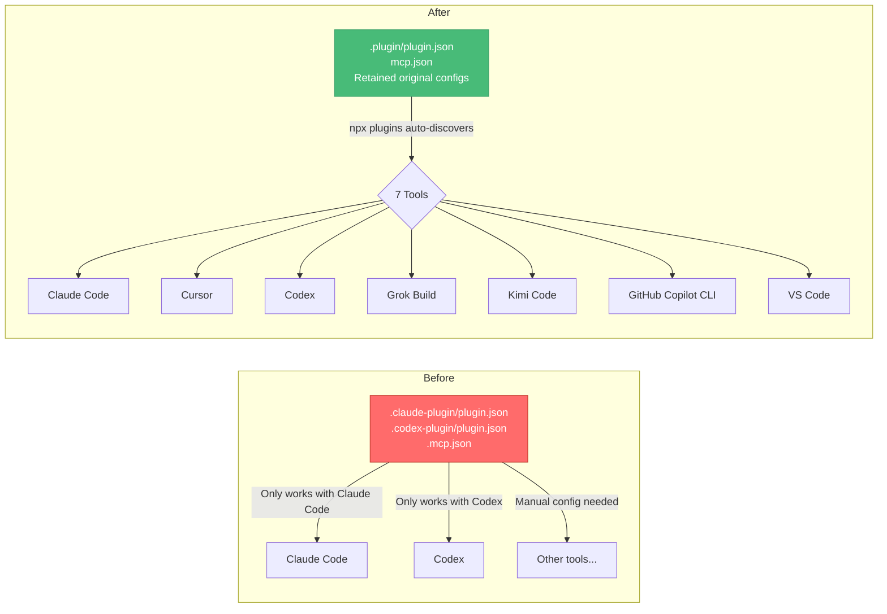
```mermaid
flowchart LR
    subgraph Before
        BEFORE[.claude-plugin/plugin.json<br/>.codex-plugin/plugin.json<br/>.mcp.json]
        BEFORE -->|Only works with Claude Code| CC[Claude Code]
        BEFORE -->|Only works with Codex| CX[Codex]
        BEFORE -->|Manual config needed| Other[Other tools...]
    end

    subgraph After
        NOW[.plugin/plugin.json<br/>mcp.json<br/>Retained original configs]
        NOW -->|npx plugins auto-discovers| ALL{7 Tools}
        ALL --> ALL1[Claude Code]
        ALL --> ALL2[Cursor]
        ALL --> ALL3[Codex]
        ALL --> ALL4[Grok Build]
        ALL --> ALL5[Kimi Code]
        ALL --> ALL6[GitHub Copilot CLI]
        ALL --> ALL7[VS Code]
    end

    style BEFORE fill:#ff6b6b,stroke:#c0392b,color:#fff
    style NOW fill:#48bb78,stroke:#38a169,color:#fff
```

### plugin.json

Following the Open Plugins spec v1.0.0 closed schema, only retaining permitted metadata fields:

```json
{
  "$schema": "https://open-plugins.com/schemas/1.0.0/plugin.schema.json",
  "name": "cloudbase",
  "version": "0.2.0",
  "description": "Tencent CloudBase — AI models, authentication, NoSQL/PostgreSQL databases, cloud functions, cloud storage, CloudRun backend services, and WeChat Mini Program integration.",
  "author": {
    "name": "Tencent CloudBase",
    "url": "https://cloudbase.net"
  },
  "homepage": "https://github.com/TencentCloudBase/CloudBase-AI-ToolKit",
  "license": "MIT",
  "keywords": [
    "cloudbase", "tencent-cloud", "baas",
    "ai-model", "database", "cloud-function",
    "authentication", "storage", "cloudrun"
  ]
}
```

### mcp.json

MCP server config moved from `.mcp.json` to the spec path `mcp.json`:

```json
{
  "mcpServers": {
    "cloudbase-mcp": {
      "command": "npx",
      "args": ["-y", "@cloudbase/cloudbase-mcp@latest"],
      "env": {}
    }
  }
}
```

### Automated Build

Wrote a `build-open-plugin-spec.mjs` build script that auto-generates artifacts from `.claude-plugin/plugin.json`. Added a `--check` mode for CI — every PR auto-validates to prevent source updates without regenerating artifacts.

```bash
# Generate artifacts
node scripts/build-open-plugin-spec.mjs

# CI mode: check only, no writes
node scripts/build-open-plugin-spec.mjs --check
```

GitHub Actions workflow (`.github/workflows/open-plugin-spec-check.yml`) runs checks on every PR automatically.

### Validation Results

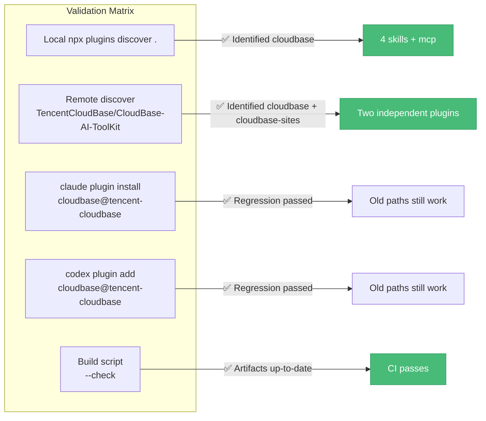
```mermaid
flowchart LR
    subgraph Validation Matrix
        CHECK1[Local npx plugins discover .]
        CHECK2[Remote discover<br/>TencentCloudBase/CloudBase-AI-ToolKit]
        CHECK3[claude plugin install<br/>cloudbase@tencent-cloudbase]
        CHECK4[codex plugin add<br/>cloudbase@tencent-cloudbase]
        CHECK5[Build script<br/>--check]
    end

    CHECK1 -->|✅ Identified cloudbase| R1[4 skills + mcp]
    CHECK2 -->|✅ Identified cloudbase + cloudbase-sites| R2[Two independent plugins]
    CHECK3 -->|✅ Regression passed| R3[Old paths still work]
    CHECK4 -->|✅ Regression passed| R4[Old paths still work]
    CHECK5 -->|✅ Artifacts up-to-date| R5[CI passes]

    style R1 fill:#48bb78,stroke:#38a169,color:#fff
    style R2 fill:#48bb78,stroke:#38a169,color:#fff
    style R5 fill:#48bb78,stroke:#38a169,color:#fff
```

The biggest win: installing to every tool with one command:

```bash
npx plugins add TencentCloudBase/cloudbase-plugin
```

And because we already had 4 Skills under `skills/`, `npx plugins discover` automatically registered them as namespaced commands:

| Component | User Invocation |
|-----------|----------------|
| `skills/ai-model/` | `/cloudbase:ai-model` |
| `skills/cloudbase-data/` | `/cloudbase:cloudbase-data` |
| `skills/cloud-functions/` | `/cloudbase:cloud-functions` |
| `skills/mini-program/` | `/cloudbase:mini-program` |

No extra config needed — just place directories by convention.

### First Pitfall: marketplace.json Conflict

After PR #808 was merged, I excitedly ran `npx plugins add TencentCloudBase/CloudBase-AI-ToolKit` and got:

```bash
No plugins found. 2 remote plugin(s) not shown.
```

The plugin was in the repo, but the CLI couldn't find it.

After digging: the main repo root has a `marketplace.json` — an index file for Claude Code and Codex marketplace add. The `npx plugins` CLI detected it and identified the entire repo as a **marketplace** (multi-plugin collection), refusing to install subdirectory plugins.

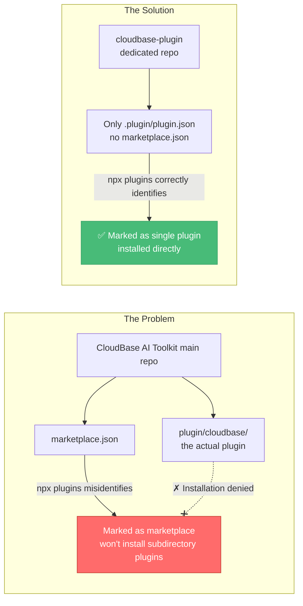
```mermaid
flowchart LR
    subgraph The Problem
        REPO[CloudBase AI Toolkit main repo] --> M[marketplace.json]
        M -->|npx plugins misidentifies| WRONG[Marked as marketplace<br/>won't install subdirectory plugins]
        REPO --> SUB[plugin/cloudbase/<br/>the actual plugin]
        SUB -.-x|✗ Installation denied| WRONG
    end

    subgraph The Solution
        NEW_REPO[cloudbase-plugin<br/>dedicated repo] --> NEW[Only .plugin/plugin.json<br/>no marketplace.json]
        NEW -->|npx plugins correctly identifies| RIGHT[✅ Marked as single plugin<br/>installed directly]
    end

    style WRONG fill:#ff6b6b,stroke:#c0392b,color:#fff
    style RIGHT fill:#48bb78,stroke:#38a169,color:#fff
```

**Solution: Create dedicated plugin repos**

Following Vercel (`vercel/vercel-plugin`) and Supabase (`supabase-community/supabase-plugin`) — create dedicated plugin repos whose root contains only `.plugin/plugin.json`, no `marketplace.json`, so the CLI identifies them as single plugins.

Created two repos:

| Repository | Install Command | Contents |
|-----------|----------------|----------|
| `TencentCloudBase/cloudbase-plugin` | `npx plugins add TencentCloudBase/cloudbase-plugin` | 28 skills + MCP + 5 commands + 2 agents + hooks |
| `TencentCloudBase/cloudbase-sites-plugin` | `npx plugins add TencentCloudBase/cloudbase-sites-plugin` | 1 skill + MCP + hooks |

Content auto-synced from the main repo's `plugin/cloudbase/` and `plugin/cloudbase-sites/`, **excluding `marketplace.json`** during sync — that's the key.

**Automated sync mechanism**

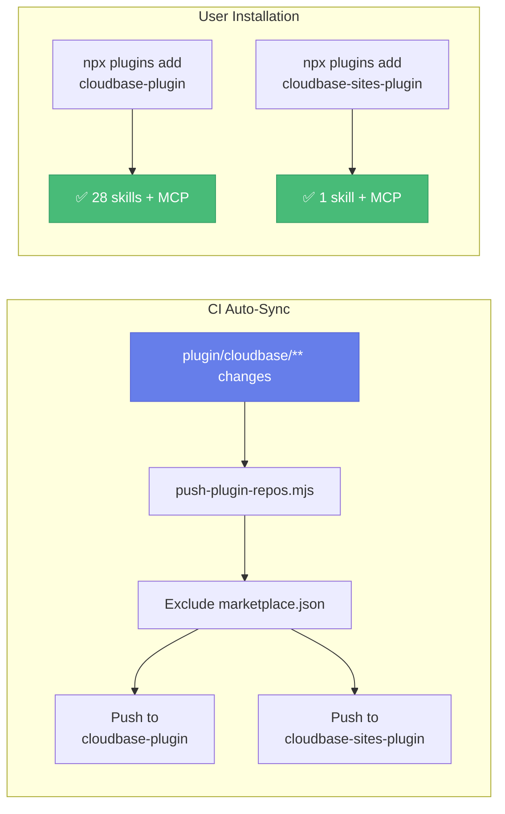
```mermaid
flowchart LR
    subgraph CI Auto-Sync
        TRIGGER[plugin/cloudbase/** changes] --> BUILD[push-plugin-repos.mjs]
        BUILD --> EXCLUDE[Exclude marketplace.json]
        EXCLUDE --> PUSH1[Push to<br/>cloudbase-plugin]
        EXCLUDE --> PUSH2[Push to<br/>cloudbase-sites-plugin]
    end

    subgraph User Installation
        USER1[npx plugins add<br/>cloudbase-plugin] --> INST1[✅ 28 skills + MCP]
        USER2[npx plugins add<br/>cloudbase-sites-plugin] --> INST2[✅ 1 skill + MCP]
    end

    style TRIGGER fill:#667eea,stroke:#5a67d8,color:#fff
    style INST1 fill:#48bb78,stroke:#38a169,color:#fff
    style INST2 fill:#48bb78,stroke:#38a169,color:#fff
```

New files added:

| File | Purpose |
|------|---------|
| `scripts/push-plugin-repos.mjs` | Build plugin repo artifacts to `.plugin-repo-output/` |
| `.github/workflows/push-plugin-repos.yaml` | CI auto-sync workflow |
| `scripts/build-open-plugin-spec.mjs` (extended) | Handle both cloudbase + cloudbase-sites |
| `plugin/cloudbase-sites/.plugin/plugin.json` | cloudbase-sites Open Plugin Spec manifest |
| `plugin/cloudbase-sites/mcp.json` | cloudbase-sites MCP config |

All validations passed:

```bash
npx plugins discover TencentCloudBase/cloudbase-plugin --remote
# → ✅ Found 1 local plugin(s), 28 skills, 5 cmds, 2 agents, hooks

npx plugins add TencentCloudBase/cloudbase-plugin --target cursor --scope local
# → ✅ Installed

npx plugins discover TencentCloudBase/cloudbase-sites-plugin --remote
# → ✅ Found 1 local plugin(s), 1 skill, hooks
```

Install commands now point to the dedicated repos:

```bash
# Main plugin
npx plugins add TencentCloudBase/cloudbase-plugin

# Sites plugin
npx plugins add TencentCloudBase/cloudbase-sites-plugin
```

The core lesson: **Open Plugins treats a repo with `marketplace.json` at its root as a plugin collection, not a single plugin.** If your repo has multiple artifacts (like CloudBase AI Toolkit with both an MCP server and plugins), you need dedicated plugin repos. Vercel and Supabase do the same.

---

## The Hook System

When I read the spec, the Hook system was the most striking part — it can hook into every lifecycle point of an agent workflow. But heads up: **Hooks aren't in Spec v1**, support is entirely up to the host tool. Claude Code and Copilot CLI have the fullest support, VS Code and Kimi Code don't recognize them (silently ignored, no error).

> 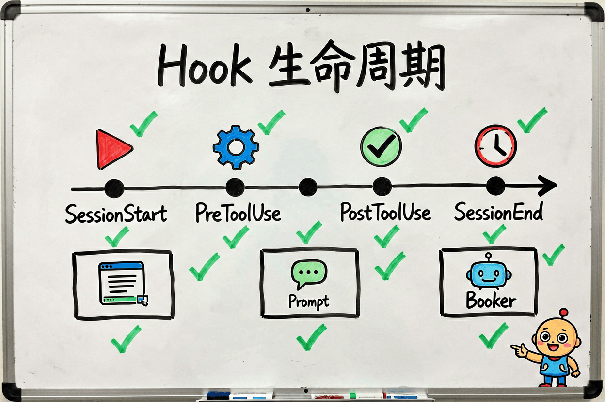
> *Fig: The Hook system — complete event chain from SessionStart to SessionEnd*

### Event Overview

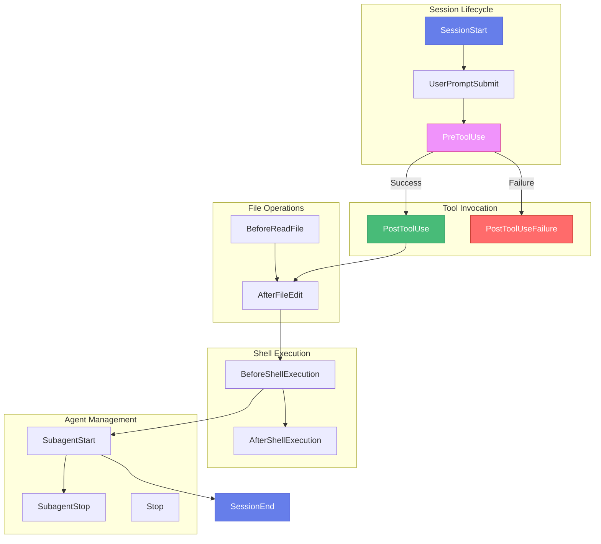
```mermaid
flowchart TD
    subgraph Session Lifecycle
        SS[SessionStart] --> US[UserPromptSubmit]
        US --> PTU[PreToolUse]
    end

    subgraph Tool Invocation
        PTU -->|Success| POT[PostToolUse]
        PTU -->|Failure| POF[PostToolUseFailure]
    end

    subgraph File Operations
        BRF[BeforeReadFile] --> AFE[AfterFileEdit]
    end

    subgraph Shell Execution
        BSE[BeforeShellExecution] --> ASE[AfterShellExecution]
    end

    subgraph Agent Management
        SAS[SubagentStart] --> SAS2[SubagentStop]
        ST[Stop]
    end

    POT --> AFE
    AFE --> BSE
    BSE --> SAS
    SAS --> SE[SessionEnd]

    style SS fill:#667eea,stroke:#5a67d8,color:#fff
    style PTU fill:#f093fb,stroke:#d53f8c,color:#fff
    style POT fill:#48bb78,stroke:#38a169,color:#fff
    style POF fill:#ff6b6b,stroke:#c0392b,color:#fff
    style SE fill:#667eea,stroke:#5a67d8,color:#fff
```

| Event | When It Fires | Matcher Scope |
|-------|---------------|---------------|
| `PreToolUse` | **Before** agent calls a tool | Tool name |
| `PostToolUse` | **After** successful tool call | Tool name |
| `PostToolUseFailure` | **On** tool call error | Tool name |
| `BeforeReadFile` | **Before** reading a file | File path |
| `AfterFileEdit` | **After** writing a file | File path |
| `BeforeShellExecution` | **Before** executing a shell command | Command string |
| `AfterShellExecution` | **After** shell command completes | Command string |
| `SessionStart` | **When** session begins | — |
| `SessionEnd` | **When** session ends | — |
| `UserPromptSubmit` | **When** user submits a prompt | — |
| `Stop` | **When** agent attempts to stop | — |
| `SubagentStart` | **When** subagent starts | — |
| `SubagentStop` | **When** subagent ends | — |

### Three Action Types

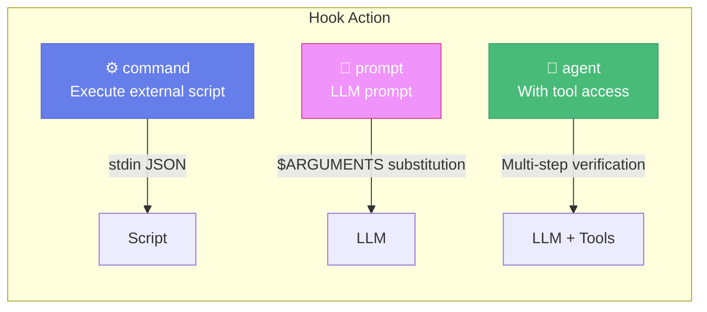
```mermaid
flowchart LR
    subgraph Hook Action
        direction TB
        CMD["⚙️ command<br/>Execute external script"] -->|stdin JSON| SCRIPT[Script]
        PRMPT["💬 prompt<br/>LLM prompt"] -->|$ARGUMENTS substitution| LLM[LLM]
        AGT["🤖 agent<br/>With tool access"] -->|Multi-step verification| LLM2[LLM + Tools]
    end

    style CMD fill:#667eea,stroke:#5a67d8,color:#fff
    style PRMPT fill:#f093fb,stroke:#d53f8c,color:#fff
    style AGT fill:#48bb78,stroke:#38a169,color:#fff
```

**command** — Execute an external script, event context passed via stdin JSON:

```json
{ "type": "command", "command": "${PLUGIN_ROOT}/scripts/lint.sh" }
```

**prompt** — Send a prompt to the LLM, `$ARGUMENTS` replaced with event context:

```json
{ "type": "prompt", "prompt": "Review the change: $ARGUMENTS" }
```

**agent** — Similar to prompt but with tool access, enabling multi-step verification:

```json
{ "type": "agent", "prompt": "Verify style guide compliance: $ARGUMENTS" }
```

### Execution Model

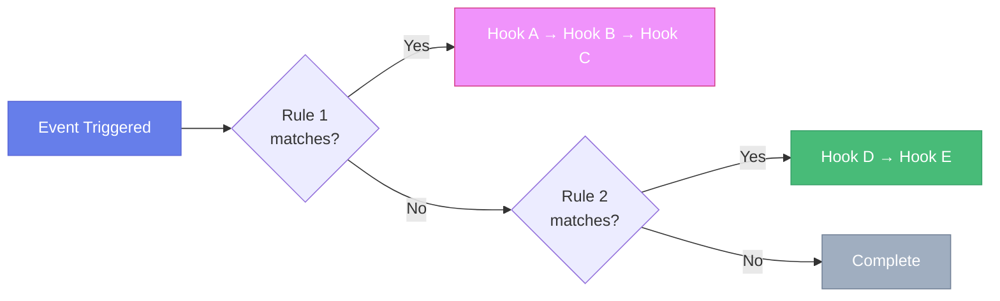
```mermaid
flowchart LR
    E[Event Triggered] --> R1{Rule 1<br/>matches?}
    R1 -->|Yes| H1[Hook A → Hook B → Hook C]
    R1 -->|No| R2{Rule 2<br/>matches?}
    R2 -->|Yes| H2[Hook D → Hook E]
    R2 -->|No| Done[Complete]

    style E fill:#667eea,stroke:#5a67d8,color:#fff
    style H1 fill:#f093fb,stroke:#d53f8c,color:#fff
    style H2 fill:#48bb78,stroke:#38a169,color:#fff
    style Done fill:#a0aec0,stroke:#718096,color:#fff
```

- Multiple rules can match the same event — **all execute**
- Hooks within the same rule run **sequentially in array order**
- Implementations **should set timeouts**
- Failures **must not crash the host tool**

---

## Adding Open Plugins Support to Your Tool

If you're building an AI coding tool and want plugin ecosystem compatibility, five things to implement:

### Five Core Capabilities

```mermaid
flowchart LR
    subgraph Plugin Host Tool
        direction TB
        C1[① Discovery & Loading<br/>Scan .agents/plugins/]
        C2[② Manifest Parsing<br/>Read plugin.json]
        C3[③ Component Discovery<br/>Scan default locations]
        C4[④ Path Expansion<br/>PLUGIN_ROOT substitution]
        C5[⑤ Namespacing<br/>{plugin}:{name}]
    end

    C1 --> C2 --> C3 --> C4 --> C5
    C3 -.->|Unsupported component types| IGNORE[MUST ignore<br/>must not error]

    style C5 fill:#667eea,stroke:#5a67d8,color:#fff
    style IGNORE fill:#ff6b6b,stroke:#c0392b,color:#fff
```

### Integration by Tool

Each tool has a different existing plugin mechanism. `npx plugins` does a translation layer during installation — converting the universal `.plugin/` format into each tool's native format:

| Tool | Install Target | Integration Mechanism |
|------|---------------|----------------------|
| **Claude Code** | `.claude/plugins/` | Skills and config directly compatible |
| **Cursor** | `.cursor/plugins/` | Registered via Rules + MCP mechanism |
| **Codex** | Marketplace entry `vercel@openai-curated` | Built-in Vercel integration |
| **Grok Build** | `grok plugin install` | Native plugin commands + Claude Code compatibility layer |
| **Kimi Code** | Kimi plugin store | Visible after `/plugins` TUI reload |
| **GitHub Copilot CLI** | `copilot plugin marketplace add` | `plugin add plugin@marketplace` after registering source |
| **VS Code** | `chat.pluginLocations` setting | Requires enabling `chat.plugins.enabled` (Preview) |

### Security Protection Model

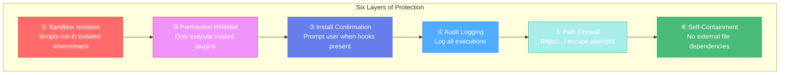
```mermaid
flowchart TD
    subgraph Six Layers of Protection
        L1["① Sandbox Isolation<br/>Scripts run in isolated environment"]
        L2["② Permission Whitelist<br/>Only execute trusted plugins"]
        L3["③ Install Confirmation<br/>Prompt user when hooks present"]
        L4["④ Audit Logging<br/>Log all executions"]
        L5["⑤ Path Firewall<br/>Reject ../ escape attempts"]
        L6["⑥ Self-Containment<br/>No external file dependencies"]
    end

    L1 --> L2 --> L3 --> L4 --> L5 --> L6

    style L1 fill:#ff6b6b,stroke:#c0392b,color:#fff
    style L2 fill:#f093fb,stroke:#d53f8c,color:#fff
    style L3 fill:#667eea,stroke:#5a67d8,color:#fff
    style L4 fill:#4facfe,stroke:#3b82f6,color:#fff
    style L5 fill:#a8edea,stroke:#38b2ac,color:#fff
    style L6 fill:#48bb78,stroke:#38a169,color:#fff
```

---

## Closing Thoughts

Open Plugins reminds me of when npm was just gaining traction ten years ago. JavaScript package management was a mess: AMD, CommonJS, UMD, IIFE… every project had its own system. Then npm + ES Modules unified the standard, and the entire ecosystem took off. The AI coding tool plugin ecosystem is in that "pre-npm" era right now.

Migrating CloudBase AI Toolkit was a fascinating process. From `npx plugins discover` identifying the plugin, to installing it across every tool with one command — that feeling of "write once, use everywhere" is exactly what this standard aims to deliver.

> 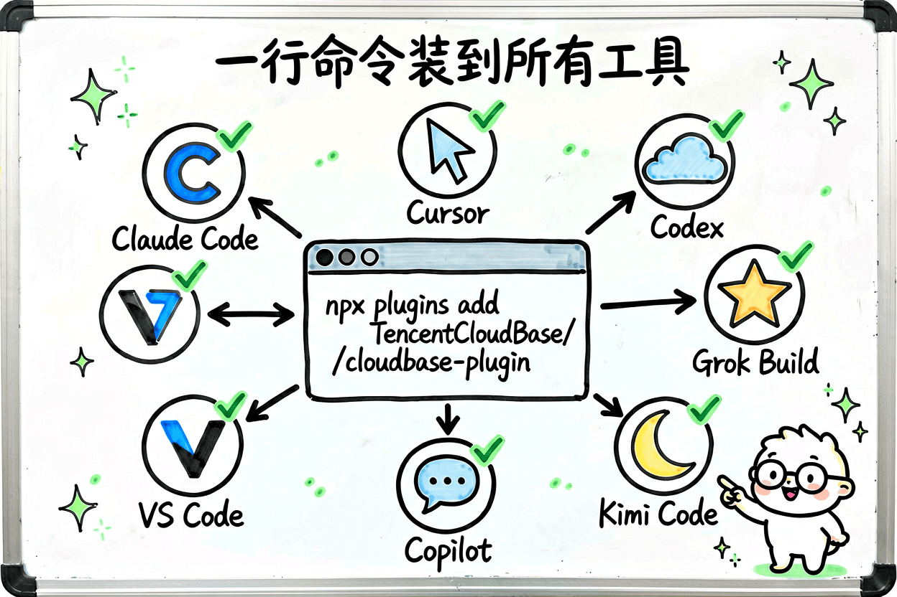
> *Fig: npx plugins add TencentCloudBase/cloudbase-plugin — one command to install everywhere*

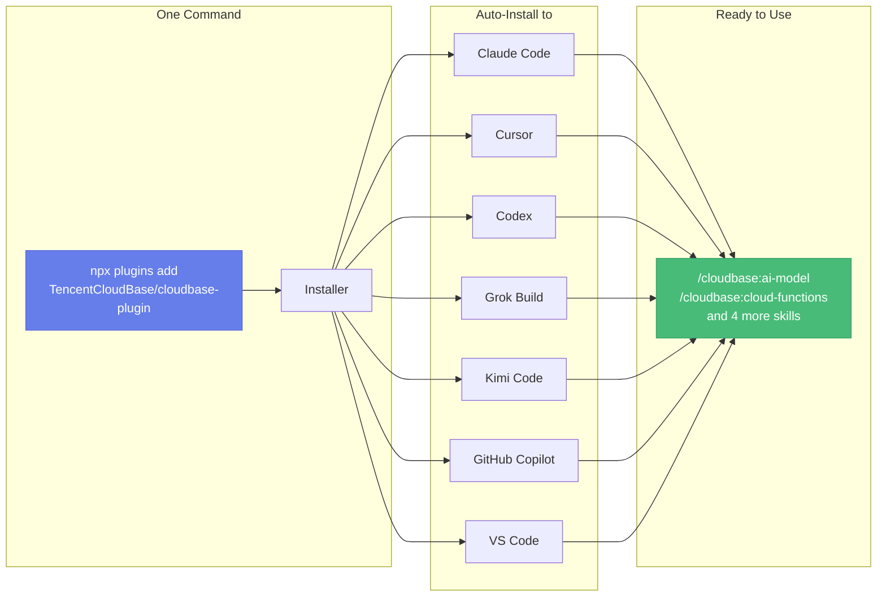
```mermaid
flowchart LR
    subgraph One Command
        CMD[npx plugins add<br/>TencentCloudBase/cloudbase-plugin] --> INSTALL
    end

    subgraph Auto-Install to
        INSTALL[Installer] --> T1[Claude Code]
        INSTALL --> T2[Cursor]
        INSTALL --> T3[Codex]
        INSTALL --> T4[Grok Build]
        INSTALL --> T5[Kimi Code]
        INSTALL --> T6[GitHub Copilot]
        INSTALL --> T7[VS Code]
    end

    subgraph Ready to Use
        T1 & T2 & T3 & T4 & T5 & T6 & T7 --> USE["/cloudbase:ai-model<br/>/cloudbase:cloud-functions<br/>and 4 more skills"]
    end

    style CMD fill:#667eea,stroke:#5a67d8,color:#fff
    style USE fill:#48bb78,stroke:#38a169,color:#fff
```

If you build extensions for AI coding tools, I recommend checking out the Open Plugins spec. The good news is you don't need anything complex — just add a `.plugin/plugin.json` to your project and it becomes discoverable by 7 tools. Our migration was about 400 lines of code, finished in under two days.

The CloudBase AI Toolkit plugins are at these repos, for reference:

```bash
npx plugins add TencentCloudBase/cloudbase-plugin
npx plugins add TencentCloudBase/cloudbase-sites-plugin
```

Open Plugins isn't "mature" yet, but the direction is right. Getting the same plugin to work across different tools is a problem worth solving. The rest depends on how the community grows.

---

## References

- [Open Plugins Official Site](https://open-plugins.com)
- [plugins npm package](https://www.npmjs.com/package/plugins) — the `npx plugins add` installer
- [Agent Skills Specification](https://agentskills.io)
- [Model Context Protocol](https://modelcontextprotocol.io)
- [CloudBase Plugin](https://github.com/TencentCloudBase/cloudbase-plugin) — Open Plugins standard plugin repo
- [CloudBase Sites Plugin](https://github.com/TencentCloudBase/cloudbase-sites-plugin) — Sites plugin repo
- [CloudBase AI Toolkit](https://github.com/TencentCloudBase/CloudBase-AI-ToolKit) — Tencent Cloud AI Toolkit, MCP server, skills & plugins
- [PR #808: CloudBase AI Toolkit Open Plugin Spec Integration](https://github.com/TencentCloudBase/CloudBase-AI-ToolKit/pull/808)
