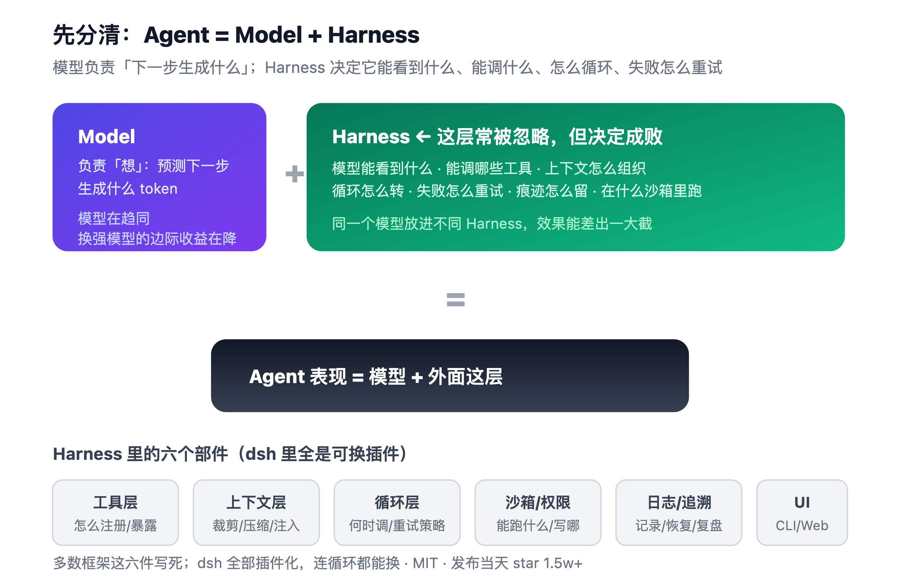
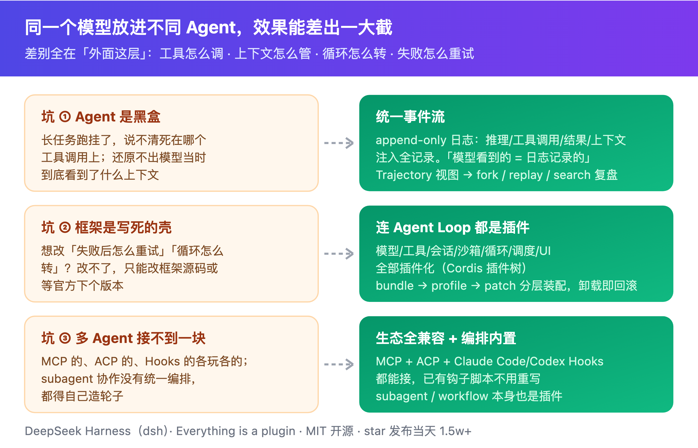
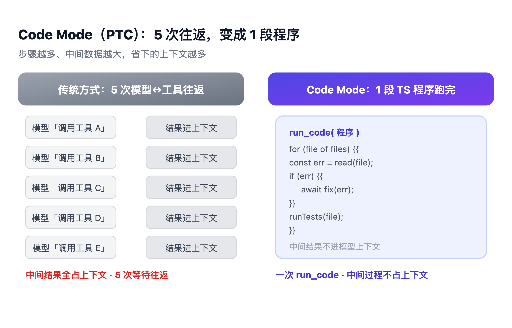
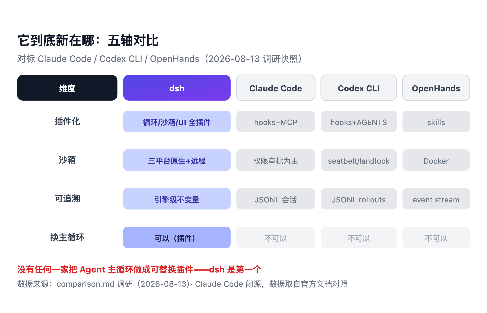
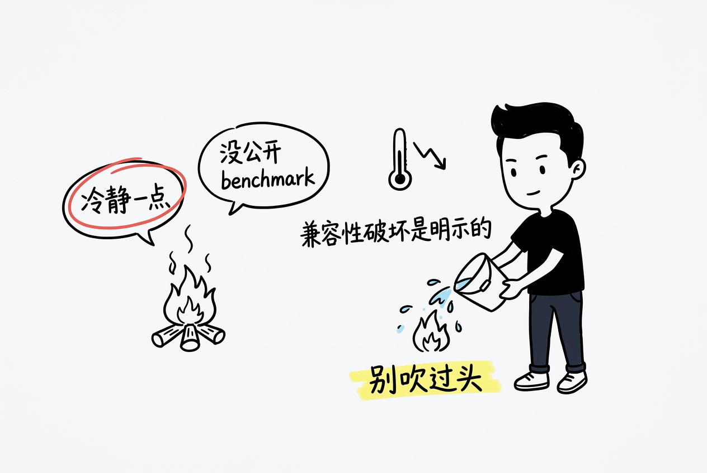

> The model thinks. The layer around it decides what it can accomplish.

*The model thinks. The harness does.*

Hi, I'm Booker.

Today I'm taking apart something DeepSeek open-sourced yesterday (2026-08-13): **DeepSeek Harness**, the CLI is `dsh`.

No hype, no jargon dumps. Step by step. By the end you'll understand what "Agent performance = model + the layer around it" actually means, and why dsh is worth a look.

{/* truncate */}

## Start with three questions

Three scenarios. You've probably hit at least one.

**First.** You ran a long agent task. It failed after hours. Can you tell which tool call it died on? Can you reconstruct what context the model was actually seeing?

**Second.** You wanted to add a rule: "after a tool call fails, retry once." Can you add it? Or do you have to fork the framework?

**Third.** You wanted three agents working together: one researching, one writing code, one reviewing. They come from different ecosystems — one speaks MCP, one speaks ACP, one speaks Hooks. Can you wire them together?

This article is about those three questions.

DeepSeek's answer for the runtime they open-sourced fits in three words: **everything is a plugin.**

## A model doesn't do things. It generates text.

Start at the most basic place.

You ask ChatGPT a question. It answers. At this point you have no concept of a "harness," and you don't need one. It's a thing that generates text: you feed it a sentence, it produces the next one.

The trouble starts when you ask it to *do* something.

Say: "fix the code in this project." To fix code, it needs to read files, find the error, edit it, run tests. The model can do none of that.

A model does exactly one thing: **predict the next token.** What it generates isn't "the act of fixing code" — it's text describing how to fix it.

So who actually reads files and runs commands?

Something outside the model has to wrap those real actions into a form the model can "call." The model says "read src/main.ts"; this layer reads it and feeds the content back.

**That layer is the Harness.**

Here's the non-obvious part: most people don't know this layer exists. We say "switch models, switch agents." But the same model inside a different harness can perform dramatically differently — how tools are exposed, how context is managed, how the loop runs — all of that is harness territory.

InfoQ put it well yesterday:

> "The model only predicts the next step; the Harness decides what the model can see, which tools it can call, how context is organized, and how to retry when something goes wrong."

## The moment things get complex, this layer has a lot to manage

If "read one file" were all it did, a thin wrapper would be enough. Real tasks aren't like that.

Back to "fix the code." A real fix task involves:

- The model says "read this file." First question: **do you have permission?** That's the sandbox's job.
- The file is huge. You need to **trim or compress** it before feeding it back. That's the context layer's job.
- Tests fail after the edit. **Retry? How many times?** That's the loop layer's job.
- Every step **needs to be logged**, or you'll never know where it died. That's the traceability layer's job.
- Should this run in a CLI, a web UI, or behind an IDE? That's the entry-point's job.

Every one of these needs someone to make decisions for the model. Those decisions all live in the Harness.

*Three real pains, and the mechanisms dsh built for them*

Here are the three pains everyone hits with Claude Code, Codex, or Cursor:

**Pain 1: The agent is a black box.** Long tasks die, and you can't tell where — or reconstruct what context the model was seeing.

**Pain 2: The framework is a fixed shell.** Want to change "retry behavior" or "how the loop turns"? You can't. Fork the source or wait for the next release.

**Pain 3: Multi-agent doesn't fit together.** MCP here, ACP there, Hooks somewhere else. No unified orchestration. You build your own wheels.

These aren't DeepSeek's inventions. They're industry-wide. dsh's value is that it has *buildable* mechanism answers to all three.

## Why now: models are converging, the harness is the differentiator

Let me be clear: this isn't a DeepSeek ad. Whether dsh is worth looking at has nothing to do with how strong the model is. It's about the layer around it.

Why now? Because models are converging.

Base capabilities — reasoning, coding, long context — are leveling out fast. The marginal gain of "a stronger model" keeps shrinking.

So where's the remaining leverage? **The harness layer.**

Same model, different tool exposure, different context management, different loop strategy, different retry policy. Tune that layer and you get more control than waiting for the next model release.

Dumb analogy: the model is the engine, the harness is the car. Chassis tuning, steering feel, brake logic — all car. Put the same engine in a grocery-getter and a sports car, and the driving experience is night and day.

*Same model, different harness, wildly different results*

So for developers: stop staring at model releases. Look at the layer you're actually using. Is it fixed? Can you change it? Can you trace it when it fails?

## Even "how the loop turns" is a plugin

The least intuitive thing about dsh: its plugin system isn't "you can add tools." It's that **model, tools, context, loop, sandbox, storage, UI — all of them are plugins.**

How? Cordis, a plugin framework, assembles the whole runtime from three config layers: `bundle → profile → patch`.

*A stack of config, assembled into a running Agent*

Want to change "retry after failure"? Don't touch source. Mount a patch that replaces that config entry. Want a different context-compaction strategy? Same thing.

And it's not a hacky "anything can mount." Cordis has a formal theory (spatiotemporal composability). The core guarantee: **when a plugin unloads, its side effects roll back completely, as if it was never installed.** Without that guarantee, plugin systems are toys. With it, deep replacement is real engineering.

## Traceability: no more guessing where it died

dsh solves the black-box problem by logging everything the model sees into one append-only event stream.

*What the model sees = what's logged. Reconstructable, replayable, forkable*

Its hard invariant: **"model-visible = logged."** Anything that reaches a model request must be reconstructable from the log.

Long task died? Open the Trajectory view. See every step, and what context the model had at each one. Fork a line and rerun. Replay for postmortem.

There's a hidden bonus for tinkerers: you can run the *same task trajectory* against different loop strategies or tool implementations and compare. That was basically impossible before.

## Code Mode: five round trips becomes one program

This is the mechanism I most wanted to try: **PTC (programmatic tool calling)**, which dsh ships as Code Mode.

The traditional way, a five-step task looks like: model says "call tool A" → wait → "call tool B" → wait… Five round trips, and every intermediate result sits in context.

*Traditional: 5 round trips. Code Mode: 1 program*

Code Mode is different: the model writes a TypeScript program — with loops, conditionals, concurrency — then one `run_code` executes the whole thing in a worker thread. Intermediate results **never enter the model's context.**

From the official comments: 5 round trips become 1.

The more steps, the bigger the intermediate data, the bigger the win. Context is a finite budget. What you don't spend, you get back as capability.

## Multi-agent and ecosystem compatibility

dsh ships four presets. They're four plugin combinations, not four separate systems:

*Standard / Code Mode / Minimal / Creator — four plugin combos*

- **Standard**: the usual agent — tool calls + loop.
- **Code Mode**: PTC, programmatic tool calls.
- **Minimal**: smallest toolset, built for running benchmarks.
- **Creator**: the agent can inspect the runtime and try installing plugins — the harness config itself becomes something the agent can operate on.

For multi-agent: subagents, forks, and workflows are all plugins. The practical part is ecosystem compatibility: dsh consumes MCP, serves ACP, and bridges Claude Code and Codex Hooks — **your existing hook scripts don't get rewritten.**

*MCP / ACP / Hooks — all plug into dsh*

## What's actually new

Talk is cheap. Compare with what exists.

I put dsh against three mainstream targets: Claude Code, Codex CLI, and OpenHands.

*Five axes: plugin depth / sandbox / traceability / modes / open-source*

The differences that matter:

- **Plugin depth**: Claude Code has Hooks and MCP, Codex has AGENTS.md, OpenHands has skills. But **none of them make the agent loop itself a replaceable plugin.** dsh is the first.
- **Sandbox**: Claude Code and Codex lean on permission prompts; OpenHands uses Docker. dsh ships native isolation on three platforms (Landlock on Linux, Seatbelt on macOS, ACL on Windows), plus a remote-execution seam.
- **Traceability**: everyone logs. dsh makes "model-visible = logged" a runtime invariant — enforced at the engine level, not as product-layer design.
- **Open-source**: Claude Code is closed. Codex is open. dsh is MIT — and hit 15k+ stars the day it launched.

One line: **on "taking the agent apart," dsh goes further than anyone.**

## Cold water

Praise done. A few honest warnings. I don't like hype.

*Stay level-headed*

**"Anything can be swapped" doesn't automatically mean better results.** Value comes from the quality of default plugins, stable composition patterns, credible benchmarks, and third-party ecosystem. Plugins buy you room to differentiate; they don't deliver it.

**No multi-agent paradigm breakthrough.** It's hierarchical Supervisor–Worker — parent decomposes, child executes. New enough, but it's not Swarm (autonomous discovery, negotiation, competition, dynamic takeover). Calling it a "revolutionary multi-agent architecture" oversells it.

**No public benchmarks.** I checked BENCHMARK.md myself. It explains *how* to run benchmarks. It publishes zero results. Treat the claims accordingly.

**Breaking changes are explicit.** It's v0.1. The README literally says *THERE WILL BE COMPATIBILITY-BREAKING CHANGES*. Early adopters, your migration cost won't be trivial.

**Plugins have a price.** Interface stability, dependency management, version compat, performance overhead, debugging complexity. The deeper you carve, the harder these get.

## Close

One sentence for the whole article: **Agent performance = model + the layer around it, and that layer is usually ignored.**

DeepSeek open-sourced dsh — turning a normally-fixed layer into replaceable plugins, with a traceable event stream and a Code Mode that runs five round trips in one program. Its thinking is worth a look, even if all you're doing is finding an agent in your own toolchain that you can *change* and *trace*.

Which of the three pains is your current framework hitting? I'd love to hear.

Want to try taking the layer apart yourself? `npx @deepseek-ai/dsh web` gets you running (needs Node.js).

🥚 Easter egg: I'm already digging through its source for the next post — how "unload rolls back side effects" actually works. Stay tuned.

— Booker
